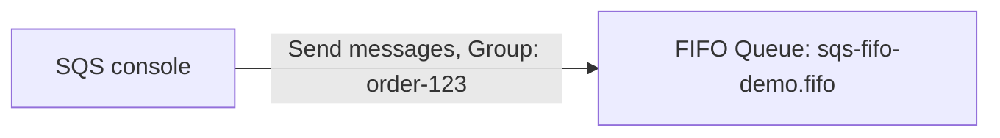

# 50 - FIFO Queue Hands-On Lab

> Goal: build a real FIFO queue, send messages with an explicit Message Group ID and Deduplication ID, and directly observe both the strict ordering guarantee and deduplication actually working. Entirely via the **AWS Console**.

---

## 1. What you're building

---

## 2. Step 1 — Create the FIFO queue

1. **SQS console** → **Create queue**.
2. **Type**: **FIFO**.
3. **Name**: `sqs-fifo-demo.fifo` — the `.fifo` suffix is required and enforced by the console.
4. **Content-based deduplication**: leave **disabled** for this demo, so Section 4 can demonstrate the explicit deduplication ID directly.
5. **Create queue**.

---

## 3. Step 2 — Send three ordered messages to the same group

Using **Send and receive messages**, send these **in this exact order**, all with **Message Group ID**: `order-123`:

1. **Body**: `step-1-validate` → **Message Deduplication ID**: `dedup-1`.
2. **Body**: `step-2-charge` → **Message Deduplication ID**: `dedup-2`.
3. **Body**: `step-3-ship` → **Message Deduplication ID**: `dedup-3`.

---

## 4. Step 3 — Confirm strict ordering

1. **Poll for messages**, receiving multiple messages at once (increase **Maximum messages** if needed).
2. Confirm they arrive in **exactly** the order sent: `step-1-validate`, `step-2-charge`, `step-3-ship` — direct proof of the FIFO ordering guarantee within a single Message Group.

---

## 5. Step 4 — Prove deduplication actually works

1. Send the message again with **Body**: `step-1-validate` and the **same** **Message Deduplication ID**: `dedup-1`, within 5 minutes of the original.
2. **Poll for messages** → confirm **no duplicate** `step-1-validate` message appears — SQS silently deduplicated it, matching the [FIFO Deduplication](47-SQS-FIFO-Deduplication.md) note's 5-minute window mechanic.
3. (Optional) Wait past the 5-minute window and resend the same body with the same deduplication ID — confirm it now **does** get delivered as a genuinely new message.

---

## 6. Troubleshooting

| Symptom | Likely cause |
|---|---|
| Queue creation fails with a naming error | The name doesn't end in `.fifo` — required for every FIFO queue |
| Messages arrive out of order | They were sent with **different** Message Group IDs — ordering is only guaranteed within the same group |
| The duplicate in Section 5 still appears | More than 5 minutes passed since the original send, or the deduplication ID didn't exactly match `dedup-1` |

---

## 7. Cleanup

1. **SQS console** → delete `sqs-fifo-demo.fifo`.

---

## 8. Recap

- Messages sent to the same **Message Group ID** arrived in **exactly** the order they were sent — a real, observed proof of FIFO's ordering guarantee.
- An explicit **Message Deduplication ID** genuinely prevented a duplicate send within the 5-minute window from creating a second message.
- Next: the [Amazon SQS Integration With AWS Services](51-Amazon-SQS-Integration-With-AWS-Services.md) note — moving from SQS's own mechanics to how it connects with the rest of AWS.

### Sources
- [Creating an Amazon SQS queue (console) — AWS docs](https://docs.aws.amazon.com/AWSSimpleQueueService/latest/SQSDeveloperGuide/step-create-queue.html)
- [FIFO queue logic — Amazon SQS docs](https://docs.aws.amazon.com/AWSSimpleQueueService/latest/SQSDeveloperGuide/FIFO-queues.html)
