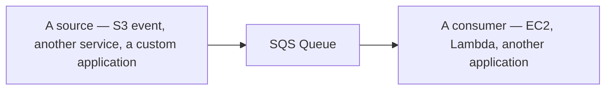

# 51 - Amazon SQS Integration With AWS Services

> Goal: preview the different ways SQS commonly connects with other AWS services — EC2, Lambda, and S3-triggered pipelines — each covered in its own dedicated note right after this one.

---

## 1. The core pattern: SQS as a buffer between two other services

SQS rarely sits alone — its entire value comes from being the **buffer** between something that produces work and something that consumes it. This note is a short map of the three specific integration patterns this folder covers next.

---

## 2. The three patterns ahead

| Note | Pattern |
|---|---|
| [SQS + EC2 Integration](52-SQS-EC2-Integration.md) | EC2 instances **poll** the queue themselves — full control over polling logic, typically for longer-running or specialized processing |
| [Amazon SQS + AWS Lambda](53-Amazon-SQS-AWS-Lambda.md) | Lambda's **event source mapping** polls SQS **on your behalf** — the more common, more "serverless" pattern |
| [S3 + SQS + Lambda](54-S3-SQS-Lambda.md) | A three-service pipeline — S3 event notifications feed SQS, which feeds Lambda — a genuinely common real-world architecture |

---

## 3. Why SQS shows up as "glue" so often

Because SQS decouples timing and availability (as the [Application Integration Basic](02-Application-Integration-Basic.md) note covered generally), it's a natural fit **between** almost any two AWS services where one produces events/work faster or less predictably than the other can consume it — which is why it appears in so many different combinations across real AWS architectures.

---

## 4. Recap

- SQS's core role in most real architectures is as a **buffer** between a producer and a consumer, not a standalone destination.
- EC2, Lambda, and S3-triggered pipelines are the three most common consumer-side patterns, each covered in the next three notes.
- Next: the [SQS + EC2 Integration](52-SQS-EC2-Integration.md) note.

### Sources
- [Amazon SQS and other AWS services — AWS docs](https://docs.aws.amazon.com/AWSSimpleQueueService/latest/SQSDeveloperGuide/welcome.html)
