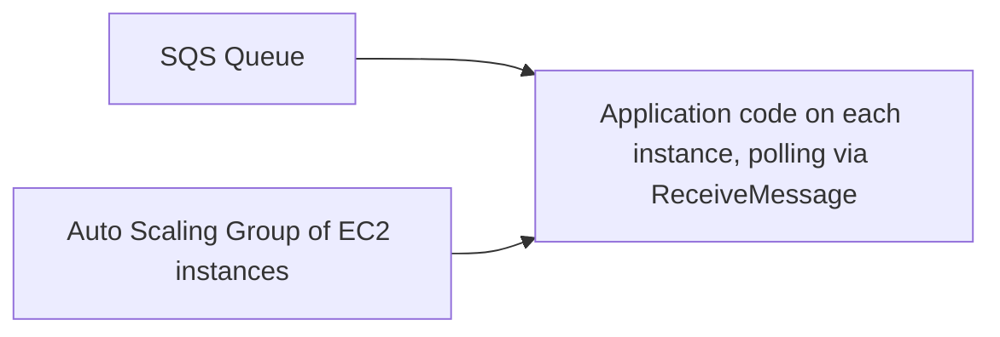

# 52 - SQS + EC2 Integration

> Goal: understand the EC2-as-consumer pattern — where instances actively poll a queue themselves — and when this genuinely fits better than the Lambda-based pattern covered next.

---

## 1. The pattern

An EC2 instance runs application code that calls `ReceiveMessage` itself (typically in a loop), processes whatever it receives, and calls `DeleteMessage` when done — the instance is fully in control of its own polling behavior, retry logic, and processing lifecycle.

---

## 2. Why choose EC2 over Lambda for this

| Reason | Detail |
|---|---|
| **Long-running processing** | Jobs that genuinely take longer than Lambda's maximum execution duration |
| **Specialized runtime/software needs** | Processing that depends on software, licenses, or a runtime environment not easily packaged for Lambda |
| **Fine-grained control over polling behavior** | Custom batching, custom concurrency handling, or integration with existing application code already running on EC2 |

---

## 3. Scaling consumers with the queue itself

A common, genuinely practical pattern: attach a CloudWatch alarm on the queue's **`ApproximateNumberOfMessagesVisible`** metric, and use it to drive an **Auto Scaling Group's** scaling policy — more backlog means more consumer instances spin up automatically, and the group scales back down once the backlog clears.

> 🎯 **Exam tip**: "scale EC2 consumer capacity automatically based on queue depth" → a CloudWatch alarm on **`ApproximateNumberOfMessagesVisible`** feeding an **Auto Scaling** policy — this is the standard, exam-favorite answer for "queue-based autoscaling."

---

## 4. Recap

- EC2 consumers poll SQS directly, giving full control over polling/processing logic — the right fit for long-running or specialized workloads.
- Queue depth (`ApproximateNumberOfMessagesVisible`) is the standard metric for driving Auto Scaling of the consumer fleet.
- Next: the [Amazon SQS + AWS Lambda](53-Amazon-SQS-AWS-Lambda.md) note — the more common, fully managed alternative to this pattern.

### Sources
- [Amazon SQS and Amazon EC2 Auto Scaling — AWS docs](https://docs.aws.amazon.com/autoscaling/ec2/userguide/as-using-sqs-queue.html)
