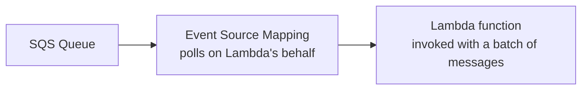

# 53 - Amazon SQS + AWS Lambda

> Goal: understand the more commonly used SQS consumer pattern — Lambda's **event source mapping** — where AWS itself handles the polling, contrasted directly with the [SQS + EC2](52-SQS-EC2-Integration.md) note's manual-polling approach.

---

## 1. The pattern: Lambda doesn't poll, AWS polls for it

An **event source mapping** is a resource you create that continuously polls the SQS queue in the background, and **invokes your Lambda function** with a batch of messages whenever any are available — the function itself never calls `ReceiveMessage` directly.

---

## 2. Key configuration: batch size and behavior on failure

| Setting | What it controls |
|---|---|
| **Batch size** | How many messages are delivered to a single Lambda invocation (up to 10,000 for Standard queues, lower limits for FIFO) |
| **Batch window** | How long to wait, collecting messages, before invoking — even if the batch size hasn't been reached yet |
| **Partial batch response** | Lets the function report **which specific messages** in a batch failed, so only those get retried/redelivered — rather than the whole batch being retried on any single message's failure |

---

## 3. Why this is the more common serverless pattern

- **No infrastructure to manage** — no EC2 instances, no custom polling loop code.
- **Automatic scaling** — Lambda concurrency scales with queue depth automatically.
- **Simpler failure handling** — a failed invocation's messages become visible again automatically (standard SQS visibility timeout behavior), and a configured DLQ (from earlier in this folder) still applies on top.

> 🎯 **Exam tip**: "process SQS messages without managing any servers, and automatically scale with queue depth" → **Lambda with an SQS event source mapping** — genuinely the default, expected answer for a serverless SQS consumer scenario, unless the question specifically flags a Lambda-incompatible requirement (long-running jobs, specialized runtime) that would point back to [SQS + EC2](52-SQS-EC2-Integration.md) instead.

---

## 4. Recap

- Lambda's **event source mapping** polls SQS on the function's behalf — the function just receives a batch of messages as its `event`.
- **Batch size**, **batch window**, and **partial batch response** are the key tuning knobs.
- This is the default, most common serverless SQS consumer pattern — EC2 remains the right fit specifically for long-running or specialized processing needs.
- Next: the [S3 + SQS + Lambda](54-S3-SQS-Lambda.md) note — combining this pattern with an S3-triggered pipeline.

### Sources
- [Using Lambda with Amazon SQS — AWS docs](https://docs.aws.amazon.com/lambda/latest/dg/with-sqs.html)
