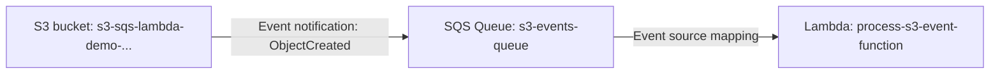

# 54 - S3 + SQS + Lambda

> Goal: build a real three-service pipeline — S3 upload → SQS queue → Lambda processing — proving the [SQS Access Policy](43-SQS-Access-Policy.md) note's warning about missing S3 permissions directly, since this exact pipeline is where that gotcha most commonly bites. Entirely via the **AWS Console**.

---

## 1. What you're building



Why insert SQS between S3 and Lambda at all, rather than triggering Lambda directly from S3? The queue adds a **buffer** — if Lambda is throttled or briefly unavailable, events wait safely in the queue instead of being lost, and it naturally smooths out a burst of many simultaneous uploads.

---

## 2. Step 1 — Create the queue and the bucket

1. **SQS console** → **Create queue** → **Type**: **Standard** → **Name**: `s3-events-queue` → **Create queue**.
2. **S3 console** → **Create bucket** → `s3-sqs-lambda-demo-<your-name-or-date>` → **Create bucket**.

---

## 3. Step 2 — Grant S3 permission via the queue's Access Policy

1. `s3-events-queue` → **Access policy** → **Edit** → add a statement allowing `sqs:SendMessage` from the `s3.amazonaws.com` service principal, with a condition scoping `aws:SourceArn` to your bucket's ARN.
2. **Save**. This is exactly the step the [SQS Access Policy](43-SQS-Access-Policy.md) note flagged as commonly missed — without it, the next section's event notification will silently fail to deliver anything.

---

## 4. Step 3 — Configure the S3 event notification

1. `s3-sqs-lambda-demo-<...>` → **Properties** → **Event notifications** → **Create event notification**.
2. **Event name**: `notify-sqs-on-upload` → **Event types**: **All object create events**.
3. **Destination**: **SQS Queue** → select `s3-events-queue` → **Save changes**.

---

## 5. Step 4 — Create the Lambda function and its event source mapping

1. **Lambda console** → **Create function** → `process-s3-event-function` → **Python 3.13**.
2. Code:
   ```python
   import json

   def lambda_handler(event, context):
       for record in event["Records"]:
           body = json.loads(record["body"])
           for s3_record in body.get("Records", []):
               key = s3_record["s3"]["object"]["key"]
               print(f"Processed new S3 object: {key}")
       return {"statusCode": 200}
   ```
3. **Deploy**.
4. **Configuration** → **Triggers** → **Add trigger** → **SQS** → select `s3-events-queue` → **Add**.

---

## 6. Step 5 — Test the full pipeline

1. **S3 console** → upload any small test file into `s3-sqs-lambda-demo-<...>`.
2. **Lambda console** → `process-s3-event-function` → **Monitor** → **View CloudWatch logs** → confirm a new log entry: `Processed new S3 object: <your-file-name>`.
3. **SQS console** → `s3-events-queue` → confirm **`ApproximateNumberOfMessagesVisible`** returns to 0 shortly after — the message was consumed and deleted by the Lambda trigger's event source mapping.

---

## 7. Troubleshooting

| Symptom | Likely cause |
|---|---|
| Nothing happens after uploading — no messages, no logs | Section 3's Access Policy statement is missing or incorrectly scoped — this is, by far, the most common cause |
| Messages pile up in the queue but Lambda never runs | The trigger in Section 5, Step 4 wasn't saved correctly, or the Lambda execution role lacks SQS read permissions (usually auto-added by the console when the trigger is created) |

---

## 8. Cleanup

1. **Lambda console** → delete `process-s3-event-function`.
2. **SQS console** → delete `s3-events-queue`.
3. **S3 console** → empty and delete `s3-sqs-lambda-demo-<...>`.

---

## 9. Recap

- This pipeline directly proved the [SQS Access Policy](43-SQS-Access-Policy.md) note's warning: without an explicit statement granting S3 permission to `SendMessage`, the entire pipeline goes silent with no obvious error.
- SQS's role here is purely as a **buffer** between S3's event and Lambda's processing — genuinely useful even for a simple pipeline like this one.
- Next: the [Priority Processing With Amazon SQS](55-Priority-Processing-With-Amazon-SQS.md) note — a different pattern, using multiple queues together.

### Sources
- [Configuring Amazon S3 event notifications — AWS docs](https://docs.aws.amazon.com/AmazonS3/latest/userguide/EventNotifications.html)
- [Amazon SQS policy examples — AWS docs](https://docs.aws.amazon.com/AWSSimpleQueueService/latest/SQSDeveloperGuide/sqs-policy-examples.html)
