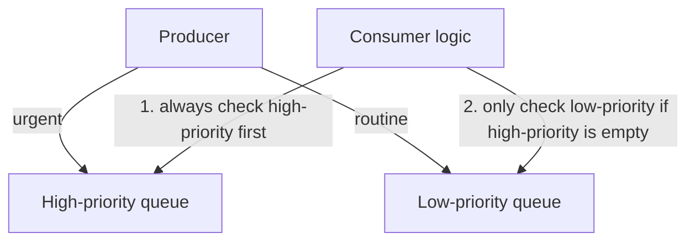

# 55 - Priority Processing With Amazon SQS

> Goal: understand how to build **priority-based processing** on top of SQS — a service with no native "priority" concept — using a simple, genuinely common multi-queue pattern.

---

## 1. The problem: SQS has no built-in priority field

A single SQS queue processes messages in **best-effort** order (Standard) or **strict FIFO** order (FIFO) — there's no setting that says "process this specific message before others already in the queue." Yet real systems often genuinely need this: a "premium" customer's request should be handled before a "free tier" customer's, for example.

---

## 2. Architecture & workflow — the standard two-(or more)-queue pattern

---

## 3. How the consumer actually implements this

The producer routes each message to the appropriate queue based on its priority. The **consumer's own polling logic** is what actually enforces priority: it polls the **high-priority queue first**, processes everything currently available there, and only polls the **low-priority queue** once the high-priority one is empty — repeating this cycle continuously.

> 🧠 This is a genuinely simple pattern precisely because it pushes the "priority" logic into **application code** rather than needing SQS itself to understand priority — SQS just provides two ordinary, separate queues, and the consumer's loop does the rest.

---

## 4. Why not just use one queue with a "priority" message attribute?

A single queue with a priority **attribute** doesn't actually change processing order — SQS still delivers messages in its normal (best-effort or FIFO) order regardless of any attribute value, since attributes are metadata, not a sorting key. Genuinely enforcing priority requires **separate queues** and consumer logic that checks them in the right order, exactly as shown above.

> 🎯 **Exam tip**: "process urgent requests before routine ones, using SQS" is the clearest signal for the **multiple-queues-by-priority** pattern — a scenario suggesting a single queue with a "priority field" as the fix is describing something that doesn't actually work, since SQS doesn't sort by message attributes.

---

## 5. Recap

- SQS has no native priority concept — priority is implemented with **separate queues per priority tier**, plus consumer logic that always checks the higher-priority queue first.
- A "priority" message attribute on a single queue does **not** change delivery order — it's just metadata.
- Next: the [AWS SQS Cheat Sheet](56-AWS-SQS-Cheat-Sheet.md) note — a compact recap of this entire SQS section.

### Sources
- [Amazon SQS message priority (community pattern, based on standard AWS multi-queue guidance) — AWS docs](https://docs.aws.amazon.com/AWSSimpleQueueService/latest/SQSDeveloperGuide/welcome.html)
