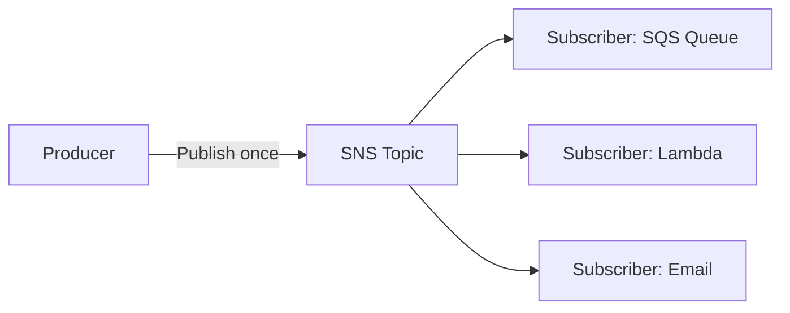

# 57 - Amazon SNS - Introduction

> Goal: get a first orientation to Amazon Simple Notification Service — a fundamentally different messaging model than SQS, despite both living under "asynchronous messaging."

---

## 1. The problem: one event, many interested parties

Imagine a new order is placed, and **three** different systems each need to know: a fulfillment system, an analytics pipeline, and a customer notification service. With SQS alone, the producer would need to send the same message to **three separate queues** itself. **Amazon SNS** solves this differently — the producer publishes **once**, to a **Topic**, and SNS delivers a copy to **every current subscriber** automatically.

---

## 2. Architecture & workflow

---

## 3. The core difference from SQS, at a glance

| | SQS | SNS |
|---|---|---|
| **Model** | Queue — one message, eventually consumed by **one** consumer | Topic — one message, delivered to **every** subscriber |
| **Delivery** | Pull-based — consumers poll | Push-based — SNS actively delivers |
| **Typical use** | Distribute **work** to be processed once | **Broadcast** an event/notification to multiple interested systems |

This project's [Amazon SQS vs. Amazon SNS](67-Amazon-SQS-Vs-Amazon-SNS.md) note, later in this section, covers this distinction in full depth once both services' mechanics are established.

---

## 4. Recap

- SNS is a **publish/subscribe (pub/sub)** service — one published message reaches every current subscriber of a topic.
- This is a fundamentally different delivery model from SQS's one-message-one-consumer queue.
- Next: the [Amazon SNS: The Push-Based Messaging Service](58-Amazon-SNS-The-Push-Based-Messaging-Service.md) note — going deeper on exactly what "push-based" means in practice.

### Sources
- [What is Amazon SNS? — AWS docs](https://docs.aws.amazon.com/sns/latest/dg/welcome.html)
