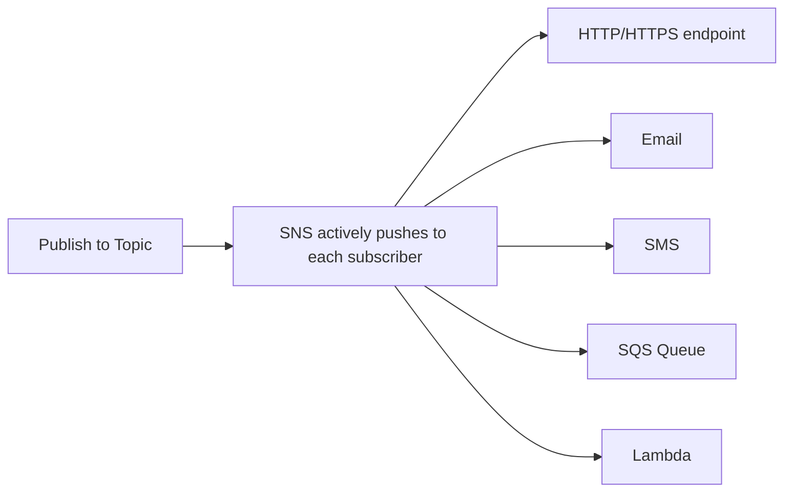

# 58 - Amazon SNS: The Push-Based Messaging Service

> Goal: understand exactly what "push-based" means for SNS, in direct contrast to the [SQS Pull-Based Mechanism](37-SQS-Pull-Based-Mechanism.md) note's polling model.

---

## 1. The core idea: SNS initiates delivery, subscribers don't ask

With SQS, a consumer must actively call `ReceiveMessage`. With SNS, the moment a message is **published** to a topic, SNS itself immediately attempts to **deliver** it to every current subscriber — the subscriber never polls or requests anything.

---

## 2. Architecture & workflow

---

## 3. What this push model actually enables

- **Near-instant delivery** — no polling interval to wait out; delivery attempts begin immediately on publish.
- **Fan-out to many subscriber types at once** — SQS queues, Lambda functions, HTTP(S) endpoints, email, and SMS can all subscribe to the **same** topic simultaneously.
- **Automatic retries with backoff** — for delivery failures, SNS retries according to a configurable **delivery policy** (covered later in this section).

---

## 4. Why this matters for choosing between SQS and SNS

> 🎯 **Exam tip**: "notify multiple different systems the instant an event happens, with no polling delay" is the clearest SNS signal — if the scenario instead emphasizes **one worker eventually processing a piece of work**, that's SQS's pull model, not SNS's push model.

---

## 5. Recap

- SNS **pushes** messages to subscribers the instant they're published — subscribers never poll.
- A single topic can push to many different subscriber types simultaneously — SQS, Lambda, HTTP(S), email, SMS.
- Next: the [SNS Core Components](59-SNS-Core-Components.md) note — the actual pieces (Topics, Subscriptions, Publishers) this push model runs on.

### Sources
- [What is Amazon SNS? — AWS docs](https://docs.aws.amazon.com/sns/latest/dg/welcome.html)
