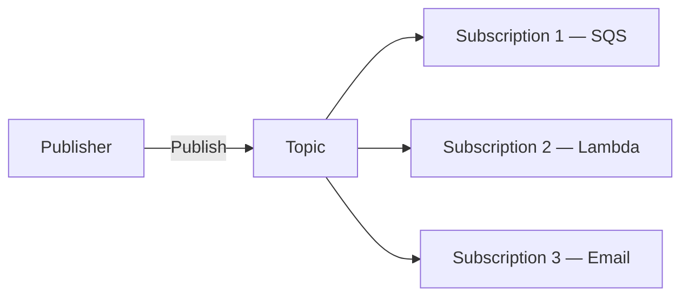

# 59 - SNS Core Components

> Goal: name and understand the actual pieces SNS is built from — Topic, Publisher, Subscriber, Subscription — the vocabulary every later SNS note in this folder assumes.

---

## 1. The core components

| Component | What it is |
|---|---|
| **Topic** | The named channel messages are published to — the actual AWS resource you create |
| **Publisher** | Whatever sends messages to the topic — an application, another AWS service, a person via the console |
| **Subscriber** | An endpoint that has registered interest in a topic's messages |
| **Subscription** | The actual **registration** connecting a specific subscriber (its type and address/ARN) to a specific topic |

---

## 2. Supported subscriber (protocol) types

- **Amazon SQS** — deliver messages into a queue.
- **AWS Lambda** — invoke a function directly with the message.
- **HTTP/HTTPS** — deliver via a webhook-style POST to any reachable endpoint.
- **Email / Email-JSON** — deliver as a human-readable email, or as raw JSON.
- **SMS** — deliver as a text message.
- **Mobile push notifications** — deliver to iOS/Android apps via the relevant push service.

---

## 3. Confirming a subscription

Most subscription types (notably **email** and **HTTP/HTTPS**) require an explicit **confirmation step** before they actually start receiving messages — SNS sends a confirmation request to the endpoint, and delivery only begins once it's confirmed. This is a genuinely important, easy-to-forget detail: **an unconfirmed subscription silently receives nothing**, with no error shown to the publisher.

> 🎯 **Exam tip**: "messages were published successfully but a specific subscriber never received anything" — check whether that **subscription was actually confirmed**, before assuming a deeper delivery problem.

---

## 4. Recap

- **Topic**, **Publisher**, **Subscriber**, and **Subscription** are the four foundational SNS building blocks.
- SNS supports a genuinely wide range of subscriber protocols in one topic — SQS, Lambda, HTTP(S), email, SMS, mobile push.
- Many subscription types require **explicit confirmation** before delivery begins — an unconfirmed subscription fails silently.
- Next: the [SNS Standard Vs FIFO Topic](60-SNS-Standard-Vs-FIFO-Topic.md) note — the foundational topic-type decision, mirroring SQS's own Standard-vs-FIFO choice.

### Sources
- [Amazon SNS concepts and terminology — AWS docs](https://docs.aws.amazon.com/sns/latest/dg/welcome.html)
- [Amazon SNS endpoints and clients — AWS docs](https://docs.aws.amazon.com/sns/latest/dg/sns-supported-protocols.html)
