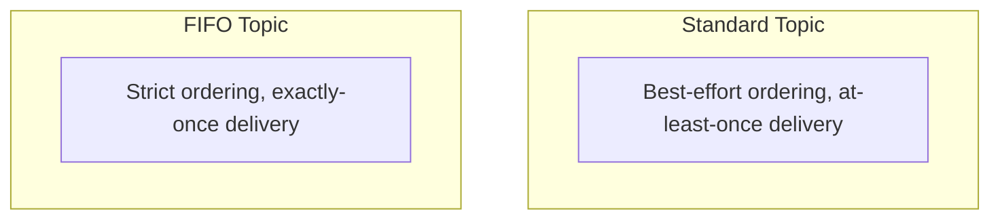

# 60 - SNS Standard Vs FIFO Topic

> Goal: understand SNS's own Standard-vs-FIFO decision — genuinely parallel to [SQS's Standard-vs-FIFO decision](38-Types-Of-SQS-Queues.md), but applied to topics instead of queues, with one important restriction worth knowing up front.

---

## 1. The two topic types

| | Standard Topic | FIFO Topic |
|---|---|---|
| **Ordering** | Best-effort | Strict, guaranteed |
| **Delivery** | At-least-once (possible duplicates) | Exactly-once |
| **Throughput** | Very high | Limited, matching FIFO SQS-style throughput constraints |
| **Naming** | Any name | Must end in `.fifo` |
| **Subscriber restriction** | Any supported subscriber type | **SQS FIFO queues only** — this is the important restriction |

---

## 2. The restriction that matters most: FIFO topics can only fan out to FIFO queues

A **FIFO SNS topic** can only deliver to **FIFO SQS queues** as subscribers — it cannot directly push to Lambda, HTTP endpoints, email, or a Standard SQS queue while preserving its ordering guarantee. This makes sense once you consider it: those other subscriber types have no concept of "message group" ordering to preserve, so SNS restricts FIFO topics to the one subscriber type that can actually honor the guarantee end to end.

> 🎯 **Exam tip**: "we need strict ordering all the way from an SNS topic through to final processing, fanned out to multiple queues" → **FIFO SNS Topic subscribing to multiple FIFO SQS queues** — and remember this combination is **SQS-only**, a detail worth memorizing directly since it's easy to assume FIFO topics work like Standard topics with any subscriber type.

---

## 3. Recap

- **Standard Topics**: best-effort order, at-least-once delivery, any subscriber type, very high throughput.
- **FIFO Topics**: strict order, exactly-once delivery, but subscribers are **restricted to FIFO SQS queues only**.
- Next: the [SNS Standard Topic All Configuration Options](61-SNS-Standard-Topic-All-Configuration-Options.md) note — the settings available on a Standard topic specifically.

### Sources
- [Amazon SNS FIFO topics — AWS docs](https://docs.aws.amazon.com/sns/latest/dg/sns-fifo-topics.html)
