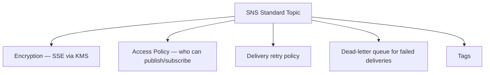

# 61 - SNS Standard Topic All Configuration Options

> Goal: survey the configuration surface available on a Standard SNS topic — a checklist worth reviewing before the hands-on build in the next note.

---

## 1. The main configuration areas

| Setting | What it controls |
|---|---|
| **Encryption** | Server-side encryption at rest, using an AWS managed or customer managed KMS key — the same model as [SQS Encryption](42-SQS-Encryption.md) |
| **Access Policy** | A resource-based IAM policy controlling who can `Publish`/`Subscribe` — the same resource-based-policy pattern as [SQS's Access Policy](43-SQS-Access-Policy.md) |
| **Delivery retry policy** | How SNS retries failed deliveries to HTTP(S) endpoints specifically — covered in depth in the [SNS Delivery Policy Lab](63-SNS-Delivery-Policy-Lab.md) |
| **Dead-letter queue** | An SQS queue that captures messages SNS couldn't successfully deliver to a subscriber after exhausting retries |
| **Tags** | Standard AWS resource tagging, for cost allocation/organization |

---

## 2. Recap

- A Standard topic's configuration mirrors several patterns already covered for SQS — encryption, access policy, and a DLQ concept — applied to topic delivery instead of queue consumption.
- **Delivery retry policy** is unique to SNS's push model, since there's no equivalent "retry" concept for a pull-based SQS consumer.
- Next: the [Create Standard SNS Topic](62-Create-Standard-SNS-Topic.md) note — building one of these for real.

### Sources
- [Amazon SNS topic attributes — AWS docs](https://docs.aws.amazon.com/sns/latest/api/API_SetTopicAttributes.html)
- [Amazon SNS message encryption — AWS docs](https://docs.aws.amazon.com/sns/latest/dg/sns-server-side-encryption.html)
