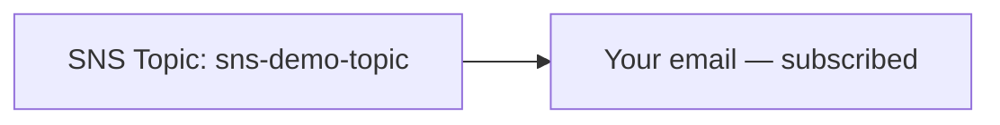

# 62 - Create Standard SNS Topic

> Goal: build a real Standard SNS topic, subscribe an email address, confirm the subscription, and publish a real message — directly proving the [SNS Core Components](59-SNS-Core-Components.md) note's subscription-confirmation warning. Entirely via the **AWS Console**.

---

## 1. What you're building

---

## 2. Step 1 — Create the topic

1. **SNS console** → **Topics** → **Create topic**.
2. **Type**: **Standard**.
3. **Name**: `sns-demo-topic`.
4. Leave other settings at their defaults → **Create topic**.

---

## 3. Step 2 — Subscribe your email

1. `sns-demo-topic` → **Create subscription**.
2. **Protocol**: **Email**.
3. **Endpoint**: your email address → **Create subscription**.
4. The subscription's status shows **Pending confirmation**.

---

## 4. Step 3 — Prove the confirmation requirement directly

1. **Before** confirming anything, go to **Publish message** → **Subject**: `test-before-confirm` → **Message body**: `this should not arrive` → **Publish message**.
2. Check your inbox — confirm **no** notification email arrives, even though the publish succeeded — direct, observed proof of [SNS Core Components](59-SNS-Core-Components.md) Section 3: an unconfirmed subscription receives nothing, silently.
3. Now check your inbox for the **original subscription confirmation email** (sent in Section 3) → click **Confirm subscription**.
4. Back in the SNS console, confirm the subscription's status is now **Confirmed**.

---

## 5. Step 4 — Publish again, now that it's confirmed

1. **Publish message** → **Subject**: `test-after-confirm` → **Message body**: `Hello from DevopsWithDeepak's SNS demo` → **Publish message**.
2. Check your inbox → confirm the email **does** arrive this time.

---

## 6. Troubleshooting

| Symptom | Likely cause |
|---|---|
| Confirmation email never arrives | Check spam/junk folders — SNS confirmation emails are sometimes filtered |
| Message published but nothing arrives even after confirming | Confirm the subscription's status genuinely shows **Confirmed**, not still **Pending** |

---

## 7. Cleanup

1. **SNS console** → delete `sns-demo-topic` (this also removes its subscription).

---

## 8. Recap

- A message published to an unconfirmed subscription genuinely goes nowhere — no error is raised, it just silently doesn't arrive.
- Confirming the subscription is a one-time, real console step, not just a formality — this demo proved both states directly.
- Next: the [SNS Delivery Policy - Lab](63-SNS-Delivery-Policy-Lab.md) note — configuring how SNS retries failed deliveries to less-forgiving endpoint types like HTTP(S).

### Sources
- [Creating an Amazon SNS topic — AWS docs](https://docs.aws.amazon.com/sns/latest/dg/sns-create-topic.html)
- [Subscribing an endpoint to an Amazon SNS topic — AWS docs](https://docs.aws.amazon.com/sns/latest/dg/sns-create-subscribe-endpoint-to-topic.html)
