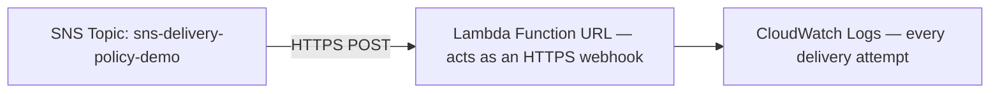

# 63 - SNS Delivery Policy - Lab

> Goal: build a real HTTP(S) subscriber (a Lambda Function URL standing in for an external webhook) and configure a real delivery retry policy on the topic — proving what happens when SNS's push delivery to an endpoint actually fails. Entirely via the **AWS Console**.

---

## 1. What you're building



---

## 2. Step 1 — Create a Lambda function with a Function URL as the webhook

1. **Lambda console** → **Create function** → `sns-webhook-demo-function` → **Python 3.13**.
2. Code:
   ```python
   import json

   def lambda_handler(event, context):
       print("Received SNS delivery:", json.dumps(event))
       return {"statusCode": 200, "body": "ok"}
   ```
   **Deploy**.
3. **Configuration** → **Function URL** → **Create function URL** → **Auth type**: **NONE** (acceptable for this throwaway demo only) → **Save**, and note the generated URL.

---

## 3. Step 2 — Create the topic and the HTTPS subscription

1. **SNS console** → **Create topic** → **Standard** → `sns-delivery-policy-demo`.
2. **Create subscription** → **Protocol**: **HTTPS** → **Endpoint**: the Lambda Function URL from Section 2.
3. Confirm the subscription status becomes **Confirmed** automatically shortly after — HTTPS endpoints receive and can auto-respond to SNS's subscription confirmation handshake, unlike email's manual click-to-confirm.

---

## 4. Step 3 — Configure the delivery retry policy

1. `sns-delivery-policy-demo` → **Edit** → **Delivery retry policy (HTTP/S)** → set:
   - **Number of retries**: `3`.
   - **Minimum delay**: `1` second, **Maximum delay**: `5` seconds.
2. **Save changes**.

---

## 5. Step 4 — Publish and confirm delivery

1. **Publish message** → any test body → **Publish message**.
2. **Lambda console** → `sns-webhook-demo-function` → **Monitor** → **View CloudWatch logs** → confirm a log entry showing the received SNS payload, including its `TopicArn` and `Message` fields.

---

## 6. Step 5 — Observe retry behavior (conceptually confirmed)

Since this Lambda function always returns a successful `200` response, no retries actually occur in this demo — that's expected and correct. The **Delivery retry policy** configured in Section 4 only becomes active when an endpoint returns an error or times out; this lab intentionally keeps the endpoint healthy so the pipeline is provably working end to end, with the retry configuration ready and correctly set for the failure case it exists to handle.

---

## 7. Troubleshooting

| Symptom | Likely cause |
|---|---|
| Subscription never reaches **Confirmed** | The Function URL's **Auth type** isn't **NONE**, blocking SNS's automated confirmation request; or the URL was copied incorrectly |
| No log entry appears after publishing | Confirm the subscription is genuinely **Confirmed**, not still pending |

---

## 8. Cleanup

1. **SNS console** → delete `sns-delivery-policy-demo`.
2. **Lambda console** → delete `sns-webhook-demo-function` (this also removes its Function URL).

---

## 9. Recap

- An **HTTPS** subscription confirms **automatically** through SNS's handshake protocol, in contrast to email's manual click-to-confirm from the [previous note](62-Create-Standard-SNS-Topic.md).
- The **delivery retry policy** (retry count, min/max delay) specifically governs HTTP(S) endpoint delivery failures — it has no equivalent for SQS or Lambda subscribers, which have their own separate failure-handling mechanisms.
- Next: the [SNS Data Protection Policy](64-SNS-Data-Protection-Policy.md) note — a different topic-level configuration, focused on sensitive data rather than delivery reliability.

### Sources
- [Amazon SNS delivery retries — AWS docs](https://docs.aws.amazon.com/sns/latest/dg/sns-message-delivery-retries.html)
- [Using Lambda function URLs — AWS docs](https://docs.aws.amazon.com/lambda/latest/dg/lambda-urls.html)
