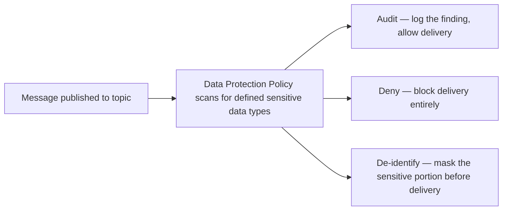

# 64 - SNS Data Protection Policy

> Goal: understand SNS's **Data Protection Policy** — a feature specifically for catching and handling sensitive data (like PII) that ends up inside message content, distinct from the [encryption](61-SNS-Standard-Topic-All-Configuration-Options.md) settings already covered.

---

## 1. The problem: encryption doesn't stop sensitive data from being *in* the message at all

Encryption protects data **in transit and at rest** from unauthorized third parties — but it does nothing to prevent a well-meaning developer from accidentally publishing a message containing a real credit card number or social security number in the first place. **Data Protection Policies** address a different question: **should this specific kind of sensitive data be allowed in messages at all**, and if found, what should happen to it.

---

## 2. Architecture & workflow

---

## 3. What it can detect and do

- **Detects** common sensitive data categories out of the box — credit card numbers, bank account numbers, and other **PII (Personally Identifiable Information)** patterns.
- **Actions**: **Audit** (log the detection but still deliver), **Deny** (block the publish/delivery entirely), or **De-identify** (mask the sensitive portion, e.g. replacing digits with asterisks, before it reaches subscribers).
- Applied **per topic**, as a JSON policy document defining which data types to look for and which action to take for each.

> 🎯 **Exam tip**: "prevent messages containing credit card numbers from ever being delivered to subscribers, even accidentally" → **SNS Data Protection Policy with a Deny action** — this is a content-inspection control, genuinely distinct from encryption or access-policy-based controls, which don't look inside message content at all.

---

## 4. Recap

- **Data Protection Policy** inspects message **content** for sensitive data types (PII, card numbers), independent of encryption or access control.
- Three actions: **Audit**, **Deny**, or **De-identify** — applied per topic.
- Next: the [SNS Fan-Out](65-SNS-Fan-Out.md) note — the architectural pattern SNS is arguably best known for.

### Sources
- [Amazon SNS data protection policies — AWS docs](https://docs.aws.amazon.com/sns/latest/dg/sns-message-data-protection.html)
