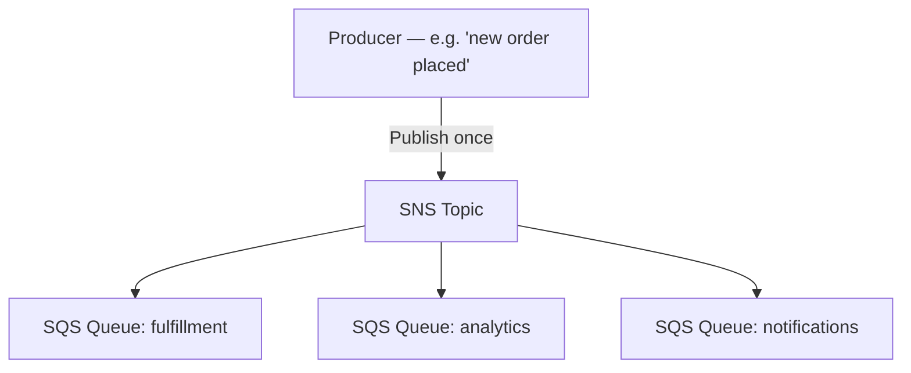

# 65 - SNS Fan-Out

> Goal: understand the **Fan-Out** pattern — arguably SNS's single most exam-favorite architecture — combining everything the last several notes covered into one coherent, genuinely common real-world design.

---

## 1. The problem this solves

The [SNS Introduction](57-Amazon-SNS-Introduction.md) note opened with this exact scenario: one event, multiple interested systems. **Fan-Out** is the formal name for the pattern of publishing **once** to an SNS topic and having it reliably reach **multiple SQS queues** (one per consuming system), each processed completely independently.

---

## 2. Architecture & workflow

---

## 3. Why SNS + SQS specifically, not SNS alone

Publishing directly to Lambda or HTTP(S) endpoints works, but pairing SNS with **SQS queues as subscribers** adds real durability: if the "analytics" system is down for maintenance, its messages simply **wait in its own queue** rather than being lost — each downstream system gets its **own independent buffer**, with its own retry/DLQ behavior, entirely decoupled from how the other systems are doing.

> 🧠 This is precisely why Fan-Out combines the two services' strengths: SNS's **one-to-many broadcast** plus SQS's **durable, per-consumer buffering** — neither service alone gives you both properties.

---

## 4. Recap

- **Fan-Out**: one SNS publish reaches multiple SQS queues, each consumed completely independently.
- Using SQS (rather than Lambda/HTTP directly) as the subscribers adds durability — one slow/down consumer doesn't affect the others or lose messages.
- Next: the [SNS Subscription Filter Policy](66-SNS-Subscription-Filter-Policy.md) note — refining Fan-Out so each subscriber only receives the messages actually relevant to it.

### Sources
- [Fanout to Amazon SQS queues — AWS docs](https://docs.aws.amazon.com/sns/latest/dg/sns-common-scenarios.html)
