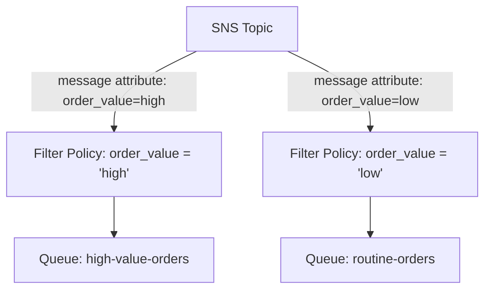

# 66 - SNS Subscription Filter Policy

> Goal: refine the [Fan-Out](65-SNS-Fan-Out.md) pattern with **Filter Policies** — so each subscriber only receives the specific subset of messages it actually cares about, rather than every single message published to the topic.

---

## 1. The problem: not every subscriber wants every message

In a pure Fan-Out setup, **every** subscriber to a topic receives **every** message published to it. But realistically, a "high-value-order" notification system probably doesn't need to see routine, low-value order events — without filtering, every subscriber has to receive everything and filter it out **themselves**, wasting processing and complicating consumer code.

---

## 2. Architecture & workflow

---

## 3. How it actually works

1. The **publisher** includes **message attributes** on each published message (e.g. `order_value: "high"`).
2. Each **subscription** (not the topic itself) has its own **Filter Policy** — a JSON document describing which attribute values that specific subscriber wants.
3. SNS evaluates each subscription's filter policy against the message's attributes at publish time — only subscriptions whose filter policy **matches** actually receive that particular message.

---

## 4. Why this is genuinely valuable

- **Reduces unnecessary processing** — a subscriber never even receives a message it was always going to discard.
- **Reduces cost** — fewer actual message deliveries (and fewer downstream Lambda invocations, if applicable) for messages a subscriber doesn't need.
- **Simplifies consumer code** — filtering logic moves out of application code and into declarative SNS configuration.

> 🎯 **Exam tip**: "different subscribers to the same topic should only receive a relevant subset of messages, based on message attributes" → **Subscription Filter Policy** — a genuinely common way the exam tests whether you know Fan-Out can be selective, not just all-or-nothing.

---

## 5. Recap

- **Filter Policies** are configured **per subscription**, not per topic — each subscriber can have completely different filtering criteria.
- Filtering is based on **message attributes**, evaluated by SNS before delivery — the subscriber never even sees a non-matching message.
- Next: the [Amazon SQS Vs Amazon SNS](67-Amazon-SQS-Vs-Amazon-SNS.md) note — the direct comparison, now that both services' mechanics are fully covered.

### Sources
- [Amazon SNS message filtering — AWS docs](https://docs.aws.amazon.com/sns/latest/dg/sns-message-filtering.html)
