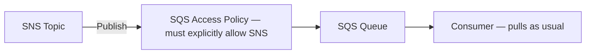

# 68 - SNS + SQS Integration

> Goal: understand the mechanics of subscribing an SQS queue to an SNS topic — the technical foundation behind the [Fan-Out](65-SNS-Fan-Out.md) pattern — before building it for real in the next note's lab.

---

## 1. The core idea

An SQS queue can be a **subscriber** to an SNS topic, exactly like an email address or a Lambda function can. Once subscribed, every message published to the topic gets **delivered into that queue** as a new SQS message — from that point on, it behaves like any other SQS message: pulled by a consumer, subject to visibility timeout, eligible for a DLQ, and so on.

---

## 2. Architecture & workflow

---

## 3. The permission piece — this is not automatic

Just like the [S3 + SQS + Lambda](54-S3-SQS-Lambda.md) note's pipeline, subscribing a queue to a topic **through the console's subscription wizard doesn't automatically fix cross-service permissions on its own** in every path — the queue's **Access Policy** needs a statement allowing the `sns.amazonaws.com` service principal to call `SendMessage`, scoped to the specific topic's ARN. The **SNS console's own subscription creation flow can add this automatically** when both resources are in the same account — but it's worth understanding explicitly, since it's the same underlying mechanism as every other resource-based-policy gotcha covered in this project.

---

## 4. What this combination is actually good for

- **Fan-Out**, as already covered — one topic, multiple SQS queues, each an independent durable buffer.
- **Adding durability to a push-based system** — a subscriber that would otherwise be a fragile HTTP endpoint becomes a durable, retryable queue instead.
- **Decoupling a burst-prone publisher from a rate-limited consumer** — the queue absorbs the burst; the topic doesn't need to know or care how fast the consumer processes.

---

## 5. Recap

- Subscribing an SQS queue to an SNS topic turns every topic publish into a new, ordinary SQS message in that queue.
- The queue's Access Policy must explicitly allow the SNS service to send to it — the same resource-based-policy pattern seen throughout this folder.
- Next: the [SNS + SQS Integration Lab Setup](69-SNS-SQS-Integration-Lab-Setup.md) note — building this for real, with two separate queues fanning out from one topic.

### Sources
- [Fanout to Amazon SQS queues — AWS docs](https://docs.aws.amazon.com/sns/latest/dg/sns-sqs-as-subscriber.html)
