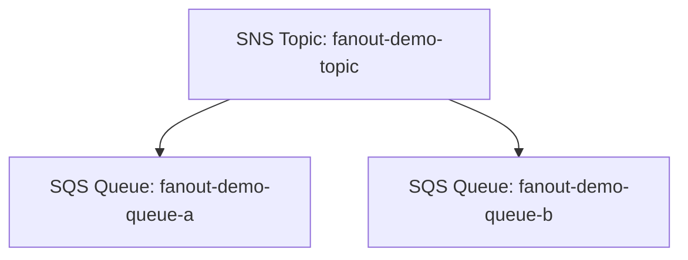

# 69 - SNS + SQS Integration Lab Setup

> Goal: build a real Fan-Out — one SNS topic, two independent SQS queues — and prove a single publish genuinely reaches both, each processed on its own schedule. Entirely via the **AWS Console**.

---

## 1. What you're building

---

## 2. Step 1 — Create the two queues

1. **SQS console** → **Create queue** → **Standard** → `fanout-demo-queue-a` → **Create queue**.
2. Repeat → `fanout-demo-queue-b`.

---

## 3. Step 2 — Create the topic

1. **SNS console** → **Create topic** → **Standard** → `fanout-demo-topic` → **Create topic**.

---

## 4. Step 3 — Subscribe both queues, using SNS's built-in permission handling

1. `fanout-demo-topic` → **Create subscription** → **Protocol**: **Amazon SQS** → **Endpoint**: select `fanout-demo-queue-a`'s ARN.
2. When prompted about queue access policy, allow the console to **automatically add the required permission** to the queue's Access Policy — this is the mechanism the [SNS + SQS Integration](68-SNS-SQS-Integration.md) note referred to.
3. Repeat: **Create subscription** → `fanout-demo-queue-b`.
4. Confirm both subscriptions show status **Confirmed** immediately — SQS subscriptions, unlike email, confirm automatically without a manual click.

---

## 5. Step 4 — Verify the access policy really was updated

1. `fanout-demo-queue-a` → **Access policy** → confirm a statement now exists allowing `sns.amazonaws.com` to `SendMessage`, conditioned on `fanout-demo-topic`'s ARN.
2. Repeat for `fanout-demo-queue-b`.

---

## 6. Step 5 — Publish once, receive in both

1. `fanout-demo-topic` → **Publish message** → **Message body**: `{"event": "fanout-test", "value": 42}` → **Publish message**.
2. **SQS console** → `fanout-demo-queue-a` → **Send and receive messages** → **Poll for messages** → confirm the message arrived.
3. Repeat for `fanout-demo-queue-b` → confirm the **same** message arrived there too, independently.

---

## 7. Troubleshooting

| Symptom | Likely cause |
|---|---|
| Message arrives in one queue but not the other | Recheck that **both** queues actually show a **Confirmed** subscription in the SNS console |
| Neither queue receives anything | The access policy update in Step 3 wasn't applied — manually verify both queues' Access Policy statements from Section 5 |

---

## 8. Cleanup

1. **SNS console** → delete `fanout-demo-topic` (this removes both subscriptions).
2. **SQS console** → delete `fanout-demo-queue-a` and `fanout-demo-queue-b`.

---

## 9. Recap

- A single publish to `fanout-demo-topic` reached **both** independent queues — real, observed Fan-Out, not just a described concept.
- The SNS console's subscription wizard **can** automatically wire the required SQS Access Policy permission when creating an SQS subscription — genuinely convenient, though understanding the underlying mechanism (from the previous note) still matters for troubleshooting.
- Next: the [SNS FIFO Configuration](70-SNS-FIFO-Configuration.md) note — the same integration pattern, applied to ordered, exactly-once delivery.

### Sources
- [Fanout to Amazon SQS queues — AWS docs](https://docs.aws.amazon.com/sns/latest/dg/sns-sqs-as-subscriber.html)
