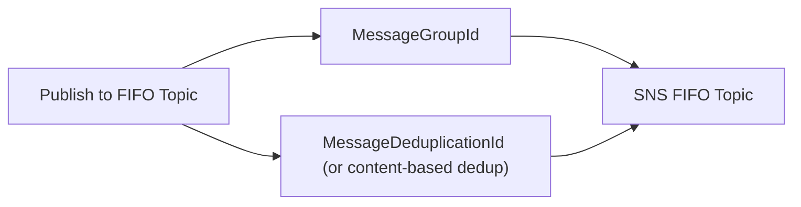

# 70 - SNS FIFO Configuration

> Goal: revisit [SNS Standard vs. FIFO Topics](60-SNS-Standard-Vs-FIFO-Topic.md) with the actual configuration details — Message Group ID and Message Deduplication ID at the SNS layer — mirroring the same concepts already covered for SQS FIFO queues.

---

## 1. The core idea

Configuring an SNS **FIFO topic** requires the same two pieces of information as an SQS FIFO queue, supplied by the **publisher**:

| Setting | What it does |
|---|---|
| **Message Group ID** | Groups related messages that must stay strictly ordered relative to each other — identical concept to [SQS's Message Group ID](48-SQS-Deduplication-Scope.md) |
| **Message Deduplication ID** (or content-based deduplication) | Prevents duplicate publishes within the same 5-minute window — identical concept to [SQS's FIFO Deduplication](47-SQS-FIFO-Deduplication.md) |

---

## 2. Why this consistency matters

AWS deliberately reused the **same mental model** across SQS and SNS FIFO — once you understand Message Group ID and Deduplication ID for one service, the other requires no new concepts, just the same ideas applied at the publish-to-a-topic step instead of the send-to-a-queue step.

> 🎯 **Exam tip**: don't over-think an SNS FIFO configuration question — if you already know SQS FIFO's Message Group ID / Deduplication ID mechanics, the SNS FIFO version is the same answer, just one layer earlier in the pipeline.

---

## 3. Recap

- SNS FIFO topics use the **same** Message Group ID and Deduplication ID concepts as SQS FIFO queues — no new mental model required.
- These are supplied by the **publisher** at publish time.
- Next: the [SNS FIFO + SQS FIFO](71-SNS-FIFO-SQS-FIFO.md) note — combining both, and confirming the ordering guarantee survives the full pipeline.

### Sources
- [Amazon SNS FIFO topics — AWS docs](https://docs.aws.amazon.com/sns/latest/dg/sns-fifo-topics.html)
