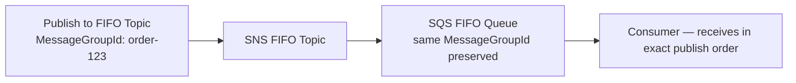

# 71 - SNS FIFO + SQS FIFO

> Goal: confirm, conceptually, that ordering survives an entire SNS FIFO → SQS FIFO pipeline — pulling together [SNS Standard vs. FIFO Topics](60-SNS-Standard-Vs-FIFO-Topic.md)' restriction and the [SNS + SQS Integration Lab](69-SNS-SQS-Integration-Lab-Setup.md)'s fan-out mechanics into the one combination that actually guarantees end-to-end order.

---

## 1. The core idea

Recall from [SNS Standard vs. FIFO Topics](60-SNS-Standard-Vs-FIFO-Topic.md): a **FIFO SNS topic can only subscribe FIFO SQS queues**. This isn't an arbitrary restriction — it's the **only** combination where the ordering guarantee genuinely holds all the way from publish to final consumption.

---

## 2. Architecture & workflow

The **Message Group ID** set at publish time (Section 1 of the [previous note](70-SNS-FIFO-Configuration.md)) is preserved as the message flows from the FIFO topic into the FIFO queue — the queue doesn't need to be told the group again separately, it inherits it from the topic delivery.

---

## 3. Why a Standard SQS queue would break this

If a FIFO topic could subscribe a **Standard** SQS queue, the queue's own best-effort ordering would immediately undo the ordering guarantee SNS just carefully preserved — messages could arrive at the final consumer out of order regardless of how carefully the topic itself delivered them. This is precisely why AWS restricts FIFO topic subscribers to FIFO queues only, rather than leaving it as a "works but ordering isn't guaranteed" combination.

> 🎯 **Exam tip**: "guarantee strict message ordering all the way from a fan-out publish through to final SQS-based processing" → **FIFO SNS Topic + FIFO SQS Queue(s)**, full stop — any Standard component anywhere in that chain breaks the end-to-end guarantee.

---

## 4. Recap

- Message Group ID set at SNS publish time carries through into the subscribed FIFO SQS queue automatically.
- The FIFO-topic-to-FIFO-queue-only restriction exists specifically because a Standard queue would silently break the ordering guarantee SNS otherwise preserves.
- This closes out the FIFO-specific SNS notes; next: the [AWS SNS Cheat Sheet](72-AWS-SNS-Cheat-Sheet.md) note — a compact recap of this entire SNS section.

### Sources
- [Amazon SNS FIFO topics — AWS docs](https://docs.aws.amazon.com/sns/latest/dg/sns-fifo-topics.html)
