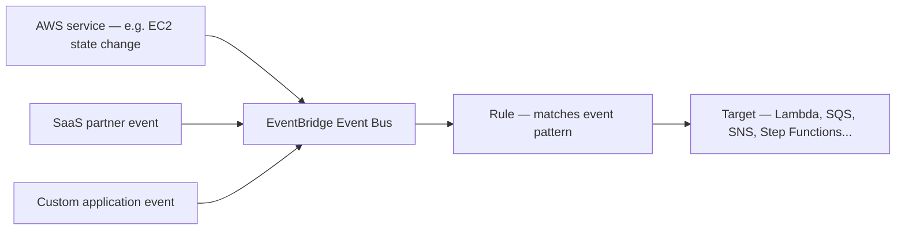

# 73 - Amazon EventBridge

> Goal: get a first orientation to Amazon EventBridge — a third asynchronous messaging model, distinct from both SQS's queues and SNS's topics, built around routing structured **events** based on their actual content.

---

## 1. The problem: SNS topics don't understand event *content*, only subscription lists

SNS's [Subscription Filter Policy](66-SNS-Subscription-Filter-Policy.md) lets subscribers filter by message attributes, but it's still fundamentally organized around **topics you publish to**. **Amazon EventBridge** flips this around: it's built for a world with **many different event sources** (dozens of AWS services, SaaS partners, and your own custom applications) and lets you write **rules** that route events to targets based on the event's actual structured content — no need to pre-organize everything into topics.

---

## 2. Architecture & workflow

---

## 3. What makes EventBridge genuinely different

| Property | Why it matters |
|---|---|
| **Native AWS service integration** | Nearly 200+ AWS services can emit events to EventBridge automatically, with zero custom producer code |
| **Content-based routing** | Rules match on the actual **structure and values** inside an event (its JSON), not just "which topic was this published to" |
| **SaaS partner integrations** | Third-party SaaS platforms (Zendesk, Datadog, and many others) can be configured as native event sources |
| **Schema Registry** | Can discover and store the **schema** of events flowing through, making it easier to write correct rule patterns and target code |
| **Built-in scheduling** | EventBridge Scheduler, covered later in this section, adds genuinely first-class time-based triggering |

---

## 4. Recap

- EventBridge is a third messaging model — routing **structured events** by content-based rules, not queue-pull or topic-subscription.
- Its core strength is breadth of native integration — AWS services and SaaS partners as sources, with minimal custom producer work required.
- Next: the [EventBridge Work Flow](74-EventBridge-Work-Flow.md) note — the actual end-to-end path an event takes through the service.

### Sources
- [What is Amazon EventBridge? — AWS docs](https://docs.aws.amazon.com/eventbridge/latest/userguide/eb-what-is.html)
