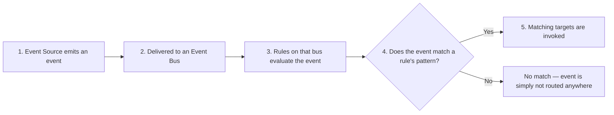

# 74 - EventBridge Work Flow

> Goal: trace the complete, end-to-end path an event takes through EventBridge — from the moment it's emitted to the moment a target actually acts on it — before the next several notes go deep on each individual piece.

---

## 1. The full workflow

---

## 2. The five steps, briefly

| Step | Covered in depth in |
|---|---|
| **1. Event Source** | An AWS service, a SaaS partner, or your own application generates a structured JSON event | [EventBridge - Event Source & Event](75-EventBridge-Event-Source-Event.md) |
| **2. Event Bus** | The event lands on a specific bus — the default bus, a custom bus, or a partner bus | [EventBridge - Event Bus](76-EventBridge-Event-Bus.md) |
| **3. Rules** | Each rule on that bus has a pattern; EventBridge evaluates every rule against every incoming event | [EventBridge - Event Bus Rule](77-EventBridge-Event-Bus-Rule.md) |
| **4. Matching** | If the event's structure/values match a rule's pattern, that rule "fires" | (same note as Step 3) |
| **5. Targets** | Every target attached to a fired rule is invoked with the event | [EventBridge Target](78-EventBridge-Target.md) |

---

## 3. What happens when nothing matches

An event that doesn't match **any** rule on its bus is simply **not routed anywhere** — this isn't an error, and there's no default "catch-all" delivery unless you explicitly build one (e.g. a deliberately broad rule with no filtering conditions, wired to a logging target).

> 🧠 This is a genuinely different failure mode than SQS or SNS — there's no equivalent of "a subscriber didn't confirm" here; a non-matching event is expected, silent, normal behavior by design, since most events on a shared bus aren't relevant to most rules.

---

## 4. Recap

- The full path: **Source → Bus → Rules evaluate → matching Rules fire → their Targets are invoked**.
- A non-matching event is normal, silent, expected behavior — not a failure.
- Next: the [EventBridge - Event Source & Event](75-EventBridge-Event-Source-Event.md) note — the first step of this pipeline, in detail.

### Sources
- [How Amazon EventBridge works — AWS docs](https://docs.aws.amazon.com/eventbridge/latest/userguide/eb-how-it-works.html)
