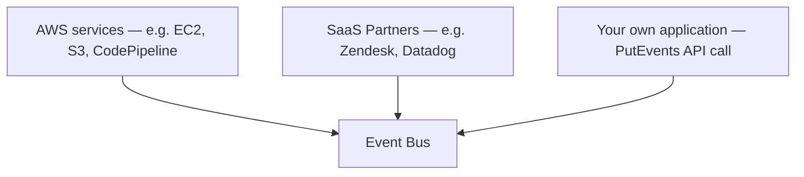

# 75 - EventBridge - Event Source & Event

> Goal: understand exactly what an **Event Source** and an **Event** actually are — the raw material EventBridge's whole workflow runs on, continuing from the [Work Flow](74-EventBridge-Work-Flow.md) note's Step 1.

---

## 1. Event Sources — where events come from



| Source type | Example |
|---|---|
| **AWS services** | An EC2 instance changing state, a CodePipeline stage completing, an S3 object being created |
| **SaaS partners** | A third-party platform configured as a native EventBridge partner event source |
| **Custom applications** | Your own code, calling the `PutEvents` API directly to emit an application-specific event |

---

## 2. The anatomy of an Event

Every EventBridge event is a JSON object with a consistent structure:

```json
{
  "version": "0",
  "id": "unique-event-id",
  "detail-type": "EC2 Instance State-change Notification",
  "source": "aws.ec2",
  "account": "123456789012",
  "time": "2026-08-01T12:00:00Z",
  "region": "us-east-1",
  "resources": ["arn:aws:ec2:us-east-1:123456789012:instance/i-0123456789"],
  "detail": {
    "instance-id": "i-0123456789",
    "state": "stopped"
  }
}
```

| Field | What it's for |
|---|---|
| **`source`** | Identifies what emitted the event (e.g. `aws.ec2`) — a primary field rules commonly match on |
| **`detail-type`** | A human-readable event category (e.g. "EC2 Instance State-change Notification") — also commonly matched on |
| **`detail`** | The event-specific payload — its structure varies by source, and is where the actual business-relevant data lives |

---

## 3. Recap

- **Event Sources** span AWS services, SaaS partners, and your own custom applications via `PutEvents`.
- Every event shares a common envelope (`source`, `detail-type`, `time`, etc.) wrapped around a source-specific `detail` payload.
- `source` and `detail-type` are the two fields most rule patterns match against first, before drilling into `detail` for finer filtering.
- Next: the [EventBridge - Event Bus](76-EventBridge-Event-Bus.md) note — where these events actually land.

### Sources
- [Amazon EventBridge event structure — AWS docs](https://docs.aws.amazon.com/eventbridge/latest/userguide/eb-events-structure.html)
