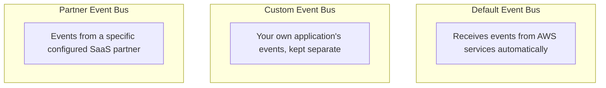

# 76 - EventBridge - Event Bus

> Goal: understand the **Event Bus** — the actual routing hub events land on — and the three distinct bus types, continuing from the [Event Source & Event](75-EventBridge-Event-Source-Event.md) note.

---

## 1. The core idea

An **Event Bus** is the "pipe" events flow through — it's the resource **Rules** are actually attached to. Every AWS account has a **default event bus** automatically, but you can also create your own.

---

## 2. Architecture & workflow

---

## 3. The three bus types

| Bus type | What it's for |
|---|---|
| **Default event bus** | Automatically receives events from AWS services in the account — always exists, no setup required |
| **Custom event bus** | Created explicitly for your own application's events, keeping them cleanly separated from the noisy default bus's AWS-service traffic |
| **Partner event bus** | Created specifically to receive events from one configured SaaS partner integration |

---

## 4. Why separate buses matter in practice

Putting custom application events on their **own** custom bus (rather than the default bus) keeps rule management cleaner — rules on the default bus don't need to account for your application's event patterns at all, and vice versa. It also enables **cross-account event sharing**: a bus's resource-based policy can grant another AWS account permission to send events to it, a genuinely useful pattern for centralizing events from many accounts into one place.

> 🎯 **Exam tip**: "receive events from a specific SaaS platform" → **Partner event bus**. "Keep custom application events organizationally separate from AWS-service events" → a dedicated **custom event bus**. "React to native AWS service activity like EC2 state changes" → the **default event bus**, since that's where AWS services deliver automatically.

---

## 5. Recap

- **Default**, **custom**, and **partner** event buses each serve a distinct organizational purpose.
- Rules are attached to a specific bus — organizing events onto the right bus keeps rule management manageable.
- A bus's resource policy enables cross-account event sharing, useful for centralizing events across an organization.
- Next: the [EventBridge - Event Bus Rule](77-EventBridge-Event-Bus-Rule.md) note — how a bus actually decides what to do with an incoming event.

### Sources
- [Amazon EventBridge event buses — AWS docs](https://docs.aws.amazon.com/eventbridge/latest/userguide/eb-event-bus.html)
