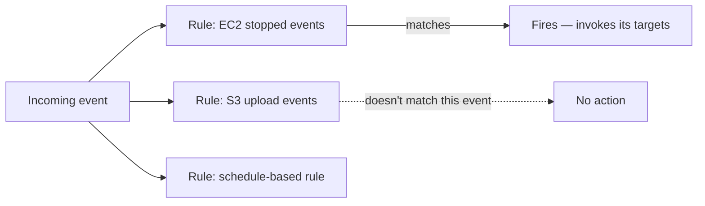

# 77 - EventBridge - Event Bus Rule

> Goal: understand **Rules** — the actual decision-making mechanism that determines which events get routed anywhere at all, continuing from the [Event Bus](76-EventBridge-Event-Bus.md) note.

---

## 1. The core idea

A **Rule** is attached to a specific event bus and contains an **event pattern** — a JSON structure describing which events should match. EventBridge evaluates **every** rule on a bus against **every** incoming event, and any rule whose pattern matches "fires," invoking its configured targets.

---

## 2. Architecture & workflow



---

## 3. Two kinds of rules

| Rule type | Trigger |
|---|---|
| **Event pattern rule** | Fires when an incoming event's structure/values match a defined pattern — the standard, event-reactive case |
| **Scheduled rule** | Fires on a **time-based** schedule (cron or rate expression) rather than reacting to any external event — the legacy mechanism, now superseded by **EventBridge Scheduler** (covered later in this section) |

---

## 4. Writing an event pattern

A pattern matches on any combination of an event's fields — most commonly `source` and `detail-type`, refined further by specific values inside `detail`:

```json
{
  "source": ["aws.ec2"],
  "detail-type": ["EC2 Instance State-change Notification"],
  "detail": {
    "state": ["stopped"]
  }
}
```

This pattern matches **only** EC2 state-change events where the new state is specifically `"stopped"` — any other state, or any other source, doesn't match.

> 🎯 **Exam tip**: "trigger different actions depending on the specific content of an event, not just which service it came from" is the clearest signal that a **content-based rule pattern** (matching on `detail` fields) is needed — a rule matching only on `source` would be too broad for that requirement.

---

## 5. Recap

- A **Rule** contains an **event pattern**; any incoming event matching that pattern causes the rule to fire.
- Rules can be **event pattern-based** (react to content) or **schedule-based** (react to time) — though scheduling now has a purpose-built successor.
- Patterns can match at any depth of the event's JSON structure, from top-level `source` down into `detail` fields.
- Next: the [EventBridge Target](78-EventBridge-Target.md) note — what actually happens once a rule fires.

### Sources
- [Amazon EventBridge rules — AWS docs](https://docs.aws.amazon.com/eventbridge/latest/userguide/eb-rules.html)
- [Amazon EventBridge event patterns — AWS docs](https://docs.aws.amazon.com/eventbridge/latest/userguide/eb-event-patterns.html)
