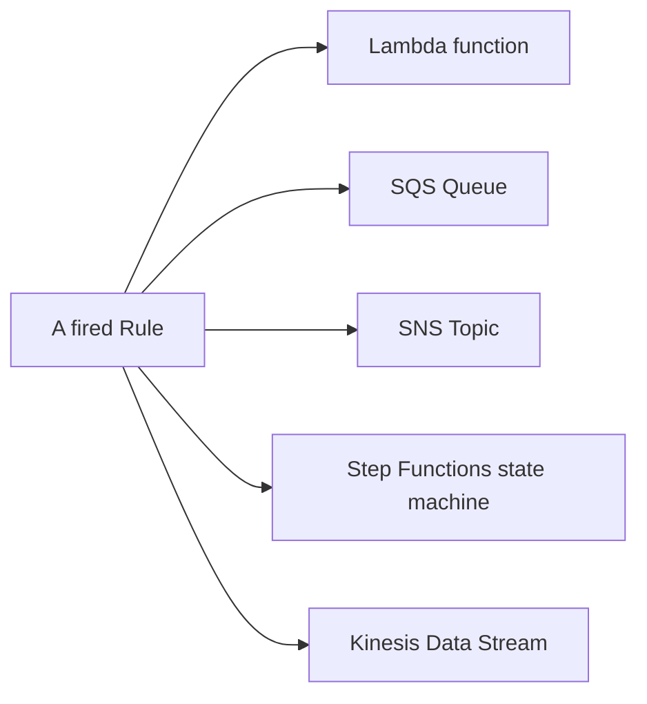

# 78 - EventBridge Target

> Goal: understand **Targets** — what a fired rule actually does — closing out the [Work Flow](74-EventBridge-Work-Flow.md) note's five-step pipeline.

---

## 1. The core idea

A **Target** is the destination a rule invokes when it fires — a single rule can have **multiple targets** (up to a documented limit), meaning one matched event can simultaneously trigger several different downstream actions.

---

## 2. Architecture & workflow

---

## 3. The breadth of supported targets

EventBridge can target a very wide range of AWS services directly — Lambda, SQS, SNS, Step Functions, Kinesis Data Streams, ECS tasks, Systems Manager Automation, and many more — without needing a Lambda function as a universal middle layer, similar in spirit to [API Gateway's AWS service integration](20-REST-API-Integration-Types.md).

---

## 4. Input transformation — reshaping the event before it reaches the target

A target doesn't have to receive the **entire raw event** — **Input Transformer** lets a rule extract specific fields and reshape them into a custom JSON structure (or even a plain string) before invoking the target, so downstream code doesn't need to parse the full event envelope just to get the one or two fields it actually needs.

> 🎯 **Exam tip**: "one event should trigger multiple independent actions" → a single **Rule with multiple Targets** — genuinely simpler than routing through SNS Fan-Out for this specific case, since EventBridge already supports multi-target delivery natively per rule.

---

## 5. Recap

- A single rule can invoke **multiple targets** simultaneously across a wide range of native AWS service integrations.
- **Input Transformer** reshapes the event into exactly what a target needs, rather than forcing every target to parse the full raw event.
- This closes out the core EventBridge pipeline notes (73-78); next: the [EventBridge Lab](79-EventBridge-Lab.md) note — building this pipeline for real.

### Sources
- [Amazon EventBridge targets — AWS docs](https://docs.aws.amazon.com/eventbridge/latest/userguide/eb-targets.html)
- [Amazon EventBridge input transformation — AWS docs](https://docs.aws.amazon.com/eventbridge/latest/userguide/eb-transform-target-input.html)
