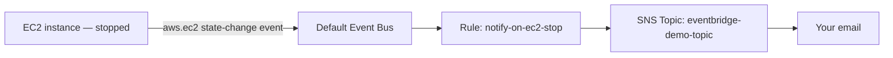

# 79 - EventBridge Lab

> Goal: build a real EventBridge rule that reacts to a genuine EC2 state-change event and notifies you by email — proving the full [Work Flow](74-EventBridge-Work-Flow.md) pipeline (Source → Bus → Rule → Target) end to end. Entirely via the **AWS Console**.

---

## 1. What you're building

---

## 2. Step 1 — Create the SNS topic and subscribe your email

1. **SNS console** → **Create topic** → **Standard** → `eventbridge-demo-topic`.
2. **Create subscription** → **Email** → your address → confirm it via the email you receive, exactly as covered in this project's [Create Standard SNS Topic](62-Create-Standard-SNS-Topic.md) note.

---

## 3. Step 2 — Launch a small EC2 instance to generate a real event

1. **EC2 console** → **Launch instances** → `eventbridge-demo-instance` → **Amazon Linux 2023** → `t2.micro` → **Proceed without a key pair** → **Launch instance**.

---

## 4. Step 3 — Create the rule

1. **EventBridge console** → **Rules** → **Create rule**.
2. **Name**: `notify-on-ec2-stop`.
3. **Event bus**: **default**.
4. **Rule type**: **Rule with an event pattern**.
5. **Event pattern**: **Event source**: **AWS services** → **AWS service**: **EC2** → **Event type**: **EC2 Instance State-change Notification** → **Specific state(s)**: **stopped**.
6. **Target**: **AWS service** → **SNS topic** → select `eventbridge-demo-topic`.
7. **Create rule**.

---

## 5. Step 4 — Trigger the real event

1. **EC2 console** → select `eventbridge-demo-instance` → **Instance state** → **Stop instance**.
2. Wait for the instance state to actually reach **Stopped**.
3. Check your email → confirm a notification arrived, containing the raw EventBridge event JSON — including `"detail-type": "EC2 Instance State-change Notification"` and `"state": "stopped"`, exactly matching the [Event Source & Event](75-EventBridge-Event-Source-Event.md) note's structure.

---

## 6. Step 5 — Confirm a non-matching event does nothing

1. **EC2 console** → **Start instance** on the same instance.
2. Confirm **no** new email arrives — the rule's pattern specifically matched `"stopped"`, not `"running"`, so this event correctly doesn't fire the rule, directly proving the [Event Bus Rule](77-EventBridge-Event-Bus-Rule.md) note's pattern-matching behavior.

---

## 7. Troubleshooting

| Symptom | Likely cause |
|---|---|
| No email after stopping the instance | Confirm the SNS subscription was actually confirmed (Section 2); check the rule's pattern exactly matches `EC2 Instance State-change Notification` / `stopped` |
| Rule shows as created but never triggers | Confirm it's attached to the **default** event bus — EC2 delivers its events there automatically, not to any custom bus |

---

## 8. Cleanup

1. **EventBridge console** → delete `notify-on-ec2-stop`.
2. **SNS console** → delete `eventbridge-demo-topic`.
3. **EC2 console** → terminate `eventbridge-demo-instance`.

---

## 9. Recap

- A real EC2 stop action produced a real event on the default bus, matched a real rule's pattern, and fired a real SNS notification — the entire pipeline proven end to end.
- The rule correctly **ignored** a non-matching event (`running`) — confirming pattern matching is genuinely selective, not just "any activity from this source."
- Next: the [Amazon EventBridge Schedule](80-Amazon-EventBridge-Schedule.md) note — time-based triggering, rather than reacting to service activity.

### Sources
- [Amazon EventBridge event patterns — AWS docs](https://docs.aws.amazon.com/eventbridge/latest/userguide/eb-event-patterns.html)
- [Amazon EC2 events and EventBridge — AWS docs](https://docs.aws.amazon.com/AWSEC2/latest/UserGuide/ec2-instance-state-changes.html)
