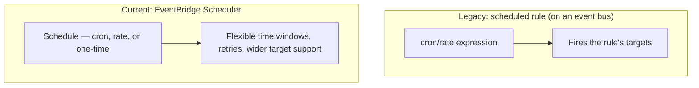

# 80 - Amazon EventBridge Schedule

> Goal: understand time-based triggering in EventBridge — both the legacy **scheduled rule** mechanism briefly mentioned in the [Event Bus Rule](77-EventBridge-Event-Bus-Rule.md) note, and its current, purpose-built successor, **EventBridge Scheduler**.

---

## 1. The problem: not everything should be triggered by an external event

Some work genuinely needs to run on a **clock**, not in reaction to anything — a nightly report, a cleanup job every hour, a one-time action at a specific future date. EventBridge supports this, but it's important to know there are now **two** different mechanisms for it.

---

## 2. Architecture & workflow

---

## 3. Legacy scheduled rules vs. EventBridge Scheduler

| | Legacy scheduled rule | EventBridge Scheduler |
|---|---|---|
| **Where it lives** | A rule type on an event bus, same as any pattern-matching rule | Its own dedicated feature, separate from event buses/rules entirely |
| **Recurrence types** | Recurring only (cron/rate expressions) | Recurring **or** genuinely **one-time** invocations |
| **Time zone support** | None | **Yes** — schedules can be defined in a specific time zone |
| **Flexible time windows** | No | **Yes** — can spread invocations across a window rather than a single instant, to smooth out load |
| **Failure handling** | Limited | Configurable **retry limits** and **maximum retention** for failed invocations |
| **Target support** | Limited to standard rule targets | A **wider set** of target API operations across more AWS services |

> ⚠️ AWS's own current console guidance actively steers you toward **EventBridge Scheduler** when creating a new scheduled rule — this is exactly the kind of real, current drift worth knowing directly: older material describing "scheduled rules" as *the* way to do time-based EventBridge triggering is describing the legacy mechanism, not AWS's current recommendation.

> 🎯 **Exam tip**: for any **new** time-based triggering requirement, **EventBridge Scheduler** is the expected current answer — reach for a legacy scheduled rule only when working with an existing system that already uses one.

---

## 4. Recap

- Legacy **scheduled rules** are a rule type on an event bus, cron/rate-only, with no time zone or flexible-window support.
- **EventBridge Scheduler** is the current, purpose-built, actively-recommended replacement — supporting one-time schedules, time zones, flexible windows, and richer retry/target options.
- Next: the [EventBridge Scheduler Hands-on Lab](81-EventBridge-Scheduler-Hands-on-Lab.md) note — building a real schedule with the modern tool.

### Sources
- [Amazon EventBridge Scheduler — AWS docs](https://docs.aws.amazon.com/eventbridge/latest/userguide/using-eventbridge-scheduler.html)
- [Creating a scheduled rule (legacy) — AWS docs](https://docs.aws.amazon.com/eventbridge/latest/userguide/eb-create-rule-schedule.html)
