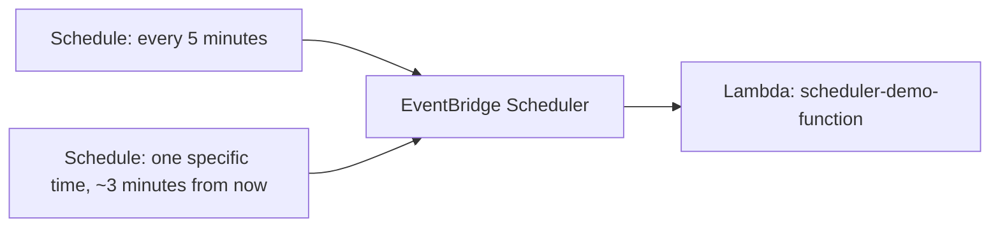

# 81 - EventBridge Scheduler Hands-on Lab

> Goal: build a real schedule using EventBridge Scheduler (not a legacy scheduled rule) — one recurring and one one-time — invoking a real Lambda function, and confirming both fire correctly. Entirely via the **AWS Console**.

---

## 1. What you're building



---

## 2. Step 1 — Create the Lambda target

1. **Lambda console** → **Create function** → `scheduler-demo-function` → **Python 3.13**.
2. Code:
   ```python
   import datetime
   def lambda_handler(event, context):
       print(f"Scheduler invoked this function at {datetime.datetime.utcnow().isoformat()}")
       return {"statusCode": 200}
   ```
   **Deploy**.

---

## 3. Step 2 — Create a recurring schedule

1. **EventBridge console** → **Scheduler** → **Create schedule**.
2. **Name**: `recurring-demo-schedule`.
3. **Schedule pattern**: **Recurring schedule** → **Rate-based schedule**: every `5` `minutes`.
4. **Target**: **AWS Lambda** → **Invoke** → `scheduler-demo-function`.
5. **Flexible time window**: **Off** (for a predictable demo) → **Create schedule**.

---

## 4. Step 3 — Create a one-time schedule

1. **Create schedule** again → **Name**: `one-time-demo-schedule`.
2. **Schedule pattern**: **One-time schedule** → set the date/time to roughly **3 minutes** from now, in your local time zone — directly exercising the **time zone support** the [previous note](80-Amazon-EventBridge-Schedule.md) called out as new versus the legacy mechanism.
3. **Target**: same `scheduler-demo-function`.
4. **Action after completion**: **Delete** (a genuinely convenient one-time-schedule option — it cleans itself up after firing once) → **Create schedule**.

---

## 5. Step 4 — Confirm both fire correctly

1. Wait roughly 5 minutes.
2. **Lambda console** → `scheduler-demo-function` → **Monitor** → **View CloudWatch logs**.
3. Confirm **at least one** log entry from the recurring schedule, and **exactly one** log entry timestamped around your chosen one-time schedule time.
4. **EventBridge console** → **Scheduler** → confirm `one-time-demo-schedule` has **disappeared** from the list — the **Delete after completion** setting from Section 4 cleaned it up automatically after its single firing.

---

## 6. Troubleshooting

| Symptom | Likely cause |
|---|---|
| No invocations at all | Confirm the Lambda target was actually selected and saved correctly in each schedule |
| One-time schedule fires at the wrong time | Double check the time zone selected during creation — this is the exact feature gap the legacy scheduled-rule mechanism didn't have |

---

## 7. Cleanup

1. **EventBridge console** → **Scheduler** → delete `recurring-demo-schedule` (the one-time schedule already deleted itself).
2. **Lambda console** → delete `scheduler-demo-function`.

---

## 8. Recap

- Both a **recurring** (rate-based) and a **one-time** schedule were built and confirmed working — the one-time schedule specifically exercised time zone support and self-cleanup, neither available on the legacy scheduled-rule mechanism.
- This is the AWS-recommended, current way to do time-based triggering, per [Amazon EventBridge Schedule](80-Amazon-EventBridge-Schedule.md)'s guidance.
- Next: the [AWS EventBridge Cheat Sheet](82-AWS-EventBridge-Cheat-Sheet.md) note — a compact recap of this entire EventBridge section.

### Sources
- [Amazon EventBridge Scheduler — AWS docs](https://docs.aws.amazon.com/eventbridge/latest/userguide/using-eventbridge-scheduler.html)
- [Schedule types on EventBridge Scheduler — AWS docs](https://docs.aws.amazon.com/scheduler/latest/UserGuide/schedule-types.html)
