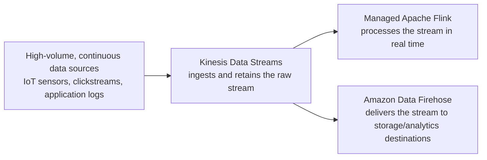

# 83 - Data Processing

> Goal: get a first orientation to the "data processing" services covered next in this folder — Kinesis, Data Firehose, Managed Apache Flink — and how they differ from everything covered so far, which was about **discrete messages/events**, not continuous **streams**.

---

## 1. The problem: some data doesn't arrive as discrete, independent messages

SQS, SNS, and EventBridge all deal with individual, self-contained messages or events. But some data is fundamentally a **continuous stream** — sensor readings arriving every second, clickstream data from millions of users, log lines from thousands of servers — where the *volume and continuity* matter as much as any single record, and where you often want to process the data **in motion**, not just store it and query it later.

---

## 2. Architecture & workflow

---

## 3. The three services ahead, at a glance

| Service | Role |
|---|---|
| **Kinesis Data Streams** | Ingests and durably retains a high-volume, ordered stream of data records, available for one or more consumers to read |
| **Amazon Data Firehose** | Reliably delivers streaming data to a destination (S3, OpenSearch, Redshift, and others), with optional transformation along the way |
| **Managed Apache Flink** | Runs real-time analytics/processing **on** the stream itself — computing aggregations, detecting patterns, as data flows through |

---

## 4. Recap

- "Data Processing" here means handling **continuous, high-volume streams**, a genuinely different problem shape than the discrete messages/events covered in the SQS/SNS/EventBridge sections.
- **Kinesis Data Streams** ingests, **Data Firehose** delivers, **Managed Apache Flink** processes — three distinct, composable roles.
- Next: the [Amazon Kinesis Services Stream](84-Amazon-Kinesis-Services-Stream.md) note — starting with the ingestion layer.

### Sources
- [Amazon Kinesis — AWS](https://aws.amazon.com/kinesis/)
