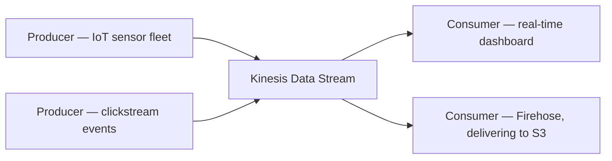

# 84 - Amazon Kinesis Services Stream

> Goal: get a first orientation specifically to Kinesis Data Streams — the ingestion layer from the [Data Processing](83-Data-Processing.md) note's overview diagram.

---

## 1. The core idea

**Amazon Kinesis Data Streams** ingests a continuous, high-volume stream of data records, retains them for a configurable period, and makes them available for **multiple independent consumers** to read — all without the producer needing to know or care who's consuming, or how many consumers there are.

---

## 2. Architecture & workflow

---

## 3. Why this isn't just "SQS for a lot of messages"

| | SQS | Kinesis Data Streams |
|---|---|---|
| **Consumption model** | A message is typically consumed **once**, then deleted | Records are **retained** for a configurable window and can be read by **multiple independent consumers**, each at their own pace |
| **Ordering** | Best-effort (Standard) or strict (FIFO) | Ordered **within a shard** — covered in the next note |
| **Replay** | Not possible — once deleted, it's gone | **Replayable** — a consumer can re-read from an earlier point within the retention window |

> 🧠 This replayability is the single biggest conceptual difference from SQS: Kinesis is built for scenarios where you might want to **process the same data more than once**, from more than one independent application, potentially re-processing historical data — none of which fits SQS's consume-once model.

---

## 4. Recap

- Kinesis Data Streams ingests high-volume, continuous data and retains it for **multiple independent consumers** to read, each at their own pace.
- Its **replayability** and **multi-consumer** support are the key differentiators from SQS's single-consumption queue model.
- Next: the [Kinesis Data Streams Terminology & Flow](85-Kinesis-Data-Streams-Terminology-Flow.md) note — the actual building blocks (shards, partition keys, records) this runs on.

### Sources
- [What is Amazon Kinesis Data Streams? — AWS docs](https://docs.aws.amazon.com/streams/latest/dev/introduction.html)
