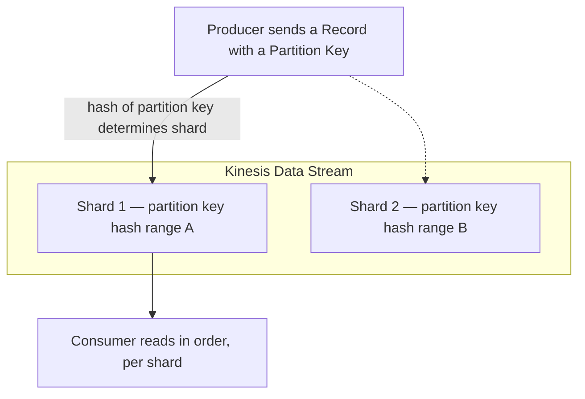

# 85 - Kinesis Data Streams Terminology & Flow

> Goal: learn the actual vocabulary Kinesis Data Streams runs on — Shards, Partition Keys, Records, Sequence Numbers — building directly on the [previous note](84-Amazon-Kinesis-Services-Stream.md)'s "why this isn't just SQS" framing.

---

## 1. The core components

| Term | What it is |
|---|---|
| **Record** | One unit of data in the stream — a partition key, a sequence number, and the actual data blob (up to 1 MB) |
| **Shard** | A stream is divided into one or more shards — each shard is an independent, ordered sequence of records, and is the actual **unit of throughput capacity** |
| **Partition Key** | Supplied by the producer with each record — Kinesis **hashes** it to deterministically decide which shard the record goes to |
| **Sequence Number** | A unique, increasing identifier assigned to each record **within its shard** — used to track a consumer's read position |

---

## 2. Why ordering is per-shard, not stream-wide

Since records are distributed across shards **by partition key hash**, strict ordering is only guaranteed **within a single shard** — records with the **same** partition key always land on the same shard (preserving their relative order), but records with **different** partition keys may land on different shards, with no ordering guarantee **between** shards.

> 🎯 **Exam tip**: "all events for a specific device/user must be processed in the order they occurred" → use that device/user's ID **as the partition key** — this guarantees all of that entity's records land on the same shard, in order, exactly the same underlying idea as SQS FIFO's Message Group ID, applied via a hash instead of an explicit group field.

---

## 3. Recap

- A stream is made of **Shards**; each shard independently orders its own records via increasing **Sequence Numbers**.
- The **Partition Key** determines shard placement via hashing — same key, same shard, preserved relative order.
- Ordering is a **per-shard** guarantee, not a whole-stream guarantee.
- Next: the [Kinesis Data Stream Hands-On Lab](86-Kinesis-Data-Stream-Hands-On-Lab.md) note — building a real stream and observing this directly.

### Sources
- [Amazon Kinesis Data Streams terminology and concepts — AWS docs](https://docs.aws.amazon.com/streams/latest/dev/key-concepts.html)
