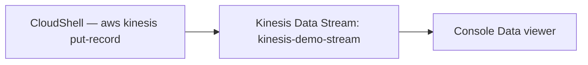

# 86 - Kinesis Data Stream Hands-On Lab

> Goal: create a real Kinesis Data Stream, put real records onto it (using **CloudShell**, since the console itself has no manual "send a message" button the way SQS/SNS do), and use the console's **Data viewer** to directly observe shard placement and ordering. Mostly the **AWS Console**, with CloudShell (browser-embedded, an already-approved exception) for the one step of actually publishing records.

---

## 1. What you're building



---

## 2. Step 1 — Create the stream

1. **Kinesis console** → **Data streams** → **Create data stream**.
2. **Name**: `kinesis-demo-stream`.
3. **Capacity mode**: **On-demand** (scales automatically, no manual shard-count planning needed for this demo).
4. **Create data stream**.

---

## 3. Step 2 — Put real records via CloudShell

1. Open **CloudShell**.
2. Send three records, two sharing a partition key, one different:
   ```bash
   aws kinesis put-record --stream-name kinesis-demo-stream --partition-key "device-A" --data "$(echo -n '{"device":"A","reading":1}' | base64)"
   aws kinesis put-record --stream-name kinesis-demo-stream --partition-key "device-A" --data "$(echo -n '{"device":"A","reading":2}' | base64)"
   aws kinesis put-record --stream-name kinesis-demo-stream --partition-key "device-B" --data "$(echo -n '{"device":"B","reading":1}' | base64)"
   ```
3. Note the **ShardId** returned in each command's output — confirm the two `device-A` records return the **same** ShardId, matching [Kinesis Data Streams Terminology & Flow](85-Kinesis-Data-Streams-Terminology-Flow.md)'s partition-key hashing behavior.

---

## 4. Step 3 — View the records in the console

1. **Kinesis console** → `kinesis-demo-stream` → **Data viewer**.
2. **Shard**: select the ShardId noted for `device-A`'s records → **Starting position**: **Trim horizon** (reads from the earliest available record) → **Get records**.
3. Confirm both `device-A` records appear, **in the order they were sent** (reading 1 before reading 2) — direct, observed proof of per-shard ordering.
4. Switch to the other shard (if `device-B` landed on a different one) → confirm the `device-B` record appears there instead.

---

## 5. Step 4 — Check the monitoring metrics

1. `kinesis-demo-stream` → **Monitoring** tab.
2. Confirm `IncomingRecords` and `IncomingBytes` reflect the three `put-record` calls from Section 3 — the same CloudWatch integration pattern seen throughout this project.

---

## 6. Troubleshooting

| Symptom | Likely cause |
|---|---|
| `put-record` command fails | CloudShell's session may need a moment to initialize its credentials — retry after a few seconds |
| Records appear out of order within the same shard | Very unlikely given this demo's simple sequential sends — if seen, double check you're reading the correct ShardId and using **Trim horizon** as the starting position |
| `device-A`'s two records land on different shards | On-demand mode's shard count can already be more than one even for a fresh stream at low volume — this is still expected Kinesis behavior, not a demo failure; the ordering guarantee only breaks if they're actually processed out of order **within** whichever shard they did land on |

---

## 7. Cleanup

1. **Kinesis console** → delete `kinesis-demo-stream`.

---

## 8. Recap

- Records sharing the same partition key (`device-A`) landed on the **same shard**, in the exact order sent — a direct, observed proof of Kinesis's per-shard ordering guarantee.
- The console's **Data viewer** is the direct way to inspect actual shard contents — genuinely useful for debugging a real stream's data placement.
- Next: the [Amazon Kinesis Data Stream Configuration Options](87-Amazon-Kinesis-Data-Stream-Configuration-Options.md) note — the settings available on a stream like this one.

### Sources
- [Creating a stream via the AWS Management Console — AWS docs](https://docs.aws.amazon.com/streams/latest/dev/how-do-i-create-a-stream.html)
- [Using the Kinesis Data Streams console Data Viewer — AWS docs](https://docs.aws.amazon.com/streams/latest/dev/data-viewer.html)
