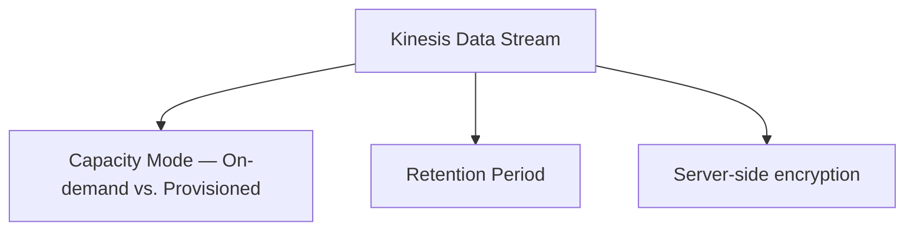

# 87 - Amazon Kinesis Data Stream Configuration Options

> Goal: cover the actual settings a real Kinesis Data Stream exposes — capacity mode, retention period, and encryption — building on the [hands-on lab](86-Kinesis-Data-Stream-Hands-On-Lab.md)'s real, already-created stream.

---

## 1. The main configuration areas

---

## 2. Capacity mode: On-demand vs. Provisioned

| Mode | How it works |
|---|---|
| **On-demand** | Kinesis automatically manages shard capacity based on observed throughput — no manual shard-count planning, scales up/down automatically. The simpler default, used in this folder's hands-on lab |
| **Provisioned** | You explicitly specify the **number of shards**, and therefore the exact read/write throughput capacity — requires manual capacity planning (and manual **resharding** to scale), but offers predictable, fixed cost and capacity |

> 🎯 **Exam tip**: "unpredictable or spiky traffic, minimal operational overhead" → **On-demand**. "Steady, well-understood, high-volume traffic where cost predictability matters" → **Provisioned**, with shard count sized to the known throughput.

---

## 3. Retention period

By default, records are retained for **24 hours**. This can be extended up to **365 days** (long-term retention), enabling consumers to replay much further back than the default window — directly enabling the "replayability" advantage over SQS covered in the [Kinesis Services Stream](84-Amazon-Kinesis-Services-Stream.md) note.

---

## 4. Server-side encryption

Kinesis Data Streams supports **SSE (Server-Side Encryption)** using KMS — the same AWS-managed-vs-customer-managed-key choice already covered for [SQS](42-SQS-Encryption.md) and [SNS](61-SNS-Standard-Topic-All-Configuration-Options.md) in this folder, applied here to stream records at rest.

---

## 5. Recap

- **On-demand** capacity mode auto-scales with no shard planning; **Provisioned** mode gives fixed, predictable capacity at the cost of manual sizing/resharding.
- **Retention period** defaults to 24 hours but can extend to 365 days, directly enabling deeper replay scenarios.
- **Encryption** follows the same AWS-managed vs. customer-managed KMS key pattern seen elsewhere in this project.
- Next: the [Amazon Data Firehose](88-Amazon-Data-Firehose.md) note — the delivery layer that commonly sits downstream of a stream like this one.

### Sources
- [Choosing the data stream capacity mode — AWS docs](https://docs.aws.amazon.com/streams/latest/dev/how-do-i-size-a-stream.html)
- [Changing the data retention period — AWS docs](https://docs.aws.amazon.com/streams/latest/dev/kinesis-extended-retention.html)
