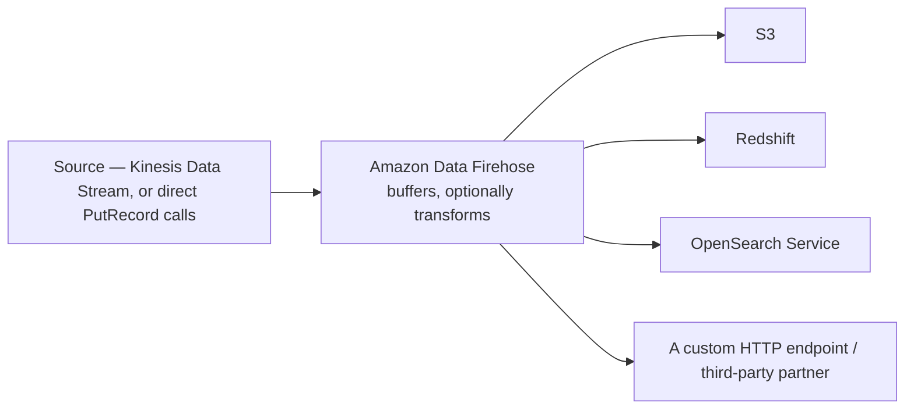

# 88 - Amazon Data Firehose

> Goal: understand Amazon Data Firehose's specific job — reliably **delivering** streaming data to a destination, with optional transformation along the way — and how it differs from consuming a Kinesis Data Stream yourself.

---

## 1. A brief naming note

This service was known as **Amazon Kinesis Data Firehose** until it was renamed to **Amazon Data Firehose** in February 2024. If you see "Kinesis Data Firehose" in older material, it's the same service under its previous name — this note (and the current AWS console) uses its current name throughout.

---

## 2. The problem: getting streaming data into storage/analytics tools reliably, without writing that plumbing yourself

You could write your own consumer application that reads from Kinesis Data Streams and writes to S3, but that means handling batching, retries, format conversion, and scaling yourself. **Amazon Data Firehose** is a fully managed alternative: point it at a source and a destination, and it handles buffering, batching, retrying, and (optionally) transforming the data along the way — no consumer application to write or operate.

---

## 3. Architecture & workflow

---

## 4. Key properties

| Property | Detail |
|---|---|
| **Near real-time, not instant** | Firehose **buffers** records (by size or time interval) before delivering — this is a deliberate design trade-off for delivery efficiency, meaning it's "near real-time," not the sub-second delivery a direct stream consumer could achieve |
| **No shard management** | Unlike consuming a Kinesis Data Stream directly, Firehose requires **no consumer application code and no shard-level concerns** at all |
| **Built-in transformation** | Can invoke a **Lambda function** to transform each record before delivery (e.g. format conversion, enrichment) |
| **Format conversion** | Can convert incoming JSON to **Parquet or ORC** before landing in S3 — genuinely useful for downstream analytics query performance |
| **Automatic retries and error handling** | Failed delivery attempts are retried, with a configurable destination for records that ultimately fail |

> 🎯 **Exam tip**: "deliver streaming data into S3 for analytics, with minimal operational overhead, no custom consumer code" → **Amazon Data Firehose**. "We need to read the stream ourselves, in near real-time, with custom processing logic and full control over consumption" → consuming **Kinesis Data Streams directly** (or via [Managed Apache Flink](90-Managed-Apache-Flink.md)) instead.

---

## 5. Recap

- Firehose **delivers** streaming data to a destination reliably, with buffering, retries, and optional transformation — no consumer code to write.
- It's "near real-time" by design, due to buffering — not a substitute for genuinely low-latency direct stream consumption.
- Format conversion to Parquet/ORC and Lambda-based transformation are two of its most practically useful features for real analytics pipelines.
- Next: the [Amazon Data Firehose Lab](89-Amazon-Data-Firehose-Lab.md) note — building a real delivery stream into S3.

### Sources
- [What is Amazon Data Firehose? — AWS docs](https://docs.aws.amazon.com/firehose/latest/dev/what-is-this-service.html)
- [Introducing Amazon Data Firehose, formerly Amazon Kinesis Data Firehose — AWS](https://aws.amazon.com/about-aws/whats-new/2024/02/amazon-data-firehose-kinesis-data-firehose/)
