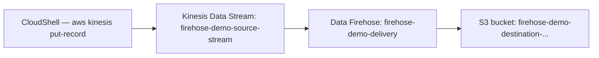

# 89 - Amazon Data Firehose Lab

> Goal: build a real Firehose delivery stream from a Kinesis Data Stream into S3, send real records, and confirm they land as real objects — proving Firehose's "no consumer code needed" value directly. Mostly the **AWS Console**, with **CloudShell** for sending the source records (same approved exception as the Kinesis lab).

---

## 1. What you're building



---

## 2. Step 1 — Create the source stream and destination bucket

1. **Kinesis console** → **Create data stream** → `firehose-demo-source-stream` → **On-demand** → **Create data stream**.
2. **S3 console** → **Create bucket** → `firehose-demo-destination-<your-name-or-date>` → **Create bucket**.

---

## 3. Step 2 — Create the Firehose delivery stream

1. **Amazon Data Firehose console** → **Create Firehose stream**.
2. **Source**: **Amazon Kinesis Data Streams** → select `firehose-demo-source-stream`.
3. **Destination**: **Amazon S3** → select `firehose-demo-destination-<...>`.
4. **Firehose stream name**: `firehose-demo-delivery`.
5. **Buffer hints**: **Buffer size**: `1` MiB, **Buffer interval**: `60` seconds — deliberately small, so this demo doesn't require a long wait.
6. **IAM role**: **Create or update IAM role** (let Firehose auto-generate the correctly scoped role) → **Create Firehose stream**.

---

## 4. Step 3 — Send real records via CloudShell

```bash
for i in 1 2 3 4 5; do
  aws kinesis put-record --stream-name firehose-demo-source-stream --partition-key "demo-$i" --data "$(echo -n "{\"event\":\"demo-record-$i\"}" | base64)"
done
```

---

## 5. Step 4 — Confirm delivery into S3

1. Wait roughly 60-90 seconds (matching the buffer interval from Section 3).
2. **S3 console** → open `firehose-demo-destination-<...>` → navigate the auto-created `YYYY/MM/DD/HH/` folder structure.
3. Download and open the delivered file → confirm it contains the five JSON records sent in Section 4 — real, delivered data, with **no consumer application ever written**, directly proving [Amazon Data Firehose](88-Amazon-Data-Firehose.md)'s core value proposition.

---

## 6. Step 5 — Check the monitoring metrics

1. `firehose-demo-delivery` → **Monitoring** tab.
2. Confirm `DeliveryToS3.Records` and `DeliveryToS3.Success` reflect the batch just delivered.

---

## 7. Troubleshooting

| Symptom | Likely cause |
|---|---|
| No file appears in S3 after several minutes | Confirm the buffer interval/size from Section 3 have actually been reached — Firehose won't deliver early just because some data exists |
| Firehose stream creation fails on IAM | Let the console **auto-create** the IAM role (Section 3) rather than selecting an existing one, unless you're certain that role has the correct S3/Kinesis permissions |

---

## 8. Cleanup

1. **Amazon Data Firehose console** → delete `firehose-demo-delivery`.
2. **Kinesis console** → delete `firehose-demo-source-stream`.
3. **S3 console** → empty and delete `firehose-demo-destination-<...>`.
4. **IAM console** → delete the auto-generated Firehose role.

---

## 9. Recap

- Records sent to a Kinesis stream were delivered into S3 **without writing a single line of consumer code** — Firehose handled buffering and delivery entirely on its own.
- The **buffer size/interval** settings directly control the near-real-time delivery latency this demo observed.
- Next: the [Managed Apache Flink](90-Managed-Apache-Flink.md) note — the third piece of this section, for when you need to actually *process* the stream, not just deliver it.

### Sources
- [Creating an Amazon Data Firehose stream — AWS docs](https://docs.aws.amazon.com/firehose/latest/dev/basic-create.html)
- [Amazon S3 Destination — AWS docs](https://docs.aws.amazon.com/firehose/latest/dev/create-destination.html#create-destination-s3)
