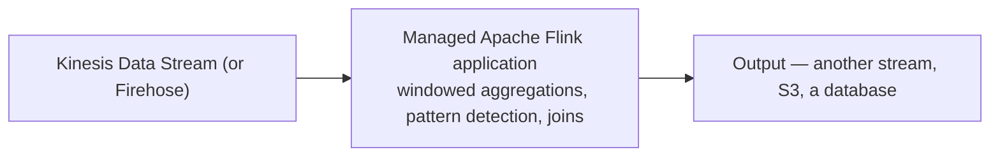

# 90 - Managed Apache Flink

> Goal: understand what actually processes a stream **in motion** — as opposed to Firehose's "deliver it somewhere" role — and be aware of two genuinely current naming/discontinuation facts worth knowing accurately. Kept concept-focused: a full working Flink application build is genuinely a developer-tooling exercise (packaging a Flink job) beyond this project's console-only demo pattern.

---

## 1. A brief but important naming and status note

This service was renamed from **Amazon Kinesis Data Analytics** to **Amazon Managed Service for Apache Flink** in August 2023 — the current name reflects that it's a managed runtime specifically for **Apache Flink** applications. Separately, and worth knowing as current, dated information: **Kinesis Data Analytics for SQL Applications** (an older, SQL-only variant) was **discontinued on January 27, 2026** — AWS's guidance for anyone still referencing that older SQL-based tool is to migrate to Managed Service for Apache Flink instead.

---

## 2. The problem: sometimes you need to compute *while* data is still streaming

Firehose delivers data; it doesn't compute running aggregations, detect patterns across a time window, or join multiple streams together in real time. **Managed Apache Flink** runs actual **Apache Flink** applications — a mature, widely-used open-source stream processing framework — fully managed by AWS, so you write processing logic without operating Flink's own cluster infrastructure yourself.

---

## 3. Architecture & workflow

---

## 4. What it's genuinely good for

- **Windowed aggregations** — "average sensor reading over the last 5 minutes," computed continuously as data arrives.
- **Real-time anomaly/pattern detection** — flagging unusual sequences of events as they happen, not after a batch job runs later.
- **Joining multiple streams** — combining related data arriving from different sources in real time.
- **Studio notebooks** — an interactive, Zeppelin-notebook-based way to explore and prototype Flink SQL/queries directly in the browser, genuinely console-accessible for learning/prototyping without a full packaged application deployment.

> 🎯 **Exam tip**: "compute a real-time running aggregate or detect a pattern across a stream, as data arrives" → **Managed Apache Flink**. "Just get streaming data reliably into S3/Redshift/OpenSearch" → [Amazon Data Firehose](88-Amazon-Data-Firehose.md) — these are genuinely different jobs (**compute** vs. **delivery**), even though both sit downstream of a Kinesis Data Stream.

---

## 5. Recap

- Renamed from **Kinesis Data Analytics** to **Managed Service for Apache Flink** in 2023; the older **SQL-only** variant was fully discontinued January 27, 2026.
- It runs real **Apache Flink** applications for in-motion stream computation — aggregations, pattern detection, stream joins — a different job than Firehose's delivery role.
- **Studio notebooks** offer a genuinely console-accessible way to prototype Flink queries interactively, without a full packaged deployment.
- Next: the [Amazon Simple Workflow Service (SWF) Part-1](91-Amazon-Simple-Workflow-Service-SWF-Part-1.md) note — the final topic in this folder, an older orchestration service with its own current-status story.

### Sources
- [Amazon Managed Service for Apache Flink — AWS docs](https://docs.aws.amazon.com/managed-flink/latest/java/what-is.html)
- [Kinesis Data Analytics for SQL Applications discontinuation — AWS docs](https://docs.aws.amazon.com/kinesisanalytics/latest/dev/discontinuation.html)
