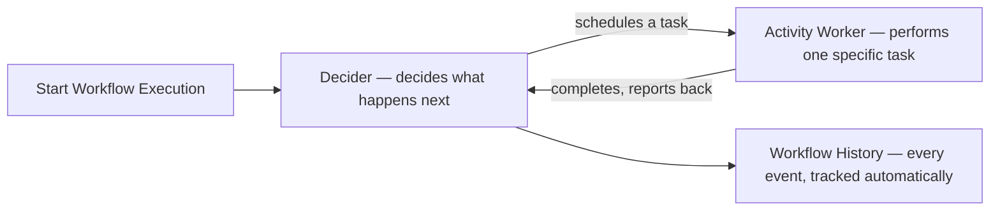

# 91 - Amazon Simple Workflow Service (SWF) Part-1

> Goal: understand SWF's core orchestration model — Workflows, Deciders, and Activity Workers — the vocabulary Part 2 builds on when covering its current real-world status.

---

## 1. The problem SWF was built to solve

Coordinating a multi-step process — "validate order → charge payment → ship → notify customer," each step potentially long-running, needing retries, and needing to track exactly where a specific execution currently stands — is genuinely hard to build correctly from scratch. **Amazon SWF** was AWS's original managed answer: a service for coordinating the steps of a distributed application's workflow, tracking state and history for you.

---

## 2. Architecture & workflow

---

## 3. The core components

| Component | What it does |
|---|---|
| **Workflow** | The overall coordinated process — a sequence of steps toward a goal (e.g. "process an order") |
| **Decider** | The **coordination logic** — decides what activity should happen next, based on the workflow's current state and history; your code implements this |
| **Activity Worker** | Performs one **specific task** the decider assigns it (e.g. "charge the payment") — your code implements this too |
| **Workflow History** | A complete, durable record of every event in an execution — every task scheduled, started, completed, or failed — automatically tracked by SWF |

---

## 4. Why this model is genuinely more manual than it might sound

Unlike a fully declarative workflow definition (the kind AWS Step Functions later introduced), SWF's **Decider** is real application code you write and run yourself — polling SWF for decision tasks, then telling SWF what to do next. This gives real flexibility, but also means you're responsible for hosting and operating that decider logic continuously, not just defining a state machine and letting AWS run it.

---

## 5. Recap

- SWF coordinates multi-step workflows via **Deciders** (coordination logic you write) and **Activity Workers** (task execution you write), with a durable **Workflow History** tracked automatically.
- This is a more code-driven, "you implement the coordinator" model than a fully declarative state machine.
- Next: the [Amazon Simple Workflow Service (SWF) Part-2](92-Amazon-Simple-Workflow-Service-SWF-Part-2.md) note — SWF's genuine current status, and how it compares to its modern successor.

### Sources
- [What is Amazon Simple Workflow Service? — AWS docs](https://docs.aws.amazon.com/amazonswf/latest/developerguide/welcome.html)
