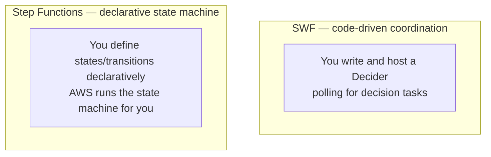

# 92 - Amazon Simple Workflow Service (SWF) Part-2

> Goal: be honest and current about where SWF genuinely stands today — not formally deprecated, but a legacy service AWS actively steers new work away from — and understand what replaced it, closing out this entire Application Integration folder.

---

## 1. ⚠️ Where SWF actually stands today — verified, not assumed

**SWF has not been formally deprecated** — it remains available and supported, and genuinely still gets used in specialized/legacy systems that need its specific programming model (long-lived workflows, explicit Decider/Worker control). But it's accurate, current information that **AWS actively recommends AWS Step Functions for new orchestration work**, and SWF sees comparatively little ongoing feature investment. If you're starting a genuinely new project today, AWS's own guidance is to evaluate Step Functions first.

---

## 2. Architecture & workflow — SWF vs. its modern successor

---

## 3. SWF vs. Step Functions

| | SWF | AWS Step Functions |
|---|---|---|
| **Coordination model** | Code-driven — you write and continuously run a **Decider** | Declarative — you define a **state machine** (JSON/Workflow Studio), AWS executes it |
| **Operational burden** | You host the decider logic yourself | Fully managed — no coordination logic to host |
| **Native AWS service integrations** | Limited, mostly through your own Activity Worker code | **Extensive direct integrations** — call many AWS service APIs straight from a state, no Lambda wrapper needed (this project's [Step Functions Intro](../Lambda/24-AWS-Step-Functions-Intro.md) note covers this directly) |
| **Current AWS guidance** | Legacy — supported, not actively recommended for new work | **Recommended** default for new workflow/orchestration needs |

---

## 4. When SWF might still genuinely come up

- **Maintaining an existing system** already built on SWF — migrating off isn't automatically justified just because a newer option exists.
- **Very specific, highly customized workflow control** that some teams' existing SWF implementations depend on.

For a **new** orchestration requirement, this project's own [AWS Step Functions Intro](../Lambda/24-AWS-Step-Functions-Intro.md) and [Step Functions Lab](../Lambda/25-Step-Functions-Lab-HandsOn.md) notes in the Lambda folder are the practical, currently-recommended place to actually build something — SWF is covered here for conceptual completeness and exam recognition, not as a service worth building new hands-on practice against.

> 🎯 **Exam tip**: if a scenario describes coordinating a multi-step, potentially long-running distributed application workflow, and doesn't specifically reference legacy SWF terminology (Decider, Activity Worker), the expected current answer is almost always **Step Functions** — SWF mostly appears on the exam as a **legacy-recognition** question, not as the modern "correct" choice.

---

## 5. Recap

- SWF is **legacy, not deprecated** — genuinely still supported, but AWS actively steers new orchestration work toward **Step Functions** instead.
- The core difference: SWF requires you to **host your own Decider logic**; Step Functions is **fully declarative and managed**, with far deeper native AWS service integration.
- This closes out the entire Application Integration folder — from foundational concepts, through API Gateway, SQS, SNS, EventBridge, and finally streaming/orchestration services.

### Sources
- [What is Amazon Simple Workflow Service? — AWS docs](https://docs.aws.amazon.com/amazonswf/latest/developerguide/welcome.html)
- [What is AWS Step Functions? — AWS docs](https://docs.aws.amazon.com/step-functions/latest/dg/welcome.html)
