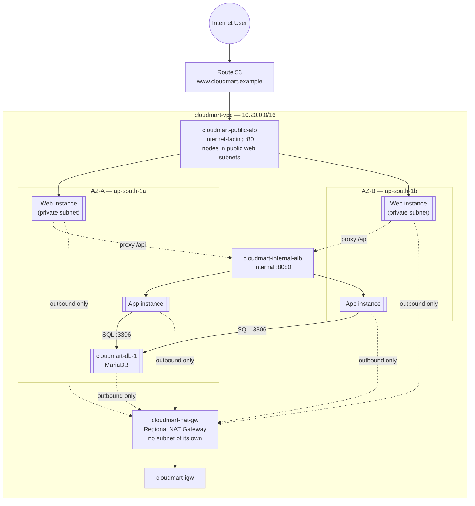
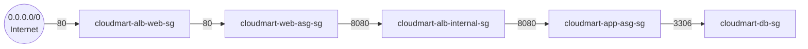

# 02 - Architecture and Design

> Goal: turn Note 01's requirements into a concrete, named architecture — every VPC, subnet, security group, load balancer, and Auto Scaling Group this capstone builds, with exact CIDRs and names, so every later hands-on file (05-11) is just executing this design in the console. This is the reference diagram to come back to throughout the build.

---

## 1. The full architecture

CloudMart is a **3-tier architecture** spread across **two Availability Zones** in `ap-south-1` (Asia Pacific — Mumbai): a private **web tier** (frontend), a private **app tier** (backend API), and a private **database tier** — each tier isolated in its own subnets, each compute tier fronted by its own load balancer and scaled by its own Auto Scaling Group. Only the two load balancers' network interfaces sit in public subnets; every single EC2 instance in this build, across all three tiers, lives in a private subnet with no public IP.

Subnets and their exact CIDRs aren't drawn as separate boxes here (that would make this diagram very crowded) — they're listed in the resource inventory table in Section 3 below. This diagram focuses purely on the traffic relationships between resources: one AZ's web/app/db instances, mirrored in the other AZ, both tiers of compute fronted by their own load balancer, and every private-subnet instance sharing the one Regional NAT Gateway for outbound-only traffic.

> 🧠 **Mental model — why the frontend can be private even though it's "public-facing."** "Public-facing" describes the **load balancer**, not the instances behind it. `cloudmart-public-alb`'s own network interfaces sit in the public web subnets (that's what makes it reachable from the internet), but the EC2 instances it forwards to are just targets registered by IP — they can live anywhere routable inside the VPC, including a private subnet. This is the standard, recommended pattern: internet exposure lives entirely in the load balancer layer, and no compute instance anywhere in the architecture needs a public IP at all.

> 🧠 **Mental model — zonal vs Regional NAT Gateway.** The classic AWS pattern is a **zonal NAT Gateway**: a resource pinned to one Availability Zone, launched inside a public subnet in that zone, with real HA requiring one per AZ plus per-AZ route tables. AWS's newer **Regional NAT Gateway** (GA since November 2025) is a single VPC-level resource with no subnet of its own at all — it automatically detects which AZs have active private-subnet workloads and expands its own presence into those AZs, so every private subnet in the VPC can point at the exact same NAT Gateway ID, in one shared route table, and still get genuine multi-AZ redundancy. This capstone uses the regional mode for exactly that reason: one resource, one route table, real HA, no manual per-AZ NAT provisioning.

**Traffic path for one request:** Internet → Route 53 resolves `www.cloudmart.example` → `cloudmart-public-alb` → a healthy instance in `cloudmart-web-asg` (whichever AZ) → that instance's Nginx serves the static page, and its JavaScript calls `/api/products`, which Nginx reverse-proxies to `cloudmart-internal-alb` → a healthy instance in `cloudmart-app-asg` → that instance's Flask app queries `cloudmart-db-1` over port 3306 → the response bubbles back up the same chain to the browser.

---

## 2. Security group chain

Each tier's security group only trusts the ONE security group directly in front of it — never a broad CIDR, never the whole internet past the first hop. This means compromising or misconfiguring one tier doesn't automatically expose the tier behind it; an attacker who somehow reached a web-tier instance still can't reach the database directly, because `cloudmart-db-sg` doesn't know `cloudmart-web-asg-sg` exists at all.

| Security Group | Attached to | Allows inbound | From |
|---|---|---|---|
| `cloudmart-alb-web-sg` | `cloudmart-public-alb` | TCP 80 | `0.0.0.0/0` |
| `cloudmart-web-asg-sg` | Web (frontend) EC2 instances | TCP 80 | `cloudmart-alb-web-sg` only |
| `cloudmart-alb-internal-sg` | `cloudmart-internal-alb` | TCP 8080 | `cloudmart-web-asg-sg` only |
| `cloudmart-app-asg-sg` | App (backend) EC2 instances | TCP 8080 | `cloudmart-alb-internal-sg` only |
| `cloudmart-db-sg` | `cloudmart-db-1` | TCP 3306 | `cloudmart-app-asg-sg` only |

🎯 **Exam tip:** referencing another **security group** as the source (instead of a CIDR block) means the rule automatically covers every instance that has that SG attached — including new ones an Auto Scaling Group launches later. This is exactly why the chain above still works correctly as `cloudmart-web-asg`/`cloudmart-app-asg` scale in and out; nobody has to edit a CIDR list every time an instance is replaced.

---

## 3. Full resource inventory

| Resource | Name | Key detail |
|---|---|---|
| VPC | `cloudmart-vpc` | `10.20.0.0/16` |
| Subnet (web, AZ-a) | `cloudmart-web-subnet-1` | `10.20.1.0/24`, public — holds only the two ALBs' nodes, no EC2 instances |
| Subnet (web, AZ-b) | `cloudmart-web-subnet-2` | `10.20.2.0/24`, public — holds only ALB nodes |
| Subnet (web-private, AZ-a) | `cloudmart-web-private-1` | `10.20.31.0/24`, private — frontend (Nginx) EC2 instances |
| Subnet (web-private, AZ-b) | `cloudmart-web-private-2` | `10.20.32.0/24`, private — frontend (Nginx) EC2 instances |
| Subnet (app, AZ-a) | `cloudmart-app-subnet-1` | `10.20.11.0/24`, private |
| Subnet (app, AZ-b) | `cloudmart-app-subnet-2` | `10.20.12.0/24`, private |
| Subnet (db, AZ-a) | `cloudmart-db-subnet-1` | `10.20.21.0/24`, private, in use |
| Subnet (db, AZ-b) | `cloudmart-db-subnet-2` | `10.20.22.0/24`, private, reserved for a future Multi-AZ DB |
| Internet Gateway | `cloudmart-igw` | attached to `cloudmart-vpc` |
| NAT Gateway | `cloudmart-nat-gw` | **Regional** availability mode — no subnet of its own, automatically maintains presence in whichever AZs have active workloads |
| Route table (web) | `cloudmart-web-rt` | `0.0.0.0/0 → cloudmart-igw`; covers both public web subnets |
| Route table (private) | `cloudmart-private-rt` | `0.0.0.0/0 → cloudmart-nat-gw`; covers all six private subnets (`web-private-1/2`, `app-subnet-1/2`, `db-subnet-1/2`) |
| IAM instance profile | `cloudmart-ssm-role` | `AmazonSSMManagedInstanceCore` attached |
| Security groups | `cloudmart-alb-web-sg`, `cloudmart-web-asg-sg`, `cloudmart-alb-internal-sg`, `cloudmart-app-asg-sg`, `cloudmart-db-sg` | see chain above — unaffected by subnet placement, since SG rules are keyed on source SG/port, not subnet |
| Database instance | `cloudmart-db-1` | `t3.micro`, MariaDB, `cloudmart-db-subnet-1` |
| Backend launch template | `cloudmart-app-lt` | Flask app on port 8080 |
| Backend target group | `cloudmart-app-tg` | HTTP:8080, health check `/health` |
| Internal load balancer | `cloudmart-internal-alb` | internal scheme, app subnets |
| Backend ASG | `cloudmart-app-asg` | min 2 / desired 2 / max 4, target-tracking CPU 50% |
| Frontend launch template | `cloudmart-web-lt` | Nginx + static page + `/api/` proxy |
| Frontend target group | `cloudmart-web-tg` | HTTP:80, health check `/` |
| Public load balancer | `cloudmart-public-alb` | internet-facing, nodes in `cloudmart-web-subnet-1/2`, targets in `cloudmart-web-private-1/2` |
| Frontend ASG | `cloudmart-web-asg` | min 2 / desired 2 / max 4, target-tracking CPU 50%, instances in `cloudmart-web-private-1/2` |
| Hosted zone | `cloudmart.example` | public hosted zone |
| Health check | `cloudmart-alb-health-check` | monitors `cloudmart-public-alb` |
| DNS record | `www.cloudmart.example` | Alias → `cloudmart-public-alb` |

---

## 4. How this achieves high availability

- **Every compute and load-balancing layer spans 2 AZs**: both subnets per compute tier (including the frontend's new private subnets), both ALBs (an ALB is inherently multi-AZ once you give it 2+ subnets), and both Auto Scaling Groups (minimum 2 instances, one per AZ at all times).
- **Regional NAT Gateway, not zonal**: `cloudmart-nat-gw` is a single resource with no subnet of its own, and AWS automatically maintains its presence in every AZ that has an active private-subnet workload. Unlike the classic one-NAT-Gateway-per-AZ pattern, this gives real multi-AZ outbound resilience from one shared route (`cloudmart-private-rt`), without provisioning (or paying for) a second NAT Gateway by hand.
- **Self-healing via health checks**: each ALB's target group continuously health-checks its instances (`/health` for the backend, `/` for the frontend); an instance that fails is removed from rotation, and its Auto Scaling Group launches a replacement automatically because the group's health check type includes ELB, not just EC2 status checks.
- **Route 53 health check on the public ALB**: `cloudmart-alb-health-check` gives the DNS layer visibility into whether the whole public entry point is healthy — a prerequisite if this architecture ever grows into multi-region failover routing later.

> ⚠️ **Known HA gap — the database tier.** `cloudmart-db-1` is a single EC2 instance in a single AZ, with no standby, no automatic failover, and no replication. This is a **deliberate, named scope limitation**, not an oversight: this capstone is scoped to exactly five services (VPC, EC2, ASG, ELB, Route 53), and a real production build would replace this single instance with **Amazon RDS in Multi-AZ mode** (or Aurora), which handles automatic failover to a synchronously-replicated standby in a second AZ. Every other tier in this architecture — including outbound NAT, now that it uses the regional mode — can lose an entire AZ and keep working; the database tier currently cannot. Note 11 revisits this gap explicitly during HA validation testing.

---

## 5. How this achieves security

- **Three-tier network isolation**: only the two public web subnets (`cloudmart-web-subnet-1/2`, which hold nothing but the two ALBs' nodes) have a route to the Internet Gateway; all six private subnets — frontend, app, and database alike — have no route to the public internet at all (outbound-only, via the Regional NAT Gateway, which itself needs no subnet at all). None of the three compute tiers can ever be reached by an inbound connection initiated from the internet; the only way in is through `cloudmart-public-alb`.
- **Chained security groups** (Section 2): each tier only accepts traffic from the specific SG in front of it, not from a CIDR range — the backend only trusts the internal ALB's SG, the database only trusts the backend's SG.
- **No SSH, anywhere.** Every EC2 instance in this project uses the `cloudmart-ssm-role` instance profile and is administered through **AWS Systems Manager Session Manager**, which requires no open inbound port, no distributed SSH key, and no bastion host — and every session is logged centrally by SSM if you enable session logging (out of scope to configure here, but worth knowing it's available).
- **Database credentials as a noted simplification**: the `cloudmart_app` database user's password is hardcoded into the instance's user data for this capstone. A real build would pull it from **AWS Secrets Manager** or **Systems Manager Parameter Store (SecureString)** at boot time instead of embedding it in plaintext — flagged here explicitly so it isn't mistaken for a recommended practice.

🎯 **Exam tip:** "the application tier must not be directly reachable from the internet" is one of the most common SAA-C03 architecture requirements, and the answer is almost always this exact pattern — private subnets with no IGW route, reached only through a load balancer or another instance in a public subnet, never by giving the private instance a public IP.

---

## 6. Recap

- CloudMart is one VPC (`cloudmart-vpc`, `10.20.0.0/16`) split into 2 public subnets (ALBs only) and 3 private compute tiers × 2 AZs = 6 private subnets, all routed outbound through one Regional NAT Gateway.
- Traffic flows Route 53 → public ALB → web ASG (private subnets) → internal ALB → app ASG → database, with each hop gated by a security group that only trusts the hop directly before it.
- HA comes from spanning every layer across 2 AZs with automatic health-check-driven replacement, plus a Regional NAT Gateway that automatically follows workloads across AZs; the single-instance database is this build's one remaining named, deliberate gap.
- Security comes from subnet isolation (now including the frontend), SG chaining, and SSM-only administrative access — never SSH.
- Next: Note 03 — Application: Frontend, Backend, Database, where the actual (dummy) code running on each tier is introduced.

### Sources
- [Application Load Balancer components — AWS docs](https://docs.aws.amazon.com/elasticloadbalancing/latest/application/introduction.html)
- [NAT gateways — AWS docs](https://docs.aws.amazon.com/vpc/latest/userguide/vpc-nat-gateway.html)
- [Regional NAT gateways for automatic multi-AZ expansion — AWS docs](https://docs.aws.amazon.com/vpc/latest/userguide/nat-gateways-regional.html)
- [Security groups for your VPC — AWS docs](https://docs.aws.amazon.com/vpc/latest/userguide/vpc-security-groups.html)
- [Amazon RDS Multi-AZ deployments — AWS docs](https://docs.aws.amazon.com/AmazonRDS/latest/UserGuide/Concepts.MultiAZ.html)
