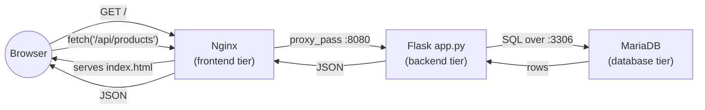

# 03 - Application: Frontend, Backend, Database

> Goal: introduce the actual code running on each of CloudMart's three tiers. This app is **deliberately minimal** — a product catalog page, a small REST API, and one database table — because the point of this capstone is the *infrastructure* around it (networking, security, high availability, scaling, DNS), not the application itself. Just enough app to make the 3-tier build real and testable.

---

## 1. The 3-tier call chain



The browser only ever talks to the frontend tier. The frontend's Nginx server does two jobs: it serves the static page directly, and it reverse-proxies any `/api/` request to the backend tier's internal load balancer — the backend is never exposed to the browser directly, and the database is never exposed to anything except the backend.

---

## 2. Database tier — MariaDB schema and seed data

One database, `cloudmart`, with a single table, `products`:

```sql
CREATE TABLE IF NOT EXISTS products (
  id INT AUTO_INCREMENT PRIMARY KEY,
  name VARCHAR(100) NOT NULL,
  price DECIMAL(10,2) NOT NULL,
  stock INT DEFAULT 0
);

INSERT INTO products (name, price, stock) VALUES
  ('CloudMart T-Shirt', 19.99, 120),
  ('CloudMart Mug', 9.99, 200),
  ('CloudMart Sticker Pack', 4.99, 500),
  ('CloudMart Hoodie', 39.99, 60),
  ('CloudMart Cap', 14.99, 150);
```

A dedicated application database user, `cloudmart_app`, is created with a password and granted access **only** to the `cloudmart` database, and only from connections originating in the app-tier subnet range (`10.20.1x.x`) — not from anywhere else, not even from other instances in the same VPC. Note 07 (the database hands-on) builds this for real via a user-data script on `cloudmart-db-1`.

> ⚠️ **Named simplification:** the `cloudmart_app` password is hardcoded in plaintext in this capstone's user-data script (`ChangeMe123!`) purely so the whole build stays inside the 5 requested services. A real project would never do this — it would pull the credential at boot time from **AWS Secrets Manager** or **Systems Manager Parameter Store (SecureString)** instead of embedding it in a script anyone with EC2 console/API read access to launch templates could see.

---

## 3. Backend tier — Flask REST API (`app.py`)

The backend is a small Python **Flask** app, run by **gunicorn** on port `8080`, exposing three routes:

```python
from flask import Flask, jsonify, request
import pymysql
import os

app = Flask(__name__)

DB_HOST = os.environ.get("DB_HOST", "10.20.21.10")
DB_USER = os.environ.get("DB_USER", "cloudmart_app")
DB_PASS = os.environ.get("DB_PASS", "ChangeMe123!")
DB_NAME = os.environ.get("DB_NAME", "cloudmart")

def get_connection():
    return pymysql.connect(
        host=DB_HOST, user=DB_USER, password=DB_PASS,
        database=DB_NAME, cursorclass=pymysql.cursors.DictCursor,
    )

@app.route("/health")
def health():
    return "OK", 200

@app.route("/api/products", methods=["GET"])
def list_products():
    conn = get_connection()
    with conn.cursor() as cur:
        cur.execute("SELECT id, name, price, stock FROM products")
        rows = cur.fetchall()
    conn.close()
    return jsonify(rows)

@app.route("/api/products", methods=["POST"])
def add_product():
    data = request.get_json()
    conn = get_connection()
    with conn.cursor() as cur:
        cur.execute(
            "INSERT INTO products (name, price, stock) VALUES (%s, %s, %s)",
            (data["name"], data["price"], data.get("stock", 0)),
        )
    conn.commit()
    conn.close()
    return jsonify({"status": "created"}), 201

if __name__ == "__main__":
    app.run(host="0.0.0.0", port=8080)
```

- **`GET /health`** — returns a bare `200 OK`. This is the exact path `cloudmart-app-tg`'s health check polls; it deliberately does nothing else (no DB query) so a slow database can't make the whole backend tier look unhealthy from the load balancer's point of view.
- **`GET /api/products`** — the read path the frontend's product list calls.
- **`POST /api/products`** — the write path, used in Note 11's end-to-end test to prove data actually flows all the way through to the database and back.
- **`DB_HOST` and friends are environment variables**, not hardcoded — Note 08 sets `DB_HOST` to `cloudmart-db-1`'s actual private IP via the launch template's user data, which is what lets the exact same `app.py` work unmodified regardless of which private IP the database instance happens to get.

---

## 4. Frontend tier — Nginx static page + reverse proxy (`index.html`)

The frontend serves one static HTML page and proxies API calls onward:

```html
<!DOCTYPE html>
<html>
<head><title>CloudMart</title></head>
<body>
  <h1>🛒 CloudMart</h1>
  <ul id="products"></ul>
  <script>
    fetch('/api/products')
      .then(r => r.json())
      .then(items => {
        const ul = document.getElementById('products');
        items.forEach(p => {
          const li = document.createElement('li');
          li.textContent = `${p.name} — $${p.price} (${p.stock} in stock)`;
          ul.appendChild(li);
        });
      });
  </script>
</body>
</html>
```

This file is placed at `/usr/share/nginx/html/index.html`, Nginx's default document root. Alongside it, an Nginx server-block configuration adds a proxy rule:

```nginx
location /api/ {
    proxy_pass http://cloudmart-internal-alb-123456789.ap-south-1.elb.amazonaws.com:8080/api/;
}
```

Every request the browser's JavaScript makes to `/api/products` therefore actually leaves the frontend instance and travels to `cloudmart-internal-alb` — the browser itself never learns the internal ALB's DNS name or the backend's port; it only ever talks to port 80 on the public ALB.

🧠 **Mental model:** the frontend instance is doing double duty as both a **static file server** and a **reverse proxy** — a very common real-world pattern (Nginx, Apache, or a CDN edge server in front of an API) that keeps the browser's view of the system to a single origin while the actual backend lives on a completely different, non-public load balancer.

---

## 5. Recap

- CloudMart's app is intentionally small: a static product page (frontend), a 3-route Flask API (backend), and a single-table MariaDB database (database tier) — enough to prove the infrastructure works, not a real production codebase.
- The frontend never talks to the database directly, and the browser never talks to the backend directly — every hop goes through exactly one proxy or load balancer, matching the security chain from Note 02.
- `DB_HOST` and the internal ALB's DNS name are the two "wiring" values that connect the tiers together, both supplied via each tier's launch-template user data rather than hardcoded into the application code itself.
- Next: Note 04 — Workflow, where the request path, build order, auto-healing, and scaling behaviors are each walked through as their own diagram.

### Sources
- [Flask Quickstart — Flask documentation](https://flask.palletsprojects.com/en/stable/quickstart/)
- [ngx_http_proxy_module (proxy_pass) — nginx documentation](https://nginx.org/en/docs/http/ngx_http_proxy_module.html)
- [PyMySQL documentation](https://pymysql.readthedocs.io/en/latest/)
