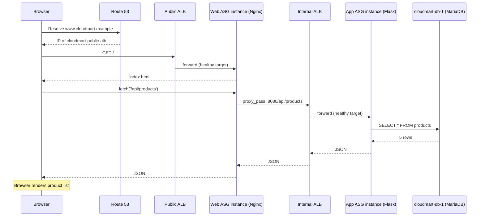
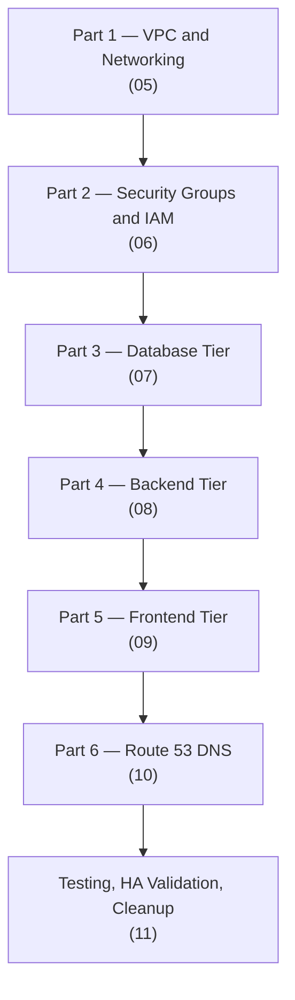
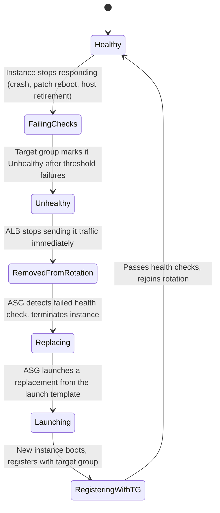
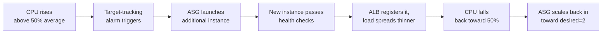

# 04 - Workflow

> Goal: walk through CloudMart's behavior over time as four separate diagrams — a single request, the order the infrastructure gets built in, what happens when an instance fails, and what happens when load rises. Note 02 showed the static architecture; this note shows it in motion.

---

## 1. A single user request, start to finish

Two load balancers sit in this path, but the browser only ever sees one hop — everything past `cloudmart-public-alb` is invisible to it, exactly as the security design in Note 02 intends.

---

## 2. Build order — why Parts 1 through 6 happen in this sequence

Each part exists as a **hard prerequisite** for the next, not just a suggested order:

| Part | Can't start until... | Because... |
|---|---|---|
| 2 (Security Groups) | Part 1's subnets exist | Security groups belong to the VPC, and later launch templates need them |
| 3 (Database) | Part 2's `cloudmart-db-sg` exists | The DB instance must launch with a security group already in place |
| 4 (Backend) | Part 3's DB instance has a private IP | The backend's user data hardcodes `DB_HOST` to that IP |
| 5 (Frontend) | Part 4's Internal ALB has a DNS name | The frontend's Nginx config hardcodes the `proxy_pass` target to that DNS name |
| 6 (Route 53) | Part 5's Public ALB exists | The DNS Alias record and health check both target the Public ALB |

🎯 **Exam tip:** this "each tier's config bakes in the previous tier's endpoint" pattern is exactly why real infrastructure-as-code tools (CloudFormation, Terraform) express these as explicit resource dependencies — doing it by hand in the console, as this capstone does, makes that dependency chain very concrete and easy to feel.

---

## 3. Auto-healing — one instance fails

This same sequence applies to **either** compute tier (web or app) — only the specific target group and ASG differ.

Because both `cloudmart-web-asg` and `cloudmart-app-asg` run with **minimum capacity 2, one per AZ**, losing a single instance never drops that tier to zero — the other AZ's instance keeps serving every request while the failed one is replaced. Note 11 exercises this exact sequence manually to prove it.

---

## 4. Scaling — load rises and falls

Both `cloudmart-web-asg` and `cloudmart-app-asg` carry an identical **target-tracking scaling policy** keyed on average CPU utilization at 50%, each capped at a maximum of 4 instances. Because the two ASGs scale independently, a frontend-heavy spike (lots of static page loads) and a backend-heavy spike (lots of API calls) each get absorbed by the tier that's actually under load, without over-provisioning the tier that isn't.

---

## 5. Recap

- One request crosses two load balancers but only one hop is ever visible to the browser.
- The 6-part build order isn't arbitrary — each part's launch template or DNS record literally hardcodes an endpoint value produced by the part before it.
- Auto-healing and scaling both rely on the same underlying mechanism: an ALB target group's health checks feeding into an ASG's replace/launch decisions.
- Next: Note 05 — Build Part 1: VPC and Networking, where the actual console build begins.

### Sources
- [How Elastic Load Balancing works with Auto Scaling — AWS docs](https://docs.aws.amazon.com/autoscaling/ec2/userguide/autoscaling-load-balancer.html)
- [Target tracking scaling policies — AWS docs](https://docs.aws.amazon.com/autoscaling/ec2/userguide/as-scaling-target-tracking.html)
- [Health checks for your target groups — AWS docs](https://docs.aws.amazon.com/elasticloadbalancing/latest/application/target-group-health-checks.html)
