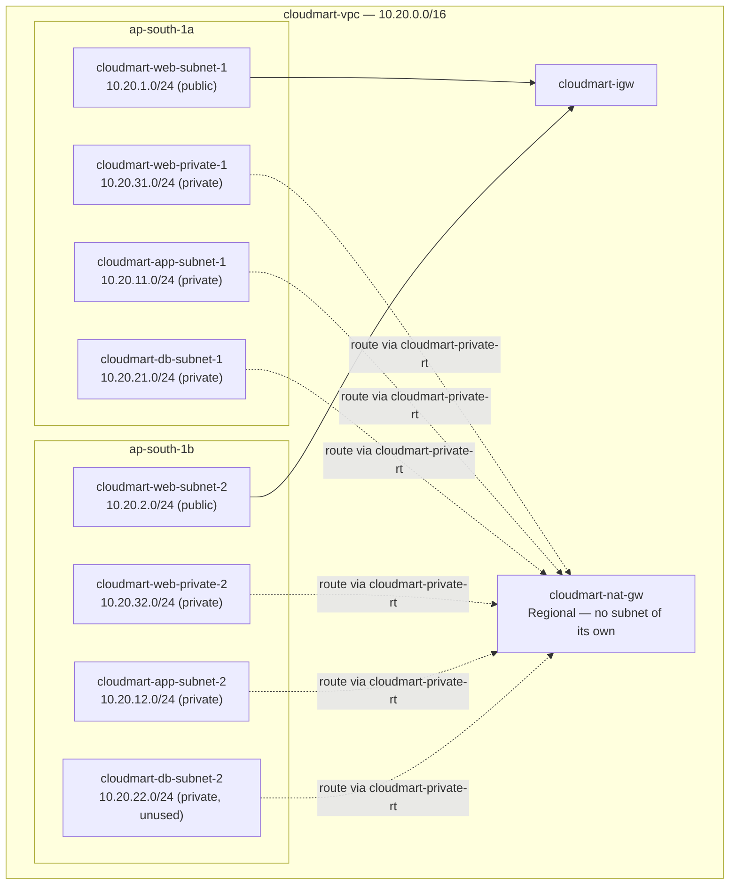

# 05 - Build Part 1: VPC and Networking (Hands-On)

> Goal: build the network foundation every other part of this capstone sits on — the VPC, all 8 subnets, the Internet Gateway, a single Regional NAT Gateway, and the route tables that tie them together. Nothing in this part costs much beyond the NAT Gateway's hourly charge, and nothing here is application-specific — it's pure networking, matching the design from Note 02.

---

## 1. Create the VPC

1. Open the **VPC console** → **Your VPCs** → **Create VPC**.
2. Choose **VPC only** (not "VPC and more" — building it by hand makes every later piece of this capstone easier to follow).
3. **Name tag**: `cloudmart-vpc`
4. **IPv4 CIDR block**: `10.20.0.0/16`
5. Leave IPv6 and tenancy at their defaults → **Create VPC**.
6. Select `cloudmart-vpc` → **Actions** → **Edit VPC settings** → enable **DNS resolution** and **DNS hostnames** (both required — the backend and frontend instances need working DNS to resolve package repositories and, later, the internal ALB's DNS name).

---

## 2. Create the eight subnets

Go to **Subnets** → **Create subnet**, select `cloudmart-vpc`, and add all eight in one wizard (use **Add new subnet** to add rows before creating):

| Name | Availability Zone | IPv4 CIDR |
|---|---|---|
| `cloudmart-web-subnet-1` | `ap-south-1a` | `10.20.1.0/24` |
| `cloudmart-web-subnet-2` | `ap-south-1b` | `10.20.2.0/24` |
| `cloudmart-web-private-1` | `ap-south-1a` | `10.20.31.0/24` |
| `cloudmart-web-private-2` | `ap-south-1b` | `10.20.32.0/24` |
| `cloudmart-app-subnet-1` | `ap-south-1a` | `10.20.11.0/24` |
| `cloudmart-app-subnet-2` | `ap-south-1b` | `10.20.12.0/24` |
| `cloudmart-db-subnet-1` | `ap-south-1a` | `10.20.21.0/24` |
| `cloudmart-db-subnet-2` | `ap-south-1b` | `10.20.22.0/24` |

Click **Create subnet** once all eight rows are filled in.

For the two `cloudmart-web-subnet-*` subnets only: select each → **Actions** → **Edit subnet settings** → enable **Auto-assign public IPv4 address**. Leave this disabled for all six other subnets (`web-private-1/2`, `app-subnet-1/2`, `db-subnet-1/2`) — they must never hand out a public IP. Note that `cloudmart-web-subnet-1/2` end up holding only the ALBs' nodes and the NAT Gateway — no EC2 instance is ever launched directly into them; the frontend's actual compute lives in `cloudmart-web-private-1/2` instead (Note 02, Section 1).

> ⚠️ `cloudmart-db-subnet-2` is created now but stays empty for this entire capstone — it exists so the network layout is already Multi-AZ-ready if this project is later extended to a real RDS Multi-AZ database (Note 02's named HA gap), without having to re-architect the VPC.

---

## 3. Create and attach the Internet Gateway

1. **Internet Gateways** → **Create internet gateway** → name it `cloudmart-igw` → **Create**.
2. Select it → **Actions** → **Attach to VPC** → choose `cloudmart-vpc` → **Attach internet gateway**.

---

## 4. Create the Regional NAT Gateway

A classic ("zonal") NAT Gateway needs its own Elastic IP and must sit in a public subnet in one specific AZ. This build instead uses the newer **Regional NAT Gateway** (GA since November 2025), which needs neither — it's a standalone VPC-level resource that automatically maintains its own presence in whichever AZs actually have private-subnet workloads.

1. **NAT Gateways** → **Create NAT gateway**.
2. **Name**: `cloudmart-nat-gw`
3. **Availability mode**: **Regional** — notice no subnet picker appears once you select this; a regional NAT Gateway doesn't live inside any subnet at all.
4. **VPC**: `cloudmart-vpc`
5. Leave IP address management on **Automatic** (AWS allocates and manages the public IP addresses it needs itself) → **Create NAT gateway**.
6. Wait until it shows **Available** before continuing. It may take up to 60 minutes to fully "expand" into a new AZ the first time a workload appears there, but for this build (which launches instances into both AZs from the start once Parts 3-5 run) that's rarely noticeable in practice.

> 🎯 **Exam tip:** a **zonal** NAT Gateway (the classic, still-default type) is scoped to a single Availability Zone and is not itself multi-AZ — the textbook HA answer has always been **one zonal NAT Gateway per AZ**, each in its own public subnet, so that one AZ's NAT failing never strands another AZ's outbound traffic. AWS's newer **Regional NAT Gateway** availability mode changes this: one resource, no subnet of its own, automatically redundant across every AZ with an active workload. The exam (SAA-C03) was written around the older zonal-only world, so expect exam questions to test the "one NAT Gateway per AZ" pattern — but know that regional NAT Gateways now exist as the modern, simpler way to get the same multi-AZ outcome from a single resource.

---

## 5. Create the two route tables

1. **Route Tables** → **Create route table**:
   - `cloudmart-web-rt`, VPC: `cloudmart-vpc` → **Create**.
   - Select it → **Routes** tab → **Edit routes** → **Add route**: destination `0.0.0.0/0`, target **Internet Gateway** → `cloudmart-igw` → **Save**.
   - **Subnet associations** tab → **Edit subnet associations** → select `cloudmart-web-subnet-1` and `cloudmart-web-subnet-2` → **Save**.
2. `cloudmart-private-rt`, VPC: `cloudmart-vpc` → **Create**.
   - **Edit routes** → add `0.0.0.0/0` → target **NAT Gateway** → `cloudmart-nat-gw` → **Save**.
   - **Edit subnet associations** → select all six private subnets: `cloudmart-web-private-1`, `cloudmart-web-private-2`, `cloudmart-app-subnet-1`, `cloudmart-app-subnet-2`, `cloudmart-db-subnet-1`, `cloudmart-db-subnet-2` → **Save**. All six share the same single route (`0.0.0.0/0 → cloudmart-nat-gw`), and because `cloudmart-nat-gw` is regional (not tied to one AZ), this one route table correctly serves subnets in both `ap-south-1a` and `ap-south-1b` with no per-AZ split needed — unlike the classic zonal-NAT pattern where each AZ's private subnets would need their own route table pointing at that AZ's own NAT Gateway.

> 🧠 Note that AWS also auto-creates its own route table for the regional NAT Gateway itself (with a pre-configured route out to `cloudmart-igw`) the moment you create it in Section 4 — that's a separate, AWS-managed table you don't need to touch; `cloudmart-private-rt` above is the one *you* create and associate with your private subnets.

Every subnet also automatically keeps its `10.20.0.0/16 → local` route — that's implicit and lets every subnet in the VPC reach every other subnet directly, regardless of which route table it's associated with.

---

## 6. End state

No compute or load balancers exist yet — that starts in Part 2 (security groups) and Part 3 (the database instance). This part is purely the network shell.

---

## 7. Troubleshooting

| Symptom | Likely cause |
|---|---|
| No subnet picker appears when creating the NAT Gateway | Expected — this is only true for **Regional** availability mode; a regional NAT Gateway isn't placed in any subnet. If you instead see a subnet picker, double check **Availability mode** is set to **Regional**, not **Zonal** |
| Subnet CIDR error on creation | Overlap with an already-created subnet — double check the octets in the table above, none of `1`, `2`, `11`, `12`, `21`, `22`, `31`, `32` should repeat |
| An instance later can't reach the internet | Check which route table its subnet is associated with, and that route table's `0.0.0.0/0` target — a common mistake is leaving a subnet on the VPC's default **main** route table instead of `cloudmart-private-rt` |
| NAT Gateway shows **Available** but a brand-new instance in a freshly-added AZ still can't reach the internet | Regional NAT Gateways can take up to ~60 minutes to expand into a new AZ the first time a workload appears there; give it time before troubleshooting further |

---

## 8. Recap

- `cloudmart-vpc` (`10.20.0.0/16`) now has 8 subnets across 2 AZs, one Internet Gateway, one Regional NAT Gateway (no subnet of its own), and 2 route tables wiring it all together.
- Only the two public web subnets have a direct route to the internet; all six private subnets (including the new `cloudmart-web-private-1/2`) route outbound-only through the single `cloudmart-nat-gw` via `cloudmart-private-rt`.
- Next: Note 06 — Build Part 2: Security Groups and IAM, where the SG chain from Note 02 gets created for real.

### Sources
- [Create a VPC — AWS docs](https://docs.aws.amazon.com/vpc/latest/userguide/create-vpc.html)
- [NAT gateways — AWS docs](https://docs.aws.amazon.com/vpc/latest/userguide/vpc-nat-gateway.html)
- [Route tables — AWS docs](https://docs.aws.amazon.com/vpc/latest/userguide/VPC_Route_Tables.html)
