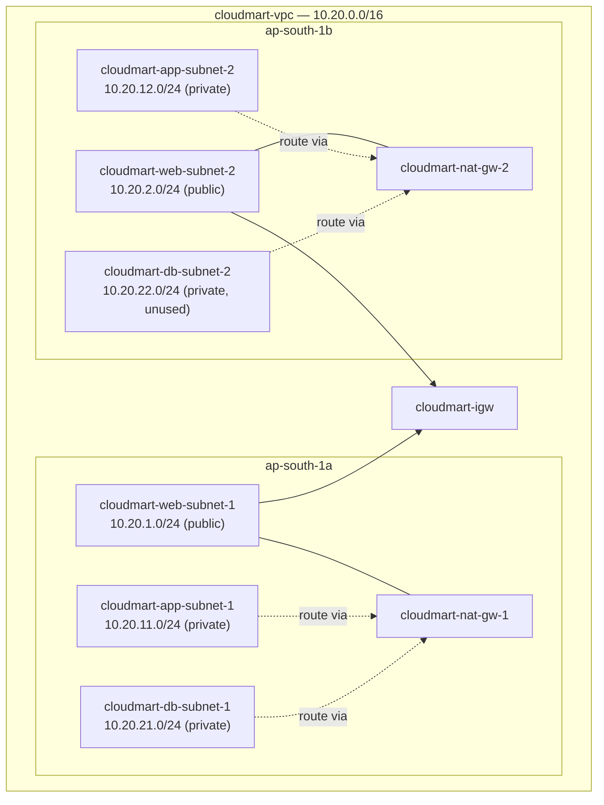

# 05 - Build Part 1: VPC and Networking (Hands-On)

> Goal: build the network foundation every other part of this capstone sits on — the VPC, all 6 subnets, the Internet Gateway, both NAT Gateways, and the route tables that tie them together. Nothing in this part costs much beyond the NAT Gateways' hourly charge, and nothing here is application-specific — it's pure networking, matching the design from Note 02.

---

## 1. Create the VPC

1. Open the **VPC console** → **Your VPCs** → **Create VPC**.
2. Choose **VPC only** (not "VPC and more" — building it by hand makes every later piece of this capstone easier to follow).
3. **Name tag**: `cloudmart-vpc`
4. **IPv4 CIDR block**: `10.20.0.0/16`
5. Leave IPv6 and tenancy at their defaults → **Create VPC**.
6. Select `cloudmart-vpc` → **Actions** → **Edit VPC settings** → enable **DNS resolution** and **DNS hostnames** (both required — the backend and frontend instances need working DNS to resolve package repositories and, later, the internal ALB's DNS name).

---

## 2. Create the six subnets

Go to **Subnets** → **Create subnet**, select `cloudmart-vpc`, and add all six in one wizard (use **Add new subnet** to add rows before creating):

| Name | Availability Zone | IPv4 CIDR |
|---|---|---|
| `cloudmart-web-subnet-1` | `ap-south-1a` | `10.20.1.0/24` |
| `cloudmart-web-subnet-2` | `ap-south-1b` | `10.20.2.0/24` |
| `cloudmart-app-subnet-1` | `ap-south-1a` | `10.20.11.0/24` |
| `cloudmart-app-subnet-2` | `ap-south-1b` | `10.20.12.0/24` |
| `cloudmart-db-subnet-1` | `ap-south-1a` | `10.20.21.0/24` |
| `cloudmart-db-subnet-2` | `ap-south-1b` | `10.20.22.0/24` |

Click **Create subnet** once all six rows are filled in.

For the two web subnets only: select each → **Actions** → **Edit subnet settings** → enable **Auto-assign public IPv4 address**. Leave this disabled for all four app/db subnets — they must never hand out a public IP.

> ⚠️ `cloudmart-db-subnet-2` is created now but stays empty for this entire capstone — it exists so the network layout is already Multi-AZ-ready if this project is later extended to a real RDS Multi-AZ database (Note 02's named HA gap), without having to re-architect the VPC.

---

## 3. Create and attach the Internet Gateway

1. **Internet Gateways** → **Create internet gateway** → name it `cloudmart-igw` → **Create**.
2. Select it → **Actions** → **Attach to VPC** → choose `cloudmart-vpc` → **Attach internet gateway**.

---

## 4. Create the two NAT Gateways

NAT Gateways need their own Elastic IP and must sit in a **public** subnet (they need a route to the internet themselves, to translate outbound traffic from the private subnets).

1. **Elastic IPs** → **Allocate Elastic IP address** → **Allocate** (repeat once, so you have two spare EIPs).
2. **NAT Gateways** → **Create NAT gateway**:
   - Name: `cloudmart-nat-gw-1`, Subnet: `cloudmart-web-subnet-1`, Connectivity type: **Public**, Elastic IP: pick the first allocated EIP → **Create NAT gateway**.
3. Repeat: `cloudmart-nat-gw-2`, Subnet: `cloudmart-web-subnet-2`, the second EIP.
4. Wait until both show **Available** (usually a few minutes) before continuing.

> 🎯 **Exam tip:** a NAT Gateway is scoped to a single Availability Zone — it is not itself a multi-AZ resource. High availability for outbound internet access from private subnets means deploying **one NAT Gateway per AZ**, exactly as done here, not one shared NAT Gateway for the whole VPC.

---

## 5. Create the three route tables

1. **Route Tables** → **Create route table**:
   - `cloudmart-web-rt`, VPC: `cloudmart-vpc` → **Create**.
   - Select it → **Routes** tab → **Edit routes** → **Add route**: destination `0.0.0.0/0`, target **Internet Gateway** → `cloudmart-igw` → **Save**.
   - **Subnet associations** tab → **Edit subnet associations** → select `cloudmart-web-subnet-1` and `cloudmart-web-subnet-2` → **Save**.
2. `cloudmart-app-rt-1`, VPC: `cloudmart-vpc` → **Create**.
   - **Edit routes** → add `0.0.0.0/0` → target **NAT Gateway** → `cloudmart-nat-gw-1` → **Save**.
   - **Edit subnet associations** → select `cloudmart-app-subnet-1` **and** `cloudmart-db-subnet-1` (both AZ-a private subnets share this one route table) → **Save**.
3. `cloudmart-app-rt-2`, VPC: `cloudmart-vpc` → **Create**.
   - **Edit routes** → add `0.0.0.0/0` → target **NAT Gateway** → `cloudmart-nat-gw-2` → **Save**.
   - **Edit subnet associations** → select `cloudmart-app-subnet-2` **and** `cloudmart-db-subnet-2` → **Save**.

Every subnet also automatically keeps its `10.20.0.0/16 → local` route — that's implicit and lets every subnet in the VPC reach every other subnet directly, regardless of which route table it's associated with.

---

## 6. End state

No compute or load balancers exist yet — that starts in Part 2 (security groups) and Part 3 (the database instance). This part is purely the network shell.

---

## 7. Troubleshooting

| Symptom | Likely cause |
|---|---|
| Can't select a subnet when creating the NAT Gateway | You're looking at a private subnet — a NAT Gateway must launch in a **public** subnet (one with an IGW route) |
| Subnet CIDR error on creation | Overlap with an already-created subnet — double check the octets in the table above, none of `1`, `2`, `11`, `12`, `21`, `22` should repeat |
| An instance later can't reach the internet | Check which route table its subnet is associated with, and that route table's `0.0.0.0/0` target — a common mistake is leaving a subnet on the VPC's default **main** route table instead of the one you built for it |

---

## 8. Recap

- `cloudmart-vpc` (`10.20.0.0/16`) now has 6 subnets across 2 AZs, one Internet Gateway, two AZ-scoped NAT Gateways, and 3 route tables wiring it all together.
- Only the web subnets have a direct route to the internet; app and db subnets route outbound-only through their own AZ's NAT Gateway.
- Next: Note 06 — Build Part 2: Security Groups and IAM, where the SG chain from Note 02 gets created for real.

### Sources
- [Create a VPC — AWS docs](https://docs.aws.amazon.com/vpc/latest/userguide/create-vpc.html)
- [NAT gateways — AWS docs](https://docs.aws.amazon.com/vpc/latest/userguide/vpc-nat-gateway.html)
- [Route tables — AWS docs](https://docs.aws.amazon.com/vpc/latest/userguide/VPC_Route_Tables.html)
