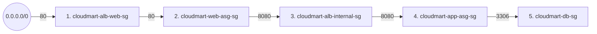

# 06 - Build Part 2: Security Groups and IAM (Hands-On)

> Goal: create the five-security-group chain and the IAM instance profile every EC2 instance in this capstone will use, continuing directly from Part 1's VPC (`cloudmart-vpc`). Order matters here — a security group can only reference another security group as a source if that other group already exists.

---

## 1. Why order matters

Note 02's chain is: `cloudmart-alb-web-sg` → `cloudmart-web-asg-sg` → `cloudmart-alb-internal-sg` → `cloudmart-app-asg-sg` → `cloudmart-db-sg`, where each arrow means "the group on the right allows inbound traffic **from** the group on the left." In the console, when you add an inbound rule with a security group as the source, that security group must already exist to appear in the source picker — so we create them in the same left-to-right order as the chain itself.

---

## 2. Create the five security groups, in order

All in the **VPC console → Security Groups → Create security group**, each with **VPC**: `cloudmart-vpc`.

**1. `cloudmart-alb-web-sg`**
- Description: "Public ALB — allows inbound HTTP from the internet"
- Inbound rule: Type **HTTP**, Port `80`, Source **Anywhere-IPv4** (`0.0.0.0/0`)
- Leave outbound at the default (allow all) → **Create security group**

**2. `cloudmart-web-asg-sg`**
- Description: "Web tier instances — only accept traffic from the public ALB"
- Inbound rule: Type **HTTP**, Port `80`, Source **Custom** → select `cloudmart-alb-web-sg`
- → **Create security group**

**3. `cloudmart-alb-internal-sg`**
- Description: "Internal ALB — only accepts traffic from the web tier"
- Inbound rule: Type **Custom TCP**, Port `8080`, Source **Custom** → select `cloudmart-web-asg-sg`
- → **Create security group**

**4. `cloudmart-app-asg-sg`**
- Description: "App tier instances — only accept traffic from the internal ALB"
- Inbound rule: Type **Custom TCP**, Port `8080`, Source **Custom** → select `cloudmart-alb-internal-sg`
- → **Create security group**

**5. `cloudmart-db-sg`**
- Description: "Database instance — only accepts traffic from the app tier"
- Inbound rule: Type **MYSQL/Aurora**, Port `3306`, Source **Custom** → select `cloudmart-app-asg-sg`
- → **Create security group**

> ⚠️ Notice what's **absent** from every one of these five groups: an inbound rule for port 22. That's intentional — see Section 3.

---

## 3. No SSH, anywhere — create the SSM instance profile instead

Every instance in this capstone is administered through **AWS Systems Manager Session Manager**, which needs no open inbound port at all (it works over an outbound HTTPS connection the instance initiates itself, which is already allowed by every security group's default outbound rule).

1. Open the **IAM console** → **Roles** → **Create role**.
2. **Trusted entity type**: AWS service → **Use case**: **EC2** → **Next**.
3. Search for and check **`AmazonSSMManagedInstanceCore`** → **Next**.
4. **Role name**: `cloudmart-ssm-role` → **Create role**.

Creating a role this way (for the EC2 use case) automatically creates a matching **instance profile** of the same name, which is what actually gets attached to an EC2 instance or launch template — you'll select `cloudmart-ssm-role` directly in the instance/launch-template wizard in later parts, and the console handles the instance-profile wrapping for you.

🧠 **Mental model:** think of `AmazonSSMManagedInstanceCore` as the permission that lets the SSM Agent (pre-installed on Amazon Linux 2023) "phone home" to the Systems Manager service — once that's in place, the console's **Connect → Session Manager** tab gives you a full shell on the instance with zero SSH keys, zero bastion hosts, and zero open inbound ports.

---

## 4. Recap

- All five security groups exist, each trusting only the SG directly before it in the chain — never a broad CIDR range past the first hop.
- `cloudmart-ssm-role` gives every instance in this capstone secure, keyless shell access via Session Manager; no security group in this project will ever need port 22 open.
- Next: Note 07 — Build Part 3: Database Tier, where `cloudmart-db-sg` and `cloudmart-ssm-role` get attached to the first real EC2 instance in this build.

### Sources
- [Security groups for your VPC — AWS docs](https://docs.aws.amazon.com/vpc/latest/userguide/vpc-security-groups.html)
- [AmazonSSMManagedInstanceCore — AWS managed policy reference](https://docs.aws.amazon.com/aws-managed-policy/latest/reference/AmazonSSMManagedInstanceCore.html)
- [Create an IAM instance profile for Systems Manager — AWS docs](https://docs.aws.amazon.com/systems-manager/latest/userguide/setup-instance-permissions.html)
