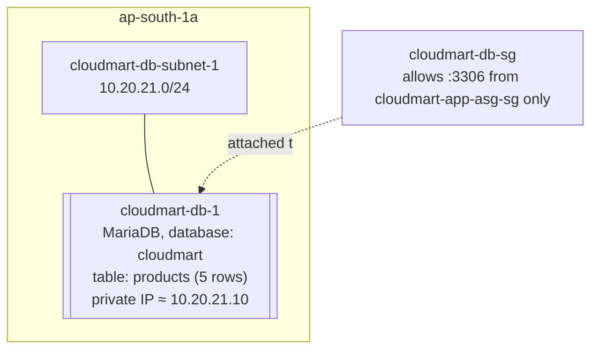

# 07 - Build Part 3: Database Tier (Hands-On)

> Goal: launch the single database instance the whole application sits on top of, continuing from Part 2's `cloudmart-db-sg` and `cloudmart-ssm-role`. This is the first real EC2 instance in this capstone, and the first place its known HA limitation becomes concrete rather than theoretical.

---

## 1. Launch `cloudmart-db-1`

1. **EC2 console** → **Launch instance**.
2. **Name**: `cloudmart-db-1`
3. **AMI**: **Amazon Linux 2023** (free-tier eligible)
4. **Instance type**: `t3.micro`
5. **Key pair**: select **Proceed without a key pair** — this instance is administered via Session Manager, not SSH, so no key pair is needed.
6. **Network settings** → **Edit**:
   - **VPC**: `cloudmart-vpc`
   - **Subnet**: `cloudmart-db-subnet-1`
   - **Auto-assign public IP**: **Disable**
   - **Firewall (security groups)**: select existing → `cloudmart-db-sg`
7. **Advanced details** → **IAM instance profile**: `cloudmart-ssm-role`
8. **Advanced details** → **User data** — paste the script from Section 2.
9. **Launch instance**.

---

## 2. User data — install and seed MariaDB

```bash
#!/bin/bash
dnf install -y mariadb105-server
systemctl enable --now mariadb

# Allow connections from the app-tier subnets, not just localhost
CNF=/etc/my.cnf.d/mariadb-server.cnf
if grep -q "^bind-address" "$CNF" 2>/dev/null; then
  sed -i 's/^bind-address.*/bind-address=0.0.0.0/' "$CNF"
  systemctl restart mariadb
fi

mysql -e "CREATE DATABASE IF NOT EXISTS cloudmart;"
mysql -e "CREATE USER IF NOT EXISTS 'cloudmart_app'@'10.20.1%' IDENTIFIED BY 'ChangeMe123!';"
mysql -e "GRANT ALL PRIVILEGES ON cloudmart.* TO 'cloudmart_app'@'10.20.1%';"
mysql -e "FLUSH PRIVILEGES;"

mysql cloudmart <<'SQL'
CREATE TABLE IF NOT EXISTS products (
  id INT AUTO_INCREMENT PRIMARY KEY,
  name VARCHAR(100) NOT NULL,
  price DECIMAL(10,2) NOT NULL,
  stock INT DEFAULT 0
);
INSERT INTO products (name, price, stock) VALUES
  ('CloudMart T-Shirt', 19.99, 120),
  ('CloudMart Mug', 9.99, 200),
  ('CloudMart Sticker Pack', 4.99, 500),
  ('CloudMart Hoodie', 39.99, 60),
  ('CloudMart Cap', 14.99, 150);
SQL
```

- `'cloudmart_app'@'10.20.1%'` is a MySQL host wildcard matching any address starting `10.20.1` — which covers both `10.20.11.0/24` (app-subnet-1) and `10.20.12.0/24` (app-subnet-2) in one rule, since both start with the digit sequence `10.20.1`. Network-level access is already locked down by `cloudmart-db-sg` (only the app tier's SG can reach port 3306 at all); this wildcard is a second, application-level layer restricting which hosts the `cloudmart_app` MySQL **account** itself will authenticate from.
- The `bind-address` edit is defensive — some MariaDB builds default to listening only on `127.0.0.1`, which would silently block all remote connections even with the security group correctly configured. The script checks for the line before editing so it doesn't fail if a given package build doesn't set one.

> ⚠️ `ChangeMe123!` is a hardcoded, plaintext password in a user-data script — acceptable only because this is a learning capstone confined to 5 services. A real build would fetch this credential from **AWS Secrets Manager** or **SSM Parameter Store (SecureString)** at boot instead (see Note 03's callout).

---

## 3. Verify, using Session Manager (no SSH)

1. **EC2 console** → select `cloudmart-db-1` → **Connect** → **Session Manager** tab → **Connect**.
2. In the shell that opens:
   ```bash
   sudo mysql -u cloudmart_app -pChangeMe123! cloudmart -e "SELECT * FROM products;"

   sudo mysql cloudmart -e "SELECT * FROM products;"
   
   +----+------------------------+-------+-------+
   | id | name                   | price | stock |
   +----+------------------------+-------+-------+
   |  1 | CloudMart T-Shirt      | 19.99 |   120 |
   |  2 | CloudMart Mug          |  9.99 |   200 |
   |  3 | CloudMart Sticker Pack |  4.99 |   500 |
   |  4 | CloudMart Hoodie       | 39.99 |    60 |
   |  5 | CloudMart Cap          | 14.99 |   150 |
   +----+------------------------+-------+-------+

   ```
- sudo mysql cloudmart -e "SELECT * FROM products;"
- It bypasses the cloudmart_app user entirely. sudo mysql authenticates as root via unix socket (no password needed), which has full access. The original error was because cloudmart_app is only authorized from 10.20.1% hosts — not localhost.
  
3. You should see all 5 seeded rows (T-Shirt, Mug, Sticker Pack, Hoodie, Cap) print out.
4. Note the instance's **private IPv4 address** from the EC2 console (**Details** tab) — the backend tier in Part 4 needs it. This capstone uses the illustrative value `10.20.21.10` throughout; substitute whatever private IP your instance actually received.

---

## 4. End state



> ⚠️ **This is the moment Note 02's "Known HA gap" becomes concrete.** Everything built so far and everything still to come (Parts 4-6) spans two Availability Zones. This single instance does not. If `cloudmart-db-1` fails, the whole application goes down with it — there is no automatic standby to fail over to. That's a deliberate, named limitation of staying within 5 services for this capstone; Note 11 revisits it directly during HA testing, and a real production build would replace this instance with **RDS in Multi-AZ mode**.

---

## 5. Recap

- `cloudmart-db-1` is running MariaDB in `cloudmart-db-subnet-1`, reachable only from the app tier's security group, seeded with a `products` table and 5 rows, with no SSH access — only Session Manager.
- Its private IP is the one piece of configuration the backend tier needs next.
- Next: Note 08 — Build Part 4: Backend Tier (ASG and Internal LB), where the Flask API from Note 03 gets deployed and wired up to this database.

### Sources
- [Tutorial: Install a LAMP server on Amazon Linux 2023 — AWS docs](https://docs.aws.amazon.com/linux/al2023/ug/ec2-lamp-amazon-linux-2023.html)
- [Session Manager — AWS Systems Manager User Guide](https://docs.aws.amazon.com/systems-manager/latest/userguide/session-manager.html)
- [MariaDB GRANT statement — MariaDB documentation](https://mariadb.com/kb/en/grant/)
