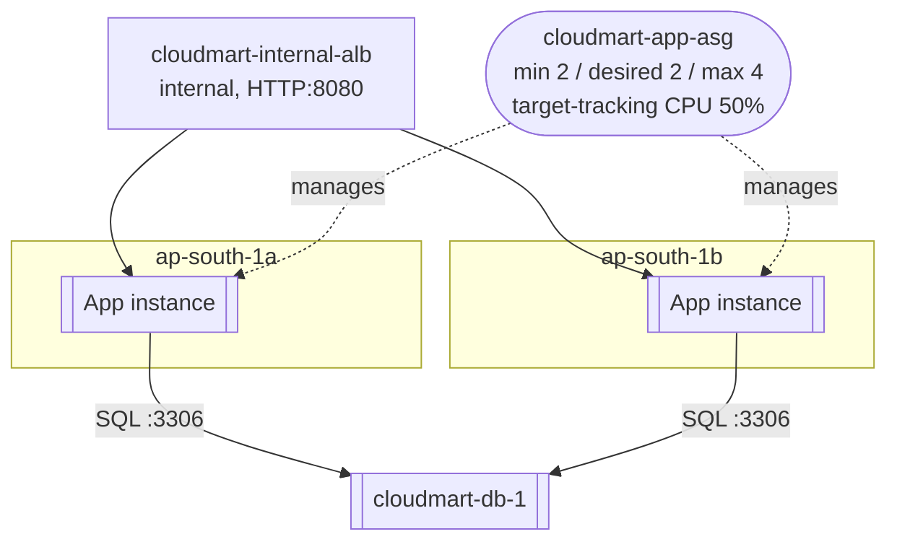

# 08 - Build Part 4: Backend Tier (ASG and Internal LB) (Hands-On)

> Goal: deploy the Flask API from Note 03 across both app subnets behind an internal load balancer, scaled by its own Auto Scaling Group — continuing from Part 3's database instance. This is the first tier in this capstone that's actually load-balanced and auto-scaled.

---

## 1. Create the backend target group

1. **EC2 console** → **Target Groups** → **Create target group**.
2. **Target type**: Instances
3. **Name**: `cloudmart-app-tg`
4. **Protocol : Port**: HTTP : `8080`
5. **VPC**: `cloudmart-vpc`
6. **Health checks** → **Advanced health check settings**: path `/health`, everything else at defaults.
7. **Next** → don't register any targets yet (the Auto Scaling Group will do that automatically) → **Create target group**.

---

## 2. Create the internal load balancer

1. **Load Balancers** → **Create load balancer** → **Application Load Balancer**.
2. **Name**: `cloudmart-internal-alb`
3. **Scheme**: **Internal** (not internet-facing — this ALB must never be reachable from outside the VPC)
4. **VPC**: `cloudmart-vpc`; **Mappings**: select `ap-south-1a` → `cloudmart-app-subnet-1`, and `ap-south-1b` → `cloudmart-app-subnet-2`.
5. **Security groups**: remove the default, select `cloudmart-alb-internal-sg`.
6. **Listeners and routing**: Protocol HTTP, Port `8080`, default action → forward to `cloudmart-app-tg`.
7. **Create load balancer**. Once active, note its **DNS name** from the load balancer's description page — it will look something like `cloudmart-internal-alb-123456789.ap-south-1.elb.amazonaws.com`. Part 5 needs this exact value.

---

## 3. Create the backend launch template

1. **Launch Templates** → **Create launch template**.
2. **Name**: `cloudmart-app-lt`
3. **AMI**: Amazon Linux 2023; **Instance type**: `t3.micro`
4. **Key pair**: none needed (Session Manager only, same as Part 3)
5. **Network settings**: security group `cloudmart-app-asg-sg` (leave subnet unset here — the ASG assigns subnets)
6. **Advanced details** → **IAM instance profile**: `cloudmart-ssm-role`
7. **Advanced details** → **User data** — paste the script from Section 4.
8. **Create launch template**.

---

## 4. User data — install Flask, write `app.py`, run it as a service

```bash
#!/bin/bash
dnf install -y python3 python3-pip
pip3 install flask gunicorn pymysql

mkdir -p /opt/cloudmart-app
cat > /opt/cloudmart-app/app.py << 'PYEOF'
from flask import Flask, jsonify, request
import pymysql
import os

app = Flask(__name__)

DB_HOST = os.environ.get("DB_HOST", "10.20.21.10")
DB_USER = os.environ.get("DB_USER", "cloudmart_app")
DB_PASS = os.environ.get("DB_PASS", "ChangeMe123!")
DB_NAME = os.environ.get("DB_NAME", "cloudmart")

def get_connection():
    return pymysql.connect(
        host=DB_HOST, user=DB_USER, password=DB_PASS,
        database=DB_NAME, cursorclass=pymysql.cursors.DictCursor,
    )

@app.route("/health")
def health():
    return "OK", 200

@app.route("/api/products", methods=["GET"])
def list_products():
    conn = get_connection()
    with conn.cursor() as cur:
        cur.execute("SELECT id, name, price, stock FROM products")
        rows = cur.fetchall()
    conn.close()
    return jsonify(rows)

@app.route("/api/products", methods=["POST"])
def add_product():
    data = request.get_json()
    conn = get_connection()
    with conn.cursor() as cur:
        cur.execute(
            "INSERT INTO products (name, price, stock) VALUES (%s, %s, %s)",
            (data["name"], data["price"], data.get("stock", 0)),
        )
    conn.commit()
    conn.close()
    return jsonify({"status": "created"}), 201

if __name__ == "__main__":
    app.run(host="0.0.0.0", port=8080)
PYEOF

cat > /etc/systemd/system/cloudmart-app.service << 'SVCEOF'
[Unit]
Description=CloudMart backend API
After=network.target

[Service]
WorkingDirectory=/opt/cloudmart-app
Environment=DB_HOST=10.20.21.10
Environment=DB_USER=cloudmart_app
Environment=DB_PASS=ChangeMe123!
Environment=DB_NAME=cloudmart
ExecStart=/usr/local/bin/gunicorn -w 2 -b 0.0.0.0:8080 app:app
Restart=always

[Install]
WantedBy=multi-user.target
SVCEOF

systemctl daemon-reload
systemctl enable --now cloudmart-app.service
```

- `Environment=DB_HOST=10.20.21.10` is the one line to change to match the actual private IP noted at the end of Part 3 — the application code itself (`app.py`) never needs editing.
- Running Flask under `gunicorn` as a systemd service means the API survives instance reboots and restarts automatically if it ever crashes (`Restart=always`).

---

## 5. Create the Auto Scaling Group

1. **Auto Scaling Groups** → **Create Auto Scaling group**.
2. **Name**: `cloudmart-app-asg`; **Launch template**: `cloudmart-app-lt`.
3. **VPC**: `cloudmart-vpc`; **Subnets**: `cloudmart-app-subnet-1` and `cloudmart-app-subnet-2`.
4. **Load balancing**: **Attach to an existing load balancer** → choose `cloudmart-app-tg` as the target group.
5. **Health checks**: enable **ELB health checks** in addition to EC2 (so a Flask crash that still leaves the OS "running" is caught).
6. **Group size**: Desired `2`, Minimum `2`, Maximum `4`.
7. **Scaling policies**: **Target tracking scaling policy**, metric type **Average CPU utilization**, target value `50`.
8. **Create Auto Scaling group**.

---

## 6. Verify

Wait for both instances to show **Healthy** in `cloudmart-app-tg`'s **Targets** tab, then connect to either one via **Session Manager** and run:

```bash
curl localhost:8080/api/products
```

You should get back the same 5-product JSON array seeded in Part 3 — proof the backend can reach the database over the network path built in Part 1 and the security group chain built in Part 2.



---

## 7. Troubleshooting

| Symptom | Likely cause |
|---|---|
| Targets show **Unhealthy** in `cloudmart-app-tg` | Check `cloudmart-app-asg-sg` allows inbound `8080` from `cloudmart-alb-internal-sg` specifically; check the app actually started (`systemctl status cloudmart-app`) |
| `curl localhost:8080/api/products` hangs or errors with a connection refused to the DB | Check `cloudmart-db-sg` allows inbound `3306` from `cloudmart-app-asg-sg`; check `DB_HOST` in the systemd unit matches the DB instance's real private IP |
| Instances launch but never join the target group | Confirm the launch template's security group is `cloudmart-app-asg-sg`, not one of the other four groups from Part 2 |

---

## 8. Recap

- The backend tier is now live: `cloudmart-app-asg` keeps 2-4 Flask instances running across both AZs, registered with `cloudmart-app-tg` behind the internal, non-public `cloudmart-internal-alb`.
- The internal ALB's DNS name is the piece of configuration Part 5 needs next.
- Next: Note 09 — Build Part 5: Frontend Tier (ASG and Public LB), where the Nginx tier from Note 03 gets deployed and wired to this internal ALB.

### Sources
- [Application Load Balancer components — AWS docs](https://docs.aws.amazon.com/elasticloadbalancing/latest/application/introduction.html)
- [Auto Scaling groups with multiple instance types and purchase options — AWS docs](https://docs.aws.amazon.com/autoscaling/ec2/userguide/ec2-auto-scaling-groups.html)
- [Target tracking scaling policies — AWS docs](https://docs.aws.amazon.com/autoscaling/ec2/userguide/as-scaling-target-tracking.html)
