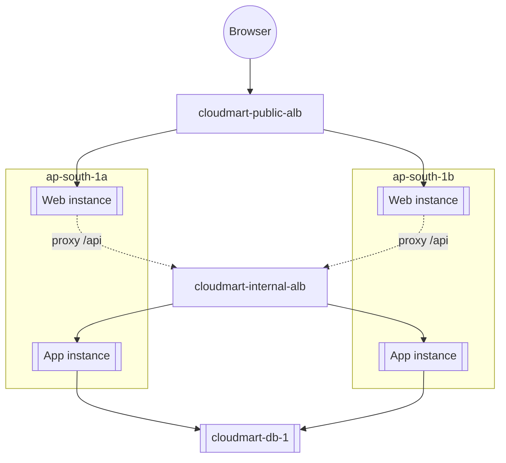

# 09 - Build Part 5: Frontend Tier (ASG and Public LB) (Hands-On)

> Goal: deploy the Nginx tier from Note 03 across both web subnets behind the internet-facing load balancer, continuing from Part 4's internal ALB. Once this part is done, CloudMart is reachable from a browser for the first time — the full 3-tier chain becomes testable end to end.

---

## 1. Create the frontend target group

1. **Target Groups** → **Create target group**.
2. **Target type**: Instances
3. **Name**: `cloudmart-web-tg`
4. **Protocol : Port**: HTTP : `80`
5. **VPC**: `cloudmart-vpc`
6. **Health check path**: `/` (Nginx's own static page — a 200 response proves Nginx itself is up)
7. **Create target group** without registering targets manually.

---

## 2. Create the public load balancer

1. **Load Balancers** → **Create load balancer** → **Application Load Balancer**.
2. **Name**: `cloudmart-public-alb`
3. **Scheme**: **Internet-facing**
4. **VPC**: `cloudmart-vpc`; **Mappings**: `ap-south-1a` → `cloudmart-web-subnet-1`, `ap-south-1b` → `cloudmart-web-subnet-2`.
5. **Security groups**: remove the default, select `cloudmart-alb-web-sg`.
6. **Listeners and routing**: Protocol HTTP, Port `80`, default action → forward to `cloudmart-web-tg`.
7. **Create load balancer**.

---

## 3. Create the frontend launch template

1. **Launch Templates** → **Create launch template**.
2. **Name**: `cloudmart-web-lt`
3. **AMI**: Amazon Linux 2023; **Instance type**: `t3.micro`
4. **Key pair**: none needed
5. **Network settings**: security group `cloudmart-web-asg-sg`; **Auto-assign public IP**: Enable
6. **Advanced details** → **IAM instance profile**: `cloudmart-ssm-role`
7. **Advanced details** → **User data** — paste the script from Section 4, substituting the real Internal ALB DNS name you noted at the end of Part 4 wherever `<INTERNAL_ALB_DNS>` appears.
8. **Create launch template**.

---

## 4. User data — install Nginx, write `index.html`, configure the `/api/` proxy

```bash
#!/bin/bash
dnf install -y nginx

cat > /usr/share/nginx/html/index.html << 'HTMLEOF'
<!DOCTYPE html>
<html>
<head><title>CloudMart</title></head>
<body>
  <h1>🛒 CloudMart</h1>
  <ul id="products"></ul>
  <script>
    fetch('/api/products')
      .then(r => r.json())
      .then(items => {
        const ul = document.getElementById('products');
        items.forEach(p => {
          const li = document.createElement('li');
          li.textContent = `${p.name} — $${p.price} (${p.stock} in stock)`;
          ul.appendChild(li);
        });
      });
  </script>
</body>
</html>
HTMLEOF

cat > /etc/nginx/conf.d/cloudmart-api-proxy.conf << 'CONFEOF'
location /api/ {
    proxy_pass http://<INTERNAL_ALB_DNS>:8080/api/;
}
CONFEOF

systemctl enable --now nginx
systemctl restart nginx
```

> ⚠️ Nginx's default `server {}` block lives in `/etc/nginx/nginx.conf`; a bare `location` block dropped into `/etc/nginx/conf.d/` only gets picked up if that directory is included inside a `server {}` context (it is, by default, on Amazon Linux 2023's stock Nginx config). If the proxy doesn't take effect, check that `/etc/nginx/nginx.conf`'s `server {}` block includes `conf.d/*.conf`, and confirm you replaced `<INTERNAL_ALB_DNS>` with the actual DNS name from Part 4 (e.g. `cloudmart-internal-alb-123456789.ap-south-1.elb.amazonaws.com`) — a placeholder left unedited is the single most common mistake in this step.

---

## 5. Create the Auto Scaling Group

1. **Auto Scaling Groups** → **Create Auto Scaling group**.
2. **Name**: `cloudmart-web-asg`; **Launch template**: `cloudmart-web-lt`.
3. **VPC**: `cloudmart-vpc`; **Subnets**: `cloudmart-web-subnet-1` and `cloudmart-web-subnet-2`.
4. **Load balancing**: attach to existing target group `cloudmart-web-tg`.
5. **Health checks**: enable ELB health checks.
6. **Group size**: Desired `2`, Minimum `2`, Maximum `4`.
7. **Scaling policies**: target tracking, Average CPU utilization, target value `50`.
8. **Create Auto Scaling group**.

---

## 6. Verify — the full chain, end to end

1. Wait for both instances to show **Healthy** in `cloudmart-web-tg`.
2. Copy `cloudmart-public-alb`'s **DNS name** from its description page.
3. Open that DNS name in a browser.

You should see the CloudMart page render with all 5 products listed — proving the entire chain works: **browser → public ALB → web ASG instance (Nginx) → internal ALB → app ASG instance (Flask) → database instance (MariaDB)** and all the way back.



---

## 7. Troubleshooting

| Symptom | Likely cause |
|---|---|
| `502 Bad Gateway` from the public ALB | The frontend instance is up but the internal ALB / app tier isn't responding — revisit Part 4's troubleshooting table |
| Page loads, but the product list stays empty | The Nginx `proxy_pass` URL doesn't exactly match the real internal ALB DNS name — check for a typo or a leftover `<INTERNAL_ALB_DNS>` placeholder |
| Page doesn't load at all | Check `cloudmart-alb-web-sg` allows inbound `80` from `0.0.0.0/0`, and that the web instances passed their target-group health check on `/` |

---

## 8. Recap

- CloudMart is now fully deployed and reachable through `cloudmart-public-alb`'s DNS name — every tier from Note 02's architecture diagram exists and is wired together correctly.
- Both compute tiers scale independently (min 2 / max 4, target-tracking on CPU 50%), each spanning both Availability Zones.
- Next: Note 10 — Build Part 6: Route 53 DNS, where a friendly domain name gets layered on top of `cloudmart-public-alb`.

### Sources
- [Application Load Balancer components — AWS docs](https://docs.aws.amazon.com/elasticloadbalancing/latest/application/introduction.html)
- [nginx core module documentation (conf.d includes)](https://nginx.org/en/docs/ngx_core_module.html)
- [Target group health checks — AWS docs](https://docs.aws.amazon.com/elasticloadbalancing/latest/application/target-group-health-checks.html)
