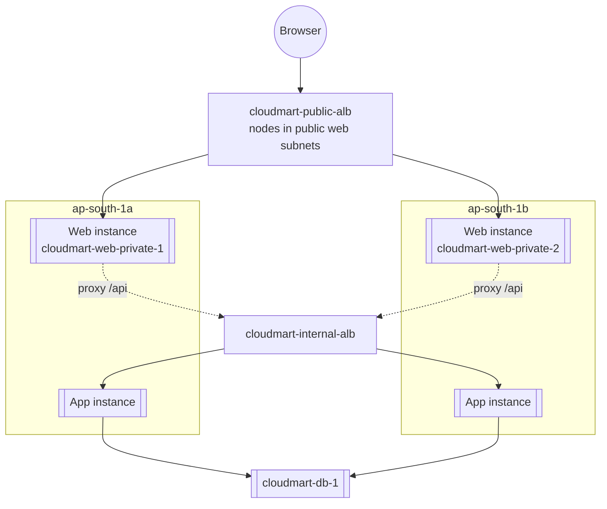

# 09 - Build Part 5: Frontend Tier (ASG and Public LB) (Hands-On)

> Goal: deploy the Nginx tier from Note 03 across both web subnets behind the internet-facing load balancer, continuing from Part 4's internal ALB. Once this part is done, CloudMart is reachable from a browser for the first time — the full 3-tier chain becomes testable end to end.

---

## 1. Create the frontend target group

1. **Target Groups** → **Create target group**.
2. **Target type**: Instances
3. **Name**: `cloudmart-web-tg`
4. **Protocol : Port**: HTTP : `80`
5. **VPC**: `cloudmart-vpc`
6. **Health check path**: `/` (Nginx's own static page — a 200 response proves Nginx itself is up)
7. **Create target group** without registering targets manually.

---

## 2. Create the public load balancer

1. **Load Balancers** → **Create load balancer** → **Application Load Balancer**.
2. **Name**: `cloudmart-public-alb`
3. **Scheme**: **Internet-facing**
4. **VPC**: `cloudmart-vpc`; **Mappings**: `ap-south-1a` → `cloudmart-web-subnet-1`, `ap-south-1b` → `cloudmart-web-subnet-2`. These are the **public** web subnets — the ALB's own network interfaces need to live here to be reachable from the internet at all. Its actual targets (the frontend EC2 instances) live somewhere else entirely; see Section 5.
5. **Security groups**: remove the default, select `cloudmart-alb-web-sg`.
6. **Listeners and routing**: Protocol HTTP, Port `80`, default action → forward to `cloudmart-web-tg`.
7. **Create load balancer**.

> 🧠 **Mental model:** an ALB's "subnets" setting and a target group's "targets" are two independent things. The subnets you map here only decide where the ALB's own load-balancer nodes sit (and therefore what can reach the ALB itself); a target group can register any instance with a routable private IP, in any subnet, including one nowhere near the ALB's own subnets. That's exactly what lets `cloudmart-public-alb` stay internet-facing while every instance behind it stays private.

---

## 3. Create the frontend launch template

1. **Launch Templates** → **Create launch template**.
2. **Name**: `cloudmart-web-lt`
3. **AMI**: Amazon Linux 2023; **Instance type**: `t3.micro`
4. **Key pair**: none needed
5. **Network settings**: security group `cloudmart-web-asg-sg`; leave subnet unset here (the ASG assigns subnets, same pattern as the backend launch template in Part 4); **Auto-assign public IP**: **Disable** — the frontend instance is now private, so it never gets a public IP; it reaches the internet outbound (to install Nginx) only via the regional `cloudmart-nat-gw`, exactly like the app and database tiers.
6. **Advanced details** → **IAM instance profile**: `cloudmart-ssm-role`
7. **Advanced details** → **User data** — paste the script from Section 4, substituting the real Internal ALB DNS name you noted at the end of Part 4 wherever `<INTERNAL_ALB_DNS>` appears.
8. **Create launch template**.

---

## 4. User data — install Nginx, write `index.html`, configure the `/api/` proxy

```bash
#!/bin/bash
dnf install -y nginx

cat > /usr/share/nginx/html/index.html << 'HTMLEOF'
<!DOCTYPE html>
<html lang="en">
<head>
  <meta charset="UTF-8">
  <meta name="viewport" content="width=device-width, initial-scale=1.0">
  <title>CloudMart</title>
  <style>
    * { margin: 0; padding: 0; box-sizing: border-box; }

    body {
      font-family: -apple-system, BlinkMacSystemFont, 'Segoe UI', Roboto, sans-serif;
      background: linear-gradient(135deg, #0f0c29, #302b63, #24243e);
      min-height: 100vh;
      color: #fff;
    }

    header {
      background: rgba(255, 255, 255, 0.05);
      backdrop-filter: blur(10px);
      border-bottom: 1px solid rgba(255, 255, 255, 0.1);
      padding: 1.5rem 2rem;
      text-align: center;
    }

    header h1 {
      font-size: 2.5rem;
      background: linear-gradient(90deg, #f093fb, #f5576c, #4facfe);
      -webkit-background-clip: text;
      -webkit-text-fill-color: transparent;
      background-clip: text;
    }

    header p {
      color: rgba(255, 255, 255, 0.6);
      margin-top: 0.5rem;
      font-size: 1.1rem;
    }

    .container {
      max-width: 1200px;
      margin: 3rem auto;
      padding: 0 2rem;
    }

    .stats-bar {
      display: flex;
      justify-content: center;
      gap: 2rem;
      margin-bottom: 3rem;
      flex-wrap: wrap;
    }

    .stat-card {
      background: rgba(255, 255, 255, 0.08);
      border: 1px solid rgba(255, 255, 255, 0.15);
      border-radius: 16px;
      padding: 1.2rem 2rem;
      text-align: center;
      backdrop-filter: blur(5px);
    }

    .stat-card .number {
      font-size: 2rem;
      font-weight: 700;
      color: #4facfe;
    }

    .stat-card .label {
      font-size: 0.85rem;
      color: rgba(255, 255, 255, 0.5);
      text-transform: uppercase;
      letter-spacing: 1px;
      margin-top: 0.3rem;
    }

    .products-grid {
      display: grid;
      grid-template-columns: repeat(auto-fill, minmax(300px, 1fr));
      gap: 1.5rem;
    }

    .product-card {
      background: rgba(255, 255, 255, 0.07);
      border: 1px solid rgba(255, 255, 255, 0.12);
      border-radius: 20px;
      padding: 2rem;
      transition: all 0.3s ease;
      position: relative;
      overflow: hidden;
    }

    .product-card::before {
      content: '';
      position: absolute;
      top: 0;
      left: 0;
      right: 0;
      height: 4px;
      background: linear-gradient(90deg, #f093fb, #f5576c, #4facfe);
      opacity: 0;
      transition: opacity 0.3s ease;
    }

    .product-card:hover {
      transform: translateY(-5px);
      border-color: rgba(255, 255, 255, 0.25);
      box-shadow: 0 20px 40px rgba(0, 0, 0, 0.3);
    }

    .product-card:hover::before {
      opacity: 1;
    }

    .product-icon {
      width: 60px;
      height: 60px;
      border-radius: 14px;
      display: flex;
      align-items: center;
      justify-content: center;
      font-size: 1.8rem;
      margin-bottom: 1.2rem;
    }

    .product-name {
      font-size: 1.3rem;
      font-weight: 600;
      margin-bottom: 0.8rem;
    }

    .product-price {
      font-size: 1.8rem;
      font-weight: 700;
      color: #4facfe;
      margin-bottom: 1rem;
    }

    .product-stock {
      display: inline-flex;
      align-items: center;
      gap: 0.4rem;
      padding: 0.4rem 1rem;
      border-radius: 20px;
      font-size: 0.85rem;
      font-weight: 500;
    }

    .stock-high {
      background: rgba(46, 213, 115, 0.15);
      color: #2ed573;
      border: 1px solid rgba(46, 213, 115, 0.3);
    }

    .stock-medium {
      background: rgba(255, 165, 2, 0.15);
      color: #ffa502;
      border: 1px solid rgba(255, 165, 2, 0.3);
    }

    .stock-low {
      background: rgba(255, 71, 87, 0.15);
      color: #ff4757;
      border: 1px solid rgba(255, 71, 87, 0.3);
    }

    .btn-cart {
      margin-top: 1.5rem;
      width: 100%;
      padding: 0.8rem;
      border: none;
      border-radius: 12px;
      background: linear-gradient(135deg, #667eea, #764ba2);
      color: #fff;
      font-size: 1rem;
      font-weight: 600;
      cursor: pointer;
      transition: all 0.3s ease;
    }

    .btn-cart:hover {
      transform: scale(1.02);
      box-shadow: 0 5px 20px rgba(102, 126, 234, 0.4);
    }

    .loading {
      text-align: center;
      padding: 4rem;
    }

    .loading .spinner {
      width: 50px;
      height: 50px;
      border: 4px solid rgba(255, 255, 255, 0.1);
      border-top-color: #4facfe;
      border-radius: 50%;
      animation: spin 1s linear infinite;
      margin: 0 auto 1rem;
    }

    @keyframes spin {
      to { transform: rotate(360deg); }
    }

    footer {
      text-align: center;
      padding: 3rem;
      color: rgba(255, 255, 255, 0.4);
      font-size: 0.9rem;
    }

    @media (max-width: 600px) {
      header h1 { font-size: 1.8rem; }
      .products-grid { grid-template-columns: 1fr; }
      .stats-bar { gap: 1rem; }
    }
  </style>
</head>
<body>
  <header>
    <h1>&#x1F6D2; CloudMart</h1>
    <p>Your cloud-native marketplace</p>
  </header>

  <div class="container">
    <div class="stats-bar" id="stats"></div>
    <div class="products-grid" id="products">
      <div class="loading">
        <div class="spinner"></div>
        <p>Loading products...</p>
      </div>
    </div>
  </div>

  <footer>
    <p>Powered by AWS &mdash; Flask &bull; MariaDB &bull; Nginx &bull; ALB</p>
  </footer>

  <script>
    const icons = ['&#x1F455;', '&#x2615;', '&#x1F3A8;', '&#x1F9E5;', '&#x1F9E2;'];
    const colors = [
      'linear-gradient(135deg, #a18cd1, #fbc2eb)',
      'linear-gradient(135deg, #fccb90, #d57eeb)',
      'linear-gradient(135deg, #84fab0, #8fd3f4)',
      'linear-gradient(135deg, #f093fb, #f5576c)',
      'linear-gradient(135deg, #4facfe, #00f2fe)'
    ];

    function getStockClass(stock) {
      if (stock >= 150) return 'stock-high';
      if (stock >= 80) return 'stock-medium';
      return 'stock-low';
    }

    fetch('/api/products')
      .then(r => r.json())
      .then(items => {
        const totalProducts = items.length;
        const totalStock = items.reduce((sum, p) => sum + p.stock, 0);
        const avgPrice = (items.reduce((sum, p) => sum + parseFloat(p.price), 0) / items.length).toFixed(2);

        document.getElementById('stats').innerHTML = `
          <div class="stat-card">
            <div class="number">${totalProducts}</div>
            <div class="label">Products</div>
          </div>
          <div class="stat-card">
            <div class="number">${totalStock}</div>
            <div class="label">Total Stock</div>
          </div>
          <div class="stat-card">
            <div class="number">$${avgPrice}</div>
            <div class="label">Avg Price</div>
          </div>
        `;

        document.getElementById('products').innerHTML = items.map((p, i) => `
          <div class="product-card">
            <div class="product-icon" style="background: ${colors[i % colors.length]}">
              ${icons[i % icons.length]}
            </div>
            <div class="product-name">${p.name}</div>
            <div class="product-price">$${p.price}</div>
            <span class="product-stock ${getStockClass(p.stock)}">
              &#x25CF; ${p.stock} in stock
            </span>
            <button class="btn-cart">Add to Cart</button>
          </div>
        `).join('');
      })
      .catch(() => {
        document.getElementById('products').innerHTML = '<p style="text-align:center;color:#ff4757;">Failed to load products. Please try again.</p>';
      });
  </script>
</body>
</html>
HTMLEOF

cat > /etc/nginx/conf.d/cloudmart-api-proxy.conf << 'CONFEOF'
server {
    listen 80;
    server_name _;

    root /usr/share/nginx/html;
    index index.html;

    location / {
        try_files $uri $uri/ /index.html;
    }

    location /api/ {
        proxy_pass http://<INTERNAL_ALB_DNS>:8080/api/;
        proxy_set_header Host $host;
        proxy_set_header X-Real-IP $remote_addr;
    }
}
CONFEOF

rm -f /etc/nginx/conf.d/default.conf
systemctl enable --now nginx

```

> ⚠️ Nginx's default `server {}` block lives in `/etc/nginx/nginx.conf`; a bare `location` block dropped into `/etc/nginx/conf.d/` only gets picked up if that directory is included inside a `server {}` context (it is, by default, on Amazon Linux 2023's stock Nginx config). If the proxy doesn't take effect, check that `/etc/nginx/nginx.conf`'s `server {}` block includes `conf.d/*.conf`, and confirm you replaced `<INTERNAL_ALB_DNS>` with the actual DNS name from Part 4 (e.g. `cloudmart-internal-alb-123456789.ap-south-1.elb.amazonaws.com`) — a placeholder left unedited is the single most common mistake in this step.

---

## 5. Create the Auto Scaling Group

1. **Auto Scaling Groups** → **Create Auto Scaling group**.
2. **Name**: `cloudmart-web-asg`; **Launch template**: `cloudmart-web-lt`.
3. **VPC**: `cloudmart-vpc`; **Subnets**: `cloudmart-web-private-1` and `cloudmart-web-private-2` — the private frontend subnets, **not** `cloudmart-web-subnet-1/2` (those hold only the ALB and NAT Gateway).
4. **Load balancing**: attach to existing target group `cloudmart-web-tg`.
5. **Health checks**: enable ELB health checks.
6. **Group size**: Desired `2`, Minimum `2`, Maximum `4`.
7. **Scaling policies**: target tracking, Average CPU utilization, target value `50`.
8. **Create Auto Scaling group**.

---

## 6. Verify — the full chain, end to end

1. Wait for both instances to show **Healthy** in `cloudmart-web-tg`.
2. Copy `cloudmart-public-alb`'s **DNS name** from its description page.
3. Open that DNS name in a browser.

You should see the CloudMart page render with all 5 products listed — proving the entire chain works: **browser → public ALB → web ASG instance (Nginx) → internal ALB → app ASG instance (Flask) → database instance (MariaDB)** and all the way back.



---

## 7. Troubleshooting

| Symptom | Likely cause |
|---|---|
| `502 Bad Gateway` from the public ALB | The frontend instance is up but the internal ALB / app tier isn't responding — revisit Part 4's troubleshooting table |
| Page loads, but the product list stays empty | The Nginx `proxy_pass` URL doesn't exactly match the real internal ALB DNS name — check for a typo or a leftover `<INTERNAL_ALB_DNS>` placeholder |
| Page doesn't load at all | Check `cloudmart-alb-web-sg` allows inbound `80` from `0.0.0.0/0`, and that the web instances passed their target-group health check on `/` |
| ASG's instances never register as healthy targets, and you notice they got a public IP | The ASG was pointed at `cloudmart-web-subnet-1/2` instead of `cloudmart-web-private-1/2` — an ALB's own subnets and its target group's instance subnets are independent settings; double-check Section 5's subnet selection |

---

## 8. Recap

- CloudMart is now fully deployed and reachable through `cloudmart-public-alb`'s DNS name — every tier from Note 02's architecture diagram exists and is wired together correctly, with the frontend running in `cloudmart-web-private-1/2` behind an ALB whose own nodes sit in the public `cloudmart-web-subnet-1/2`.
- Both compute tiers scale independently (min 2 / max 4, target-tracking on CPU 50%), each spanning both Availability Zones.
- No EC2 instance anywhere in this build has a public IP — the public web subnets exist purely to host the ALBs' nodes and the NAT Gateway.
- Next: Note 10 — Build Part 6: Route 53 DNS, where a friendly domain name gets layered on top of `cloudmart-public-alb`.

### Sources
- [Application Load Balancer components — AWS docs](https://docs.aws.amazon.com/elasticloadbalancing/latest/application/introduction.html)
- [nginx core module documentation (conf.d includes)](https://nginx.org/en/docs/ngx_core_module.html)
- [Target group health checks — AWS docs](https://docs.aws.amazon.com/elasticloadbalancing/latest/application/target-group-health-checks.html)
