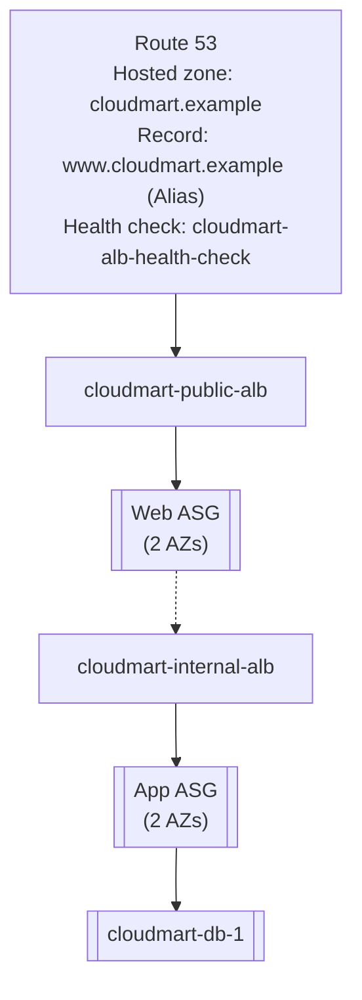

# 10 - Build Part 6: Route 53 DNS (Hands-On)

> Goal: put a friendly, health-checked domain name in front of `cloudmart-public-alb`, continuing from Part 5. This is the last infrastructure piece — after this, CloudMart matches every requirement from Note 01.

---

## 1. A note on the domain used here

This capstone uses the illustrative domain `cloudmart.example`. The `.example` TLD (like `.test`, `.invalid`, and the domains `example.com`/`.net`/`.org`) is permanently reserved by IANA (RFC 2606) specifically for documentation — it cannot really be registered or resolved on the public internet. In a real project you would already own a real, registered domain, and would either register it directly through Route 53 (**Registered domains**) or keep it registered elsewhere and point that registrar's name servers at the hosted zone created below. This hands-on demonstrates the DNS layer's mechanics correctly even though `cloudmart.example` itself won't actually resolve publicly.

---

## 2. Create the public hosted zone

1. **Route 53 console** → **Hosted zones** → **Create hosted zone**.
2. **Domain name**: `cloudmart.example`
3. **Type**: **Public hosted zone**
4. **Create hosted zone**.

This automatically creates the zone's **NS** record (the 4 name servers assigned to this zone — what you'd point a real registrar at) and its **SOA** record.

---

## 3. Create a health check on the public ALB

1. **Health checks** → **Create health check**.
2. **Name**: `cloudmart-alb-health-check`
3. **What to monitor**: **Endpoint**
4. **Specify endpoint by**: **Domain name** → paste `cloudmart-public-alb`'s DNS name (from Part 5)
5. **Protocol**: HTTP, **Port**: 80, **Path**: `/`
6. Leave the request interval at the standard 30 seconds → **Create health check**.

---

## 4. Create the DNS record

1. Back in the `cloudmart.example` hosted zone → **Create record**.
2. **Record name**: `www`
3. **Record type**: **A**
4. Toggle **Alias**: **On**
5. **Route traffic to**: **Alias to Application and Classic Load Balancer** → select the Region (`ap-south-1`) → select `cloudmart-public-alb`
6. **Routing policy**: Simple
7. **Health check**: `cloudmart-alb-health-check`
8. **Create records**.

`www.cloudmart.example` is now an **Alias** record pointing at `cloudmart-public-alb` — not a CNAME. Alias records are Route 53's own extension: free of charge, usable even at a zone's apex (unlike a CNAME, which the DNS specification forbids at the apex), and Route 53 automatically tracks the target's actual IPs as the ALB's underlying nodes change, which a static A record never could.

---

## 5. End state

---

## 6. An optional future extension (not built here)

Because `cloudmart-alb-health-check` already exists and is already wired to the DNS record, this hosted zone is one step away from supporting **Failover routing**: adding a second, standby `cloudmart-public-alb` in a different AWS Region, plus a second health check monitoring it, would let Route 53 automatically redirect `www.cloudmart.example` to the standby Region if the primary Region's health check ever failed — full multi-region disaster recovery. Note 01 named this explicitly as out of scope for this capstone, but the groundwork (a health-check-aware record) is already in place if CloudMart ever needs it.

---

## 7. Recap

- `cloudmart.example` is a public hosted zone with a health-checked Alias record pointing at `cloudmart-public-alb`.
- Alias, not CNAME, because CNAME records are disallowed at a zone's apex/root-style names and Alias records are free and target-health-aware.
- Every piece of Note 01's requirements is now built: HA (2 AZs everywhere except the named DB gap), security (private tiers, no SSH, chained SGs), independent scaling per tier, and friendly, health-check-aware DNS.
- Next: Note 11 — End-to-End Testing, HA Validation, and Cleanup, where the whole build gets tested under simulated failure and then torn down safely.

### Sources
- [What is Amazon Route 53? — AWS docs](https://docs.aws.amazon.com/Route53/latest/DeveloperGuide/Welcome.html)
- [Choosing an Alias record type — AWS docs](https://docs.aws.amazon.com/Route53/latest/DeveloperGuide/resource-record-sets-choosing-alias-non-alias.html)
- [Special-Use Domain Names (RFC 2606) — IETF](https://www.rfc-editor.org/rfc/rfc2606.html)
